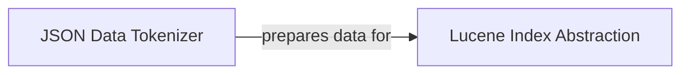

## Details

The `Indexing Module` subsystem is responsible for the entire lifecycle of Lucene-based indexes within Pyserini. This includes the initial preparation and tokenization of raw data, the core operations of creating and populating indexes, and managing interactions with the underlying Anserini (Java/Apache Lucene) library. It acts as the primary interface for transforming unstructured or semi-structured data into searchable index structures.

### Lucene Index Abstraction
This component provides a high-level, Pythonic interface for all Lucene-based index operations. It encapsulates the complexities of initializing, managing, and interacting with Lucene indexes via `pyjnius` to the underlying Anserini library. Its responsibilities include adding documents, handling index validation, and providing index statistics. It acts as a facade over the low-level Java indexing functionalities.

**Related Classes/Methods**:

- <a href="https://github.com/castorini/pyserini/blob/master/pyserini/index/lucene/_base.py" target="_blank" rel="noopener noreferrer">`pyserini/index/lucene/_base.py`</a>

### JSON Data Tokenizer
This component is dedicated to the crucial data preparation phase before indexing. It processes raw JSON document collections, performs necessary tokenization of their content, and manages the persistence of the tokenized output (typically to files). This prepared data then serves as input for the indexing process, ensuring that the content is in an optimal format for Lucene.

**Related Classes/Methods**:

- <a href="https://github.com/castorini/pyserini/blob/master/pyserini/tokenize_json_collection.py" target="_blank" rel="noopener noreferrer">`pyserini/tokenize_json_collection.py`</a>

### [FAQ](https://github.com/CodeBoarding/GeneratedOnBoardings/tree/main?tab=readme-ov-file#faq)