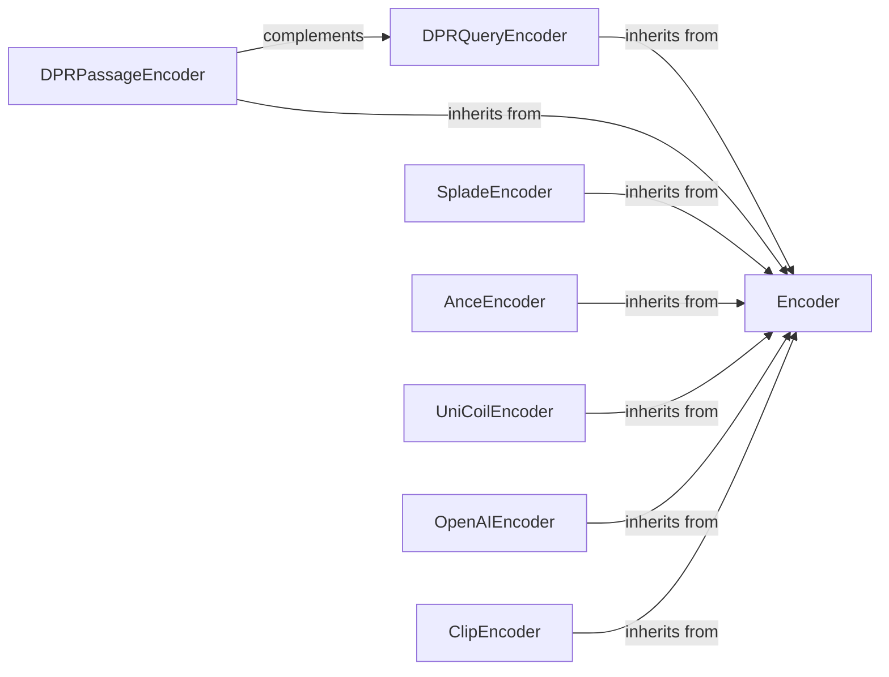

## Details

The Model Encoding Layer subsystem is responsible for transforming textual data (queries and documents) into vector representations suitable for information retrieval tasks. It provides a unified interface for various neural network models, supporting both dense and sparse encoding strategies.

### Encoder
The abstract base class that defines the common interface and provides shared functionalities for all text encoding models. It acts as a blueprint for concrete encoders, ensuring consistency across different model implementations.

**Related Classes/Methods**:

- <a href="https://github.com/castorini/pyserini/blob/master/pyserini/encode/_base.py" target="_blank" rel="noopener noreferrer">`pyserini.encode._base.Encoder`</a>

### DPRQueryEncoder
A concrete implementation of Encoder specifically designed to encode text queries into dense vector representations using the DPR (Dense Passage Retrieval) model. It handles model loading and inference for queries.

**Related Classes/Methods**:

- <a href="https://github.com/castorini/pyserini/blob/master/pyserini/encode/_dpr.py#L73-L94" target="_blank" rel="noopener noreferrer">`pyserini.encode._dpr.DPRQueryEncoder`:73-94</a>

### DPRPassageEncoder
A concrete implementation of Encoder for encoding text passages (documents) into dense vector representations using the DPR model. It complements DPRQueryEncoder by providing the document-side encoding.

**Related Classes/Methods**:

- <a href="https://github.com/castorini/pyserini/blob/master/pyserini/encode/_dpr.py" target="_blank" rel="noopener noreferrer">`pyserini.encode._dpr.DPRPassageEncoder`</a>

### SpladeEncoder
A concrete implementation of Encoder that encodes text into sparse vector representations using the SPLADE model. It generates token weights, enabling sparse retrieval methods.

**Related Classes/Methods**:

- <a href="https://github.com/castorini/pyserini/blob/master/pyserini/encode/_splade.py" target="_blank" rel="noopener noreferrer">`pyserini.encode._splade.SpladeEncoder`</a>

### AnceEncoder
Initializes and loads weights for the ANCE (Approximate Nearest Neighbor Negative Contrastive Estimation) model for dense encoding. It's another prominent dense encoder.

**Related Classes/Methods**:

- <a href="https://github.com/castorini/pyserini/blob/master/pyserini/encode/_ance.py#L25-L70" target="_blank" rel="noopener noreferrer">`pyserini.encode._ance.AnceEncoder`:25-70</a>

### UniCoilEncoder
Initializes weights, tokenizes with injects, and generates token weights for the UniCoil model, which is a sparse encoding approach.

**Related Classes/Methods**:

- <a href="https://github.com/castorini/pyserini/blob/master/pyserini/encode/_unicoil.py#L28-L74" target="_blank" rel="noopener noreferrer">`pyserini.encode._unicoil.UniCoilEncoder`:28-74</a>

### OpenAIEncoder
Provides an interface to generate embeddings using the OpenAI API. This component abstracts the interaction with external embedding services.

**Related Classes/Methods**:

- <a href="https://github.com/castorini/pyserini/blob/master/pyserini/encode/_openai.py" target="_blank" rel="noopener noreferrer">`pyserini.encode._openai.OpenAIEncoder`</a>

### ClipEncoder
Handles encoding for both text and images using the CLIP model, enabling multi-modal retrieval capabilities.

**Related Classes/Methods**:

- <a href="https://github.com/castorini/pyserini/blob/master/pyserini/encode/_clip.py#L126-L133" target="_blank" rel="noopener noreferrer">`pyserini.encode._clip.ClipEncoder`:126-133</a>

### [FAQ](https://github.com/CodeBoarding/GeneratedOnBoardings/tree/main?tab=readme-ov-file#faq)