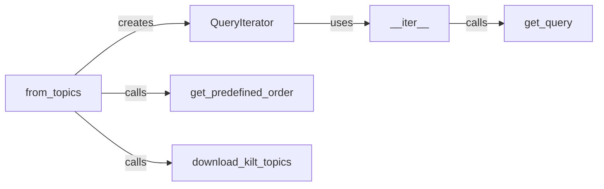

## Details

The Query Processing Module is primarily encapsulated within the pyserini/query_iterator.py file. This module is responsible for managing the ingestion, preparation, and sequential access of queries from various sources, ensuring they are in the correct format for subsequent retrieval operations. The Query Processing Module exhibits a clear pipeline-like interaction: The from_topics factory method orchestrates the initial setup, potentially downloading external data (download_kilt_topics) and determining the processing order (get_predefined_order), before creating a QueryIterator instance. The QueryIterator then leverages its __iter__ method to enable sequential access. During iteration, __iter__ repeatedly calls get_query to fetch individual, prepared queries. This structure ensures a clean separation of concerns, where query source initialization, data acquisition, ordering, and actual query retrieval are handled by distinct, yet interconnected, components.

### QueryIterator
Serves as the core component for sequential access to queries. It manages the state and logic for iterating through various query sources, acting as the primary interface for query consumption within the system. This aligns with the "Data/Corpus Management" and "Search/Query Module" patterns by providing structured access to query data.

**Related Classes/Methods**:

- <a href="https://github.com/castorini/pyserini/blob/master/pyserini/query_iterator.py" target="_blank" rel="noopener noreferrer">`QueryIterator:__iter__`</a>
- <a href="https://github.com/castorini/pyserini/blob/master/pyserini/query_iterator.py#L210-L232" target="_blank" rel="noopener noreferrer">`from_topics`:210-232</a>

### from_topics
A factory method responsible for constructing QueryIterator instances specifically from predefined topic sets. It abstracts the complexity of initializing topic-based query processing, serving as a key entry point for query ingestion. This aligns with the "Facade Pattern" by simplifying the creation of complex objects.

**Related Classes/Methods**:

- <a href="https://github.com/castorini/pyserini/blob/master/pyserini/query_iterator.py#L37-L84" target="_blank" rel="noopener noreferrer">`QueryIterator`:37-84</a>
- <a href="https://github.com/castorini/pyserini/blob/master/pyserini/query_iterator.py#L73-L84" target="_blank" rel="noopener noreferrer">`get_predefined_order`:73-84</a>
- <a href="https://github.com/castorini/pyserini/blob/master/pyserini/query_iterator.py#L151-L165" target="_blank" rel="noopener noreferrer">`download_kilt_topics`:151-165</a>

### __iter__
Implements the Python iterator protocol for the QueryIterator class, enabling instances to be used directly in iteration contexts (e.g., for loops). It acts as the entry point for sequential query access, ensuring the module adheres to standard Pythonic iteration patterns.

**Related Classes/Methods**:

- <a href="https://github.com/castorini/pyserini/blob/master/pyserini/query_iterator.py#L196-L208" target="_blank" rel="noopener noreferrer">`get_query`:196-208</a>
- <a href="https://github.com/castorini/pyserini/blob/master/pyserini/query_iterator.py#L37-L84" target="_blank" rel="noopener noreferrer">`QueryIterator`:37-84</a>

### get_query
Retrieves a single, prepared query during the iteration process. This method encapsulates the logic for fetching one query at a time from the underlying data source, ensuring consistent query formatting.

**Related Classes/Methods**:

- <a href="https://github.com/castorini/pyserini/blob/master/pyserini/query_iterator.py#L66-L68" target="_blank" rel="noopener noreferrer">`__iter__`:66-68</a>

### get_predefined_order
Manages and returns the specific, predefined order in which topics or queries should be processed. This component is critical for ensuring reproducibility in information retrieval experiments, aligning with the "Reproducibility and Experimentation" architectural bias.

**Related Classes/Methods**:

- <a href="https://github.com/castorini/pyserini/blob/master/pyserini/query_iterator.py#L210-L232" target="_blank" rel="noopener noreferrer">`from_topics`:210-232</a>

### download_kilt_topics
Handles the downloading of specific KILT dataset topics from external sources. It separates the concern of external data acquisition from the core query processing logic, promoting modularity. This aligns with the "Data/Corpus Management" pattern.

**Related Classes/Methods**:

- <a href="https://github.com/castorini/pyserini/blob/master/pyserini/query_iterator.py#L210-L232" target="_blank" rel="noopener noreferrer">`from_topics`:210-232</a>

### [FAQ](https://github.com/CodeBoarding/GeneratedOnBoardings/tree/main?tab=readme-ov-file#faq)