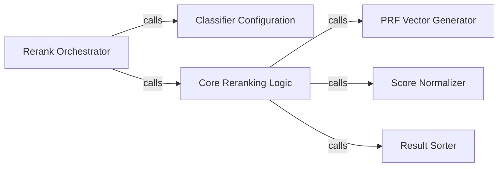

## Details

The reranking subsystem in Pyserini is primarily managed by the `PseudoRelevanceClassifierReranker` class, which serves as the `Rerank Orchestrator`. This orchestrator initiates the reranking process by configuring the appropriate `Classifier Configuration` and then delegating to the `Core Reranking Logic`. The core logic is responsible for generating `PRF Vectors` from the initial search results, applying the classifier, and normalizing the scores using the `Score Normalizer`. Finally, the `Result Sorter` reorders the documents based on these refined scores, ensuring an optimized ranking output. This design follows a pipeline-like structure, where each component performs a specific, well-defined task in the overall reranking workflow.

### Rerank Orchestrator
Serves as the primary public entry point for the reranking process within the `PseudoRelevanceClassifierReranker`. It abstracts the complexity of classifier setup and application, orchestrating the overall flow from initial results to final reordered documents. This component acts as a Facade for the reranking functionality.

**Related Classes/Methods**:

- <a href="https://github.com/castorini/pyserini/blob/master/pyserini/search/faiss/_searcher.py" target="_blank" rel="noopener noreferrer">`rerank`</a>

### Classifier Configuration
Handles the initialization, loading, and configuration of the specific machine learning model or classifier used for re-scoring documents. This includes setting up the necessary environment for the model, ensuring it's ready for inference. This aligns with the Model Integration Layer.

**Related Classes/Methods**:

- <a href="https://github.com/castorini/pyserini/blob/master/pyserini/search/lucene/reranker.py#L49-L55" target="_blank" rel="noopener noreferrer">`_set_classifier`:49-55</a>

### Core Reranking Logic
Implements the core logic for applying the configured classifier to the initial search results. It computes new scores for documents based on the classifier's output and manages the reordering process. This is the central processing step in the Pipeline Pattern.

**Related Classes/Methods**:

- <a href="https://github.com/castorini/pyserini/blob/master/pyserini/search/lucene/reranker.py#L66-L78" target="_blank" rel="noopener noreferrer">`_rerank_with_classifier`:66-78</a>

### PRF Vector Generator
Generates or retrieves pseudo-relevance feedback (PRF) vectors. These vectors are derived from top-ranked documents and are used as features or input to enhance the reranking classifier, improving its performance. This component contributes to Data/Corpus Management by preparing features.

**Related Classes/Methods**:

- <a href="https://github.com/castorini/pyserini/blob/master/pyserini/search/lucene/reranker.py#L57-L64" target="_blank" rel="noopener noreferrer">`_get_prf_vectors`:57-64</a>

### Score Normalizer
Provides utility for scaling and normalizing scores produced by the reranking classifier. This ensures consistency and comparability of scores, which is crucial before final sorting.

**Related Classes/Methods**:

- <a href="https://github.com/castorini/pyserini/blob/master/pyserini/eval/evaluate_dpr_retrieval.py#L219-L220" target="_blank" rel="noopener noreferrer">`_normalize`:219-220</a>

### Result Sorter
A utility component responsible for efficiently reordering document lists based on their new reranked scores. It ensures the final output reflects the refined ranking.

**Related Classes/Methods**:

- <a href="https://github.com/castorini/pyserini/blob/master/pyserini/search/lucene/reranker.py#L113-L122" target="_blank" rel="noopener noreferrer">`_sort_dual_list`:113-122</a>

### [FAQ](https://github.com/CodeBoarding/GeneratedOnBoardings/tree/main?tab=readme-ov-file#faq)