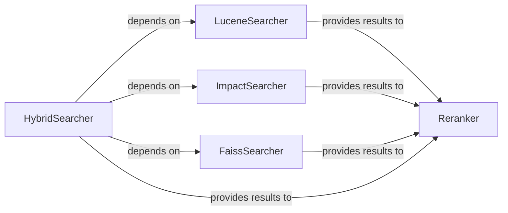

## Details

The pyserini.search subsystem provides a comprehensive suite of search functionalities, encompassing sparse, dense, and hybrid retrieval methods, along with re-ranking capabilities. The core components include LuceneSearcher for traditional sparse retrieval, ImpactSearcher for sparse retrieval with learned term weights, and FaissSearcher for dense vector-based retrieval. The HybridSearcher acts as an orchestrator, combining results from these individual searchers to offer a unified hybrid search experience. Finally, the Reranker component refines the initial search results by applying machine learning models based on pseudo-relevance feedback, enhancing the overall relevance of the retrieved documents. This modular design allows for flexible integration and extension of various search and re-ranking strategies.

### LuceneSearcher
The primary component for sparse retrieval against Lucene/Anserini indexes. It encapsulates the logic for executing queries, handling query expansion (e.g., RM3), and converting raw Lucene results into a usable format.

**Related Classes/Methods**:

- <a href="https://github.com/castorini/pyserini/blob/master/pyserini/search/lucene/_searcher.py#L39-L424" target="_blank" rel="noopener noreferrer">`pyserini.search.lucene._searcher.LuceneSearcher`:39-424</a>

### ImpactSearcher
Specializes in sparse retrieval using learned term weights, often derived from neural models. It handles IDF computation, query encoding, and provides fast re-ranking capabilities.

**Related Classes/Methods**:

- <a href="https://github.com/castorini/pyserini/blob/master/pyserini/search/lucene/_impact_searcher.py" target="_blank" rel="noopener noreferrer">`pyserini.search.lucene._impact_searcher.ImpactSearcher`</a>

### FaissSearcher
Manages dense retrieval operations. It is responsible for initializing neural encoders (e.g., from Hugging Face Transformers), loading Faiss indexes, and performing efficient vector similarity searches.

**Related Classes/Methods**:

- <a href="https://github.com/castorini/pyserini/blob/master/pyserini/search/faiss/_searcher.py#L44-L250" target="_blank" rel="noopener noreferrer">`pyserini.search.faiss._searcher.FaissSearcher`:44-250</a>

### HybridSearcher
Orchestrates and combines results from both sparse (LuceneSearcher/ImpactSearcher) and dense (FaissSearcher) retrieval methods. It provides a unified interface for hybrid search.

**Related Classes/Methods**:

- <a href="https://github.com/castorini/pyserini/blob/master/pyserini/search/hybrid/_searcher.py#L27-L82" target="_blank" rel="noopener noreferrer">`pyserini.search.hybrid._searcher.HybridSearcher`:27-82</a>

### Reranker
Provides re-ranking capabilities for initial search results, often incorporating machine learning models to refine relevance. It uses pseudo-relevance feedback with classifiers (Logistic Regression or SVM) to re-score and reorder documents.

**Related Classes/Methods**:

- <a href="https://github.com/castorini/pyserini/blob/master/pyserini/search/lucene/reranker.py#L34-L122" target="_blank" rel="noopener noreferrer">`pyserini.search.lucene.reranker.PseudoRelevanceClassifierReranker`:34-122</a>

### [FAQ](https://github.com/CodeBoarding/GeneratedOnBoardings/tree/main?tab=readme-ov-file#faq)