```mermaid
graph LR
    Data_Resource_Management["Data & Resource Management"]
    Indexing_Module["Indexing Module"]
    Query_Processing_Module["Query Processing Module"]
    Model_Encoding_Layer["Model Encoding Layer"]
    Retrieval_Core["Retrieval Core"]
    Reranking_Module["Reranking Module"]
    Evaluation_TREC_Tools["Evaluation & TREC Tools"]
    API_Demonstration_Layer["API & Demonstration Layer"]
    Data_Resource_Management -- "provides raw data/corpora to" --> Indexing_Module
    Indexing_Module -- "creates and loads indexes for" --> Retrieval_Core
    Data_Resource_Management -- "provides predefined query sets to" --> Query_Processing_Module
    Query_Processing_Module -- "feeds prepared queries to" --> Model_Encoding_Layer
    Model_Encoding_Layer -- "encodes queries and documents for" --> Retrieval_Core
    Retrieval_Core -- "passes initial search results to" --> Reranking_Module
    Retrieval_Core -- "provides search results for analysis by" --> Evaluation_TREC_Tools
    Reranking_Module -- "provides reranked results for analysis by" --> Evaluation_TREC_Tools
    API_Demonstration_Layer -- "initiates search requests and interacts with" --> Retrieval_Core
    API_Demonstration_Layer -- "interacts with" --> Indexing_Module
    API_Demonstration_Layer -- "interacts with" --> Query_Processing_Module
    API_Demonstration_Layer -- "interacts with" --> Model_Encoding_Layer
    click Data_Resource_Management href "https://github.com/CodeBoarding/GeneratedOnBoardings/blob/main/pyserini/Data_Resource_Management.md" "Details"
    click Indexing_Module href "https://github.com/CodeBoarding/GeneratedOnBoardings/blob/main/pyserini/Indexing_Module.md" "Details"
    click Query_Processing_Module href "https://github.com/CodeBoarding/GeneratedOnBoardings/blob/main/pyserini/Query_Processing_Module.md" "Details"
    click Model_Encoding_Layer href "https://github.com/CodeBoarding/GeneratedOnBoardings/blob/main/pyserini/Model_Encoding_Layer.md" "Details"
    click Retrieval_Core href "https://github.com/CodeBoarding/GeneratedOnBoardings/blob/main/pyserini/Retrieval_Core.md" "Details"
    click Reranking_Module href "https://github.com/CodeBoarding/GeneratedOnBoardings/blob/main/pyserini/Reranking_Module.md" "Details"
    click Evaluation_TREC_Tools href "https://github.com/CodeBoarding/GeneratedOnBoardings/blob/main/pyserini/Evaluation_TREC_Tools.md" "Details"
    click API_Demonstration_Layer href "https://github.com/CodeBoarding/GeneratedOnBoardings/blob/main/pyserini/API_Demonstration_Layer.md" "Details"
```

## Details

The pyserini architecture is structured around a robust information retrieval pipeline, designed for both research and application development. It begins with the Data & Resource Management component, which serves as the foundation for all data-driven operations, providing necessary corpora and pre-built assets. This data flows into the Indexing Module, responsible for transforming raw content into efficient, searchable Lucene indexes. Queries are independently handled by the Query Processing Module, which can then leverage the Model Encoding Layer to convert text into vector representations for neural retrieval. The heart of the system is the Retrieval Core, which orchestrates sparse, dense, and hybrid search strategies to retrieve relevant documents. Search results can then be passed to the Reranking Module for further refinement, enhancing precision. All retrieval outcomes are ultimately fed into the Evaluation & TREC Tools for rigorous performance assessment. Finally, the API & Demonstration Layer provides a user-friendly interface, enabling external applications and users to interact with the entire retrieval pipeline, from indexing to search and result analysis. This modular design ensures clear separation of concerns, facilitating extensibility, reproducibility, and high performance in information retrieval tasks.

### Data & Resource Management [[Expand]](./Data_Resource_Management.md)
Manages the acquisition, storage, and integrity of various data assets, including pre-built indexes, corpora, query sets, and evaluation resources.

**Related Classes/Methods**:

- <a href="https://github.com/castorini/pyserini/blob/master/pyserini/util.py" target="_blank" rel="noopener noreferrer">`pyserini/util.py`</a>
- <a href="https://github.com/castorini/pyserini/blob/master/pyserini/collection/_base.py" target="_blank" rel="noopener noreferrer">`pyserini/collection/_base.py`</a>

### Indexing Module [[Expand]](./Indexing_Module.md)
Handles the creation, loading, and interaction with Lucene-based indexes, transforming raw data into searchable structures.

**Related Classes/Methods**:

- <a href="https://github.com/castorini/pyserini/blob/master/pyserini/index/lucene/_base.py" target="_blank" rel="noopener noreferrer">`pyserini/index/lucene/_base.py`</a>
- <a href="https://github.com/castorini/pyserini/blob/master/pyserini/tokenize_json_collection.py" target="_blank" rel="noopener noreferrer">`pyserini/tokenize_json_collection.py`</a>

### Query Processing Module [[Expand]](./Query_Processing_Module.md)
Manages the ingestion and preparation of queries from various sources, ensuring they are in the correct format for retrieval.

**Related Classes/Methods**:

- <a href="https://github.com/castorini/pyserini/blob/master/pyserini/query_iterator.py" target="_blank" rel="noopener noreferrer">`pyserini/query_iterator.py`</a>

### Model Encoding Layer [[Expand]](./Model_Encoding_Layer.md)
Encapsulates neural network models for converting text (queries and documents) into dense or sparse vector representations.

**Related Classes/Methods**:

- <a href="https://github.com/castorini/pyserini/blob/master/pyserini/encode/_base.py" target="_blank" rel="noopener noreferrer">`pyserini/encode/_base.py`</a>
- <a href="https://github.com/castorini/pyserini/blob/master/pyserini/encode/_dpr.py" target="_blank" rel="noopener noreferrer">`pyserini/encode/_dpr.py`</a>
- <a href="https://github.com/castorini/pyserini/blob/master/pyserini/encode/_splade.py" target="_blank" rel="noopener noreferrer">`pyserini/encode/_splade.py`</a>

### Retrieval Core [[Expand]](./Retrieval_Core.md)
The central search engine component, providing sparse (Lucene/Anserini), dense (Faiss), and hybrid retrieval capabilities.

**Related Classes/Methods**:

- <a href="https://github.com/castorini/pyserini/blob/master/pyserini/search/lucene/_searcher.py" target="_blank" rel="noopener noreferrer">`pyserini/search/lucene/_searcher.py`</a>
- <a href="https://github.com/castorini/pyserini/blob/master/pyserini/search/faiss/_searcher.py" target="_blank" rel="noopener noreferrer">`pyserini/search/faiss/_searcher.py`</a>
- <a href="https://github.com/castorini/pyserini/blob/master/pyserini/search/hybrid/_searcher.py" target="_blank" rel="noopener noreferrer">`pyserini/search/hybrid/_searcher.py`</a>

### Reranking Module [[Expand]](./Reranking_Module.md)
Applies post-retrieval strategies to refine and reorder initial search results, often using advanced scoring functions or ML models.

**Related Classes/Methods**:

- <a href="https://github.com/castorini/pyserini/blob/master/pyserini/search/lucene/reranker.py" target="_blank" rel="noopener noreferrer">`pyserini/search/lucene/reranker.py`</a>

### Evaluation & TREC Tools [[Expand]](./Evaluation_TREC_Tools.md)
Offers comprehensive tools for evaluating retrieval system performance against ground truth relevance judgments and manipulating TREC-style data.

**Related Classes/Methods**:

- <a href="https://github.com/castorini/pyserini/blob/master/pyserini/eval/evaluate_kilt_retrieval.py" target="_blank" rel="noopener noreferrer">`pyserini/eval/evaluate_kilt_retrieval.py`</a>
- <a href="https://github.com/castorini/pyserini/blob/master/pyserini/2cr/_base.py" target="_blank" rel="noopener noreferrer">`pyserini/2cr/_base.py`</a>
- <a href="https://github.com/castorini/pyserini/blob/master/pyserini/trectools/_base.py" target="_blank" rel="noopener noreferrer">`pyserini/trectools/_base.py`</a>

### API & Demonstration Layer [[Expand]](./API_Demonstration_Layer.md)
Exposes Pyserini functionalities as a web service and provides example applications showcasing library usage.

**Related Classes/Methods**:

- <a href="https://github.com/castorini/pyserini/blob/master/pyserini/server/search_controller.py" target="_blank" rel="noopener noreferrer">`pyserini/server/search_controller.py`</a>
- <a href="https://github.com/castorini/pyserini/blob/master/pyserini/demo/acl.py" target="_blank" rel="noopener noreferrer">`pyserini/demo/acl.py`</a>

### [FAQ](https://github.com/CodeBoarding/GeneratedOnBoardings/tree/main?tab=readme-ov-file#faq)