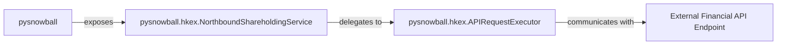

## Details

The `pysnowball` subsystem provides a Python interface to various external financial APIs, primarily focusing on data retrieval. At its core, the `pysnowball` package acts as a unified entry point, exposing specialized services like `pysnowball.hkex.NorthboundShareholdingService`. This service handles high-level data requests, which are then translated into low-level HTTP operations by the `pysnowball.hkex.APIRequestExecutor`. The `APIRequestExecutor` is solely responsible for direct communication with the `External Financial API Endpoint`, which represents the actual third-party data providers. This layered architecture ensures a clear separation of concerns, from high-level data abstraction to the fundamental network interactions with external services.

### pysnowball
The top-level library component that acts as a comprehensive wrapper for various external financial APIs. It provides a unified interface for users to access diverse financial data without needing to interact directly with the underlying API complexities.

**Related Classes/Methods**:

- <a href="https://github.com/uname-yang/pysnowball/blob/master/pysnowball/__init__.py#L1-L39" target="_blank" rel="noopener noreferrer">`pysnowball`:1-39</a>

### pysnowball.hkex.NorthboundShareholdingService
This component provides a high-level, specialized interface for retrieving northbound shareholding data for specific stock exchanges (e.g., Shanghai, Shenzhen). It abstracts the details of specific data requests, preparing parameters and delegating the actual API call. This component consolidates the functionality of `northbound_shareholding_sh` and `northbound_shareholding_sz`.

**Related Classes/Methods**:

- <a href="https://github.com/uname-yang/pysnowball/blob/master/pysnowball/hkex.py#L18-L22" target="_blank" rel="noopener noreferrer">`pysnowball.hkex.northbound_shareholding_sh`:18-22</a>
- <a href="https://github.com/uname-yang/pysnowball/blob/master/pysnowball/hkex.py#L25-L29" target="_blank" rel="noopener noreferrer">`pysnowball.hkex.northbound_shareholding_sz`:25-29</a>

### pysnowball.hkex.APIRequestExecutor
This component is responsible for the low-level mechanics of making HTTP requests to the external financial APIs. It handles URL construction, parameter encoding, and the execution of the actual network call, serving as the central point for fetching raw data. This component maps directly to `_get_shareholding`.

**Related Classes/Methods**:

- <a href="https://github.com/uname-yang/pysnowball/blob/master/pysnowball/hkex.py#L32-L55" target="_blank" rel="noopener noreferrer">`pysnowball.hkex._get_shareholding`:32-55</a>

### External Financial API Endpoint
Represents the actual external financial data providers (e.g., Xueqiu API) that serve as the authoritative sources for raw stock market and financial information. This component is external to the `pysnowball` library and does not have internal source code references within the project.

**Related Classes/Methods**: _None_

### [FAQ](https://github.com/CodeBoarding/GeneratedOnBoardings/tree/main?tab=readme-ov-file#faq)