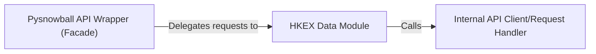

## Details

The `Pysnowball API Wrapper` subsystem is defined by the `pysnowball` package and its internal modules, specifically focusing on data access and retrieval from the Xueqiu API.

### Pysnowball API Wrapper (Facade) [[Expand]](./Pysnowball_API_Wrapper_Facade_.md)
The top-level facade of the `pysnowball` library, providing a simplified Pythonic interface to various financial data sources. It acts as the primary interface for the User/Client Application and dispatches requests to specific data modules.

**Related Classes/Methods**:

- <a href="https://github.com/uname-yang/pysnowball/blob/master/pysnowball" target="_blank" rel="noopener noreferrer">`pysnowball`</a>

### HKEX Data Module
A dedicated module within `pysnowball` responsible for handling all requests and data related to the Hong Kong Stock Exchange (HKEX). It encapsulates HKEX-specific API endpoints and data structures.

**Related Classes/Methods**:

- <a href="https://github.com/uname-yang/pysnowball/blob/master/pysnowball/hkex.py" target="_blank" rel="noopener noreferrer">`pysnowball.hkex`</a>

### Internal API Client/Request Handler
An internal helper component within the `HKEX Data Module` that encapsulates the core logic for making HTTP requests to fetch northbound shareholding data. It handles common parameters and the raw API response.

**Related Classes/Methods**:

- <a href="https://github.com/uname-yang/pysnowball/blob/master/pysnowball/hkex.py#L32-L55" target="_blank" rel="noopener noreferrer">`pysnowball.hkex._get_shareholding`:32-55</a>

### [FAQ](https://github.com/CodeBoarding/GeneratedOnBoardings/tree/main?tab=readme-ov-file#faq)