```mermaid
graph LR
    User_Client_Application["User/Client Application"]
    Pysnowball_API_Wrapper_Facade_["Pysnowball API Wrapper (Facade)"]
    Authentication_Configuration["Authentication & Configuration"]
    Request_Response_Handler["Request & Response Handler"]
    Data_Specific_Modules["Data Specific Modules"]
    External_Financial_APIs["External Financial APIs"]
    User_Client_Application -- "requests data from" --> Pysnowball_API_Wrapper_Facade_
    Pysnowball_API_Wrapper_Facade_ -- "delegates request to" --> Data_Specific_Modules
    Data_Specific_Modules -- "retrieves config from" --> Authentication_Configuration
    Data_Specific_Modules -- "invokes request via" --> Request_Response_Handler
    Request_Response_Handler -- "sends requests to" --> External_Financial_APIs
    External_Financial_APIs -- "returns raw data to" --> Request_Response_Handler
    Request_Response_Handler -- "provides parsed data to" --> Data_Specific_Modules
    Data_Specific_Modules -- "returns processed data to" --> Pysnowball_API_Wrapper_Facade_
    Pysnowball_API_Wrapper_Facade_ -- "returns data to" --> User_Client_Application
    click Pysnowball_API_Wrapper_Facade_ href "https://github.com/CodeBoarding/GeneratedOnBoardings/blob/main/pysnowball/Pysnowball_API_Wrapper_Facade_.md" "Details"
    click External_Financial_APIs href "https://github.com/CodeBoarding/GeneratedOnBoardings/blob/main/pysnowball/External_Financial_APIs.md" "Details"
```

## Details

The pysnowball library functions as a robust API wrapper, abstracting the complexities of interacting with various External Financial APIs for a User/Client Application. The core interaction begins with the User/Client Application initiating data requests through the Pysnowball API Wrapper (Facade). This facade acts as the central orchestrator, delegating requests to the appropriate Data Specific Modules based on the type of financial data required. Each Data Specific Module is responsible for preparing the specific API request, often retrieving necessary authentication tokens and endpoint URLs from the Authentication & Configuration component. The prepared request is then handed over to the Request & Response Handler, which manages the actual HTTP communication with the External Financial APIs. Upon receiving raw data, the Request & Response Handler parses it into a structured format before returning it to the originating Data Specific Module. Finally, the processed and structured data is returned through the Pysnowball API Wrapper (Facade) back to the User/Client Application. This architecture ensures a clear separation of concerns, simplifying data access for users while centralizing API interaction, authentication, and data parsing within the library.

### User/Client Application
Represents any external application or script that consumes the pysnowball library to access financial data. This is the entry point for all data requests.

**Related Classes/Methods**: _None_

### Pysnowball API Wrapper (Facade) [[Expand]](./Pysnowball_API_Wrapper_Facade_.md)
The top-level facade of the pysnowball library, providing a simplified Pythonic interface to various financial data sources. It acts as the primary interface for the User/Client Application and dispatches requests to specific data modules.

**Related Classes/Methods**:

- <a href="https://github.com/uname-yang/pysnowball/blob/master/pysnowball" target="_blank" rel="noopener noreferrer">`pysnowball`</a>
- <a href="https://github.com/uname-yang/pysnowball/blob/master/pysnowball/hkex.py" target="_blank" rel="noopener noreferrer">`pysnowball.hkex`</a>

### Authentication & Configuration
Manages the retrieval and provision of authentication tokens (e.g., cookies) and centralizes the definition and storage of various API endpoint URLs.

**Related Classes/Methods**:

- <a href="https://github.com/uname-yang/pysnowball/blob/master/pysnowball/token.py" target="_blank" rel="noopener noreferrer">`pysnowball.token`</a>
- <a href="https://github.com/uname-yang/pysnowball/blob/master/pysnowball/api_ref.py" target="_blank" rel="noopener noreferrer">`pysnowball.api_ref`</a>

### Request & Response Handler
The core component responsible for making HTTP/HTTPS requests to external APIs and parsing the raw responses (e.g., JSON, HTML) into structured Python data.

**Related Classes/Methods**:

- <a href="https://github.com/uname-yang/pysnowball/blob/master/pysnowball/utls.py" target="_blank" rel="noopener noreferrer">`pysnowball.utls`</a>

### Data Specific Modules
A group of modules, each dedicated to a specific category of financial data (e.g., HKEX, Fund, Finance, Realtime). These modules contain the business logic for preparing requests and processing responses for their respective domains.

**Related Classes/Methods**:

- <a href="https://github.com/uname-yang/pysnowball/blob/master/pysnowball/hkex.py" target="_blank" rel="noopener noreferrer">`pysnowball.hkex`</a>
- <a href="https://github.com/uname-yang/pysnowball/blob/master/pysnowball/fund.py" target="_blank" rel="noopener noreferrer">`pysnowball.fund`</a>
- <a href="https://github.com/uname-yang/pysnowball/blob/master/pysnowball/finance.py" target="_blank" rel="noopener noreferrer">`pysnowball.finance`</a>
- <a href="https://github.com/uname-yang/pysnowball/blob/master/pysnowball/realtime.py" target="_blank" rel="noopener noreferrer">`pysnowball.realtime`</a>
- <a href="https://github.com/uname-yang/pysnowball/blob/master/pysnowball/bond.py" target="_blank" rel="noopener noreferrer">`pysnowball.bond`</a>
- <a href="https://github.com/uname-yang/pysnowball/blob/master/pysnowball/capital.py" target="_blank" rel="noopener noreferrer">`pysnowball.capital`</a>
- <a href="https://github.com/uname-yang/pysnowball/blob/master/pysnowball/cube.py" target="_blank" rel="noopener noreferrer">`pysnowball.cube`</a>
- <a href="https://github.com/uname-yang/pysnowball/blob/master/pysnowball/f10.py" target="_blank" rel="noopener noreferrer">`pysnowball.f10`</a>
- <a href="https://github.com/uname-yang/pysnowball/blob/master/pysnowball/index.py" target="_blank" rel="noopener noreferrer">`pysnowball.index`</a>
- <a href="https://github.com/uname-yang/pysnowball/blob/master/pysnowball/report.py" target="_blank" rel="noopener noreferrer">`pysnowball.report`</a>
- <a href="https://github.com/uname-yang/pysnowball/blob/master/pysnowball/suggest.py" target="_blank" rel="noopener noreferrer">`pysnowball.suggest`</a>
- <a href="https://github.com/uname-yang/pysnowball/blob/master/pysnowball/user.py" target="_blank" rel="noopener noreferrer">`pysnowball.user`</a>

### External Financial APIs [[Expand]](./External_Financial_APIs.md)
Represents the external financial data APIs (e.g., Xueqiu, Eastmoney, CSIndex, Danjuan Fund) that serve as the authoritative sources for raw stock market and financial information.

**Related Classes/Methods**: _None_

### [FAQ](https://github.com/CodeBoarding/GeneratedOnBoardings/tree/main?tab=readme-ov-file#faq)