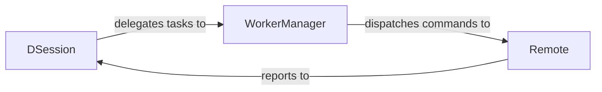

## Details

The Inter-Process Communication (IPC) Layer subsystem in pytest-xdist is crucial for enabling distributed test execution by facilitating communication between the central Coordinator (main pytest process) and the various Worker processes. This layer abstracts the underlying communication mechanisms, allowing for the exchange of commands, test items, results, and events.

### DSession
As the central orchestrator, DSession acts as the primary communication endpoint for receiving test results, collection reports, and various lifecycle events from all worker processes. It initiates the distributed test run and aggregates all incoming data to provide a unified view of the test session. While it delegates the direct management of worker processes, it remains the ultimate recipient and consolidator of all worker-generated information.

**Related Classes/Methods**:

- <a href="https://github.com/pytest-dev/pytest-xdist/blob/master/src/xdist/dsession.py#L32-L452" target="_blank" rel="noopener noreferrer">`xdist.dsession.DSession`:32-452</a>

### WorkerManager
WorkerManager is responsible for the lifecycle management of worker processes from the coordinator's perspective. It sets up new worker nodes, handles file synchronization (rsync) to worker environments, and, critically for IPC, dispatches commands (e.g., "run tests," "steal tests") to the individual Remote Worker instances. It serves as the DSession's primary interface for sending instructions to workers.

**Related Classes/Methods**:

- <a href="https://github.com/pytest-dev/pytest-xdist/blob/master/src/xdist/workermanage.py" target="_blank" rel="noopener noreferrer">`xdist.workermanage.WorkerManager`</a>

### Remote
Remote represents an individual worker process from the perspective of the coordinator. It is the actual endpoint on the worker side that receives commands dispatched by the WorkerManager and executes the assigned tests. Crucially for IPC, it is responsible for sending back test results, collection reports, and various lifecycle events (e.g., "worker started," "test finished") to the DSession component.

**Related Classes/Methods**:

- <a href="https://github.com/pytest-dev/pytest-xdist/blob/master/src/xdist/remote.py" target="_blank" rel="noopener noreferrer">`xdist.remote`</a>

### [FAQ](https://github.com/CodeBoarding/GeneratedOnBoardings/tree/main?tab=readme-ov-file#faq)