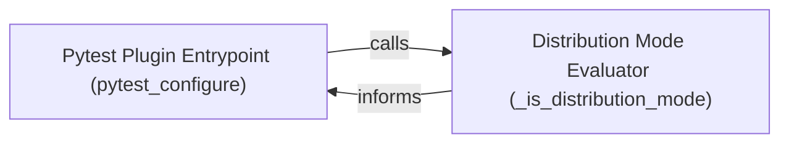

## Details

The `Pytest Plugin Integration` subsystem encompasses the initial setup and configuration logic of `pytest-xdist` as it integrates with the core `pytest` framework. Its boundaries are defined by the components responsible for parsing `pytest-xdist`-specific command-line arguments, determining the execution mode (distributed vs. non-distributed), and preparing the `pytest` session for the subsequent orchestration of distributed test execution. This subsystem acts as the initial bridge between the standard `pytest` execution flow and `pytest-xdist`'s distributed capabilities.

### Pytest Plugin Entrypoint (pytest_configure)
This component serves as the primary orchestrator for `pytest-xdist`'s initial setup within the `pytest` framework. It is responsible for parsing command-line arguments specific to `pytest-xdist`, configuring the `pytest` session for distributed execution, and initiating the overall distributed test run. It embodies the "Main Process/Coordinator" role by preparing the environment for subsequent worker management.

**Related Classes/Methods**:

- <a href="https://github.com/pytest-dev/pytest-xdist/blob/master/src/xdist/plugin.py#L260-L296" target="_blank" rel="noopener noreferrer">`pytest_configure`:260-296</a>

### Distribution Mode Evaluator (_is_distribution_mode)
This component acts as a crucial decision-making helper. Its responsibility is to evaluate the current `pytest` session's configuration and command-line arguments to determine whether `pytest-xdist`'s distributed execution features should be enabled. This function ensures that `pytest-xdist` only activates its distributed logic when explicitly requested or configured, serving as a guard for the distributed execution flow.

**Related Classes/Methods**:

- <a href="https://github.com/pytest-dev/pytest-xdist/blob/master/src/xdist/plugin.py#L299-L301" target="_blank" rel="noopener noreferrer">`_is_distribution_mode`:299-301</a>

### [FAQ](https://github.com/CodeBoarding/GeneratedOnBoardings/tree/main?tab=readme-ov-file#faq)