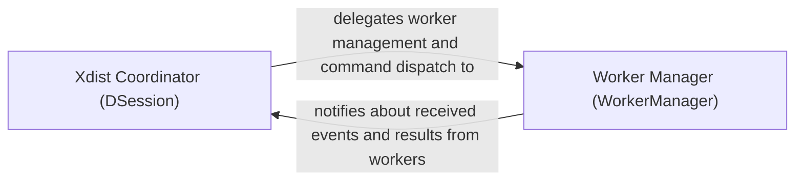

## Details

The `pytest-xdist` subsystem for distributed testing is orchestrated by the `Xdist Coordinator (DSession)`, which acts as the central master node. It manages the overall test execution, delegating the setup, teardown, and command dispatch to worker nodes through the `Worker Manager (WorkerManager)`. The `Worker Manager` is responsible for the lifecycle of individual worker processes and handles the low-level communication. It forwards events and test results received from the workers back to the `Xdist Coordinator` for aggregation and final reporting.

### Xdist Coordinator (DSession)
The central orchestrator of the distributed test session. It acts as the master node, managing the overall test execution flow. Its responsibilities include initiating the test run, distributing test items to worker nodes (delegating the actual sending to the Worker Manager), aggregating all results (test reports, collection reports) and events from the workers, and handling worker lifecycle events such as errors or shutdowns. It maintains the global state of the distributed session.

**Related Classes/Methods**:

- <a href="https://github.com/pytest-dev/pytest-xdist/blob/master/src/xdist/dsession.py#L32-L452" target="_blank" rel="noopener noreferrer">`xdist.dsession.DSession`:32-452</a>
- <a href="https://github.com/pytest-dev/pytest-xdist/blob/master/src/xdist/dsession.py#L128-L144" target="_blank" rel="noopener noreferrer">`xdist.dsession.pytest_runtestloop`:128-144</a>
- <a href="https://github.com/pytest-dev/pytest-xdist/blob/master/src/xdist/dsession.py" target="_blank" rel="noopener noreferrer">`xdist.dsession.DSession.worker_testreport`</a>
- <a href="https://github.com/pytest-dev/pytest-xdist/blob/master/src/xdist/dsession.py" target="_blank" rel="noopener noreferrer">`xdist.dsession.DSession.worker_collectreport`</a>
- <a href="https://github.com/pytest-dev/pytest-xdist/blob/master/src/xdist/dsession.py" target="_blank" rel="noopener noreferrer">`xdist.dsession.DSession.worker_errordown`</a>

### Worker Manager (WorkerManager)
Responsible for managing the lifecycle of worker nodes. This includes setting up and tearing down worker processes, establishing and maintaining communication channels with them, and acting as the primary interface for sending commands/test items to workers and receiving raw messages/events from them. It abstracts the underlying inter-process communication (IPC) details from the DSession coordinator.

**Related Classes/Methods**:

- <a href="https://github.com/pytest-dev/pytest-xdist/blob/master/src/xdist/workermanage.py" target="_blank" rel="noopener noreferrer">`xdist.workermanage.WorkerManager`</a>
- <a href="https://github.com/pytest-dev/pytest-xdist/blob/master/src/xdist/workermanage.py" target="_blank" rel="noopener noreferrer">`xdist.workermanage.WorkerManager.setup_nodes`</a>
- <a href="https://github.com/pytest-dev/pytest-xdist/blob/master/src/xdist/workermanage.py" target="_blank" rel="noopener noreferrer">`xdist.workermanage.WorkerManager.sendcommand`</a>
- <a href="https://github.com/pytest-dev/pytest-xdist/blob/master/src/xdist/workermanage.py" target="_blank" rel="noopener noreferrer">`xdist.workermanage.WorkerManager.process_from_remote`</a>

### [FAQ](https://github.com/CodeBoarding/GeneratedOnBoardings/tree/main?tab=readme-ov-file#faq)