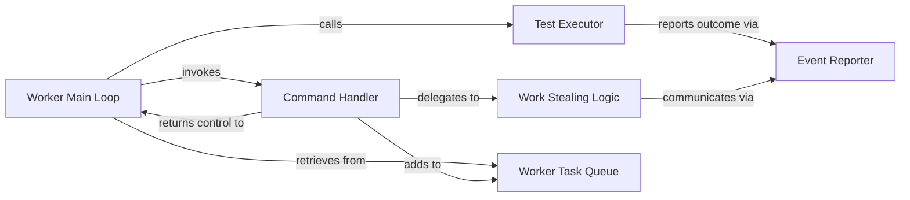

## Details

The `pytest-xdist` worker subsystem is designed to execute tests in a distributed environment, acting as a remote agent that receives commands, runs tests, and reports results back to a central coordinator. Its core functionality revolves around a main loop that continuously fetches tasks from an internal queue, processes them, and communicates test outcomes and status updates. The subsystem also incorporates logic for handling various commands from the coordinator, including work-stealing requests, to ensure efficient workload distribution and resource utilization across the distributed test setup.

### Worker Main Loop
Acts as the central orchestrator for the worker process. It manages the continuous execution loop, fetching commands or test items and dispatching them for processing.

**Related Classes/Methods**:

### Test Executor
Executes a single test item assigned to the worker. It encapsulates the logic for running the test and capturing its outcome.

**Related Classes/Methods**:

### Event Reporter
Serves as the primary communication mechanism for the worker to send various events, test reports, and status updates back to the coordinator (master process).

**Related Classes/Methods**:

### Command Handler
Interprets and executes specific control commands received from the coordinator. These commands can include instructions to add test items, initiate work-stealing, or other operational directives.

**Related Classes/Methods**:

### Work Stealing Logic
Implements the work-stealing mechanism, allowing an idle worker to request and acquire test items from other busy workers. This optimizes resource utilization and balances the workload across the distributed test environment.

**Related Classes/Methods**:

### Worker Task Queue
An internal data structure (likely a queue) used for buffering and managing incoming commands and test items within the worker process. It decouples the reception of messages from their immediate processing, ensuring smooth operation.

**Related Classes/Methods**:

- <a href="https://github.com/pytest-dev/pytest-xdist/blob/master/src/xdist/remote.py#L74-L109" target="_blank" rel="noopener noreferrer">`xdist.remote.TestQueue`:74-109</a>

### [FAQ](https://github.com/CodeBoarding/GeneratedOnBoardings/tree/main?tab=readme-ov-file#faq)