```mermaid
graph LR
    Pytest_Plugin_Integration["Pytest Plugin Integration"]
    Xdist_Coordinator_Master_Process_["Xdist Coordinator (Master Process)"]
    Xdist_Worker_Slave_Process_["Xdist Worker (Slave Process)"]
    Test_Item_Scheduler["Test Item Scheduler"]
    Inter_Process_Communication_IPC_Layer["Inter-Process Communication (IPC) Layer"]
    Pytest_Plugin_Integration -- "Initializes Distributed Session" --> Xdist_Coordinator_Master_Process_
    Xdist_Coordinator_Master_Process_ -- "Spawns & Manages Workers" --> Xdist_Worker_Slave_Process_
    Xdist_Coordinator_Master_Process_ -- "Requests Test Distribution Strategy" --> Test_Item_Scheduler
    Test_Item_Scheduler -- "Provides Test Item Batches" --> Xdist_Coordinator_Master_Process_
    Xdist_Coordinator_Master_Process_ -- "Sends Commands / Receives Events" --> Inter_Process_Communication_IPC_Layer
    Inter_Process_Communication_IPC_Layer -- "Receives Tests / Sends Results" --> Xdist_Worker_Slave_Process_
    click Pytest_Plugin_Integration href "https://github.com/CodeBoarding/GeneratedOnBoardings/blob/main/pytest-xdist/Pytest_Plugin_Integration.md" "Details"
    click Xdist_Coordinator_Master_Process_ href "https://github.com/CodeBoarding/GeneratedOnBoardings/blob/main/pytest-xdist/Xdist_Coordinator_Master_Process_.md" "Details"
    click Xdist_Worker_Slave_Process_ href "https://github.com/CodeBoarding/GeneratedOnBoardings/blob/main/pytest-xdist/Xdist_Worker_Slave_Process_.md" "Details"
    click Inter_Process_Communication_IPC_Layer href "https://github.com/CodeBoarding/GeneratedOnBoardings/blob/main/pytest-xdist/Inter_Process_Communication_IPC_Layer.md" "Details"
```

## Details

`pytest-xdist` extends `pytest` to enable distributed test execution. The architecture centers around a `Pytest Plugin Integration` that initializes a `Xdist Coordinator (Master Process)`. This Coordinator manages multiple `Xdist Worker (Slave Process)` instances, distributing test items via a `Test Item Scheduler` and communicating through a robust `Inter-Process Communication (IPC) Layer`. This design ensures efficient parallel test execution and centralized result aggregation, optimizing for both performance and maintainability.

### Pytest Plugin Integration [[Expand]](./Pytest_Plugin_Integration.md)
The initial interface that hooks `pytest-xdist` into the core `pytest` framework. It handles command-line argument parsing, session configuration, and the initiation of the distributed test run.

**Related Classes/Methods**:

- <a href="https://github.com/pytest-dev/pytest-xdist/blob/master/src/xdist/plugin.py#L260-L296" target="_blank" rel="noopener noreferrer">`xdist.plugin.pytest_configure`:260-296</a>

### Xdist Coordinator (Master Process) [[Expand]](./Xdist_Coordinator_Master_Process_.md)
The central orchestrator of the distributed test session. It manages worker lifecycles, distributes test items, and aggregates all results and events from the workers.

**Related Classes/Methods**:

- <a href="https://github.com/pytest-dev/pytest-xdist/blob/master/src/xdist/dsession.py#L32-L452" target="_blank" rel="noopener noreferrer">`xdist.dsession.DSession`:32-452</a>
- <a href="https://github.com/pytest-dev/pytest-xdist/blob/master/src/xdist/dsession.py#L128-L144" target="_blank" rel="noopener noreferrer">`xdist.dsession.pytest_runtestloop`:128-144</a>
- <a href="https://github.com/pytest-dev/pytest-xdist/blob/master/src/xdist/workermanage.py#L91-L97" target="_blank" rel="noopener noreferrer">`xdist.workermanage.WorkerManager.setup_nodes`:91-97</a>
- <a href="https://github.com/pytest-dev/pytest-xdist/blob/master/src/xdist/workermanage.py#L383-L386" target="_blank" rel="noopener noreferrer">`xdist.workermanage.WorkerManager.sendcommand`:383-386</a>
- <a href="https://github.com/pytest-dev/pytest-xdist/blob/master/src/xdist/dsession.py#L326-L330" target="_blank" rel="noopener noreferrer">`xdist.dsession.DSession.worker_testreport`:326-330</a>
- <a href="https://github.com/pytest-dev/pytest-xdist/blob/master/src/xdist/dsession.py#L357-L368" target="_blank" rel="noopener noreferrer">`xdist.dsession.DSession.worker_collectreport`:357-368</a>
- <a href="https://github.com/pytest-dev/pytest-xdist/blob/master/src/xdist/dsession.py#L238-L267" target="_blank" rel="noopener noreferrer">`xdist.dsession.DSession.worker_errordown`:238-267</a>
- <a href="https://github.com/pytest-dev/pytest-xdist/blob/master/src/xdist/workermanage.py#L392-L467" target="_blank" rel="noopener noreferrer">`xdist.workermanage.WorkerManager.process_from_remote`:392-467</a>

### Xdist Worker (Slave Process) [[Expand]](./Xdist_Worker_Slave_Process_.md)
An independent process responsible for executing a subset of test items assigned by the Coordinator and reporting its results.

**Related Classes/Methods**:

- <a href="https://github.com/pytest-dev/pytest-xdist/blob/master/src/xdist/remote.py#L200-L209" target="_blank" rel="noopener noreferrer">`xdist.remote.pytest_runtestloop`:200-209</a>
- <a href="https://github.com/pytest-dev/pytest-xdist/blob/master/src/xdist/remote.py#L211-L234" target="_blank" rel="noopener noreferrer">`xdist.remote.run_one_test`:211-234</a>
- <a href="https://github.com/pytest-dev/pytest-xdist/blob/master/src/xdist/remote.py#L124-L126" target="_blank" rel="noopener noreferrer">`xdist.remote.sendevent`:124-126</a>

### Test Item Scheduler
A specialized sub-component within the Coordinator's domain that implements various strategies for efficiently distributing test items among worker nodes.

**Related Classes/Methods**:

- <a href="https://github.com/pytest-dev/pytest-xdist/blob/master/src/xdist/scheduler/load.py#L14-L335" target="_blank" rel="noopener noreferrer">`xdist.scheduler.load.LoadScheduling`:14-335</a>
- <a href="https://github.com/pytest-dev/pytest-xdist/blob/master/src/xdist/scheduler/each.py#L13-L152" target="_blank" rel="noopener noreferrer">`xdist.scheduler.each.EachScheduling`:13-152</a>
- <a href="https://github.com/pytest-dev/pytest-xdist/blob/master/src/xdist/scheduler/loadfile.py#L10-L60" target="_blank" rel="noopener noreferrer">`xdist.scheduler.loadfile.LoadFileScheduling`:10-60</a>
- <a href="https://github.com/pytest-dev/pytest-xdist/blob/master/src/xdist/scheduler/loadgroup.py#L10-L59" target="_blank" rel="noopener noreferrer">`xdist.scheduler.loadgroup.LoadGroupScheduling`:10-59</a>
- <a href="https://github.com/pytest-dev/pytest-xdist/blob/master/src/xdist/scheduler/loadscope.py#L15-L438" target="_blank" rel="noopener noreferrer">`xdist.scheduler.loadscope.LoadScopeScheduling`:15-438</a>
- <a href="https://github.com/pytest-dev/pytest-xdist/blob/master/src/xdist/scheduler/worksteal.py" target="_blank" rel="noopener noreferrer">`xdist.scheduler.worksteal.WorkStealScheduling`</a>

### Inter-Process Communication (IPC) Layer [[Expand]](./Inter_Process_Communication_IPC_Layer.md)
The abstract communication channel facilitating data exchange (commands, test items, results, events) between the Coordinator and Worker processes.

**Related Classes/Methods**:

- <a href="https://github.com/pytest-dev/pytest-xdist/blob/master/src/xdist/dsession.py#L32-L452" target="_blank" rel="noopener noreferrer">`xdist.dsession.DSession`:32-452</a>
- <a href="https://github.com/pytest-dev/pytest-xdist/blob/master/src/xdist/remote.py" target="_blank" rel="noopener noreferrer">`xdist.remote`</a>
- <a href="https://github.com/pytest-dev/pytest-xdist/blob/master/src/xdist/workermanage.py" target="_blank" rel="noopener noreferrer">`xdist.workermanage.WorkerManager`</a>

### [FAQ](https://github.com/CodeBoarding/GeneratedOnBoardings/tree/main?tab=readme-ov-file#faq)