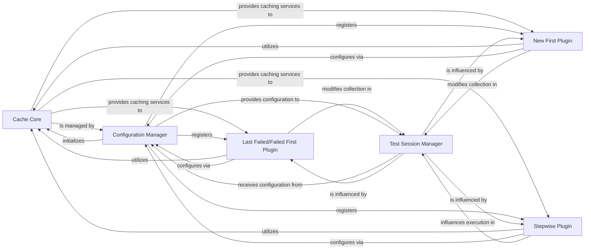

## Component Details

The Caching & Persistence subsystem in pytest provides mechanisms to store and retrieve data across test runs, enhancing performance and enabling features like re-running last-failed tests, failed-first execution, new-first execution, and stepwise test execution. It achieves this by leveraging a core caching component that interacts with various plugins and the main pytest configuration and session management.

### Cache Core
Provides the fundamental caching mechanism for pytest, allowing plugins to store and retrieve arbitrary data across test runs. It manages the cache directory (.pytest_cache) and offers methods for reading and writing cached values and directories.

**Related Classes/Methods**:

- <a href="https://github.com/pytest-dev/pytest/blob/master/src/_pytest/cacheprovider.py#L57-L246" target="_blank" rel="noopener noreferrer">`_pytest.cacheprovider.Cache` (57:246)</a>

### Last Failed/Failed First Plugin
Implements the --lf (run last-failing) and --ff (failed-first) command-line options, which reorder or filter tests based on their failure status in previous runs. It leverages the Cache Core to persist failure information and integrates with the test collection process.

**Related Classes/Methods**:

- <a href="https://github.com/pytest-dev/pytest/blob/master/src/_pytest/cacheprovider.py#L319-L429" target="_blank" rel="noopener noreferrer">`_pytest.cacheprovider.LFPlugin` (319:429)</a>
- <a href="https://github.com/pytest-dev/pytest/blob/master/src/_pytest/cacheprovider.py#L249-L298" target="_blank" rel="noopener noreferrer">`_pytest.cacheprovider.LFPluginCollWrapper` (249:298)</a>
- <a href="https://github.com/pytest-dev/pytest/blob/master/src/_pytest/cacheprovider.py#L301-L316" target="_blank" rel="noopener noreferrer">`_pytest.cacheprovider.LFPluginCollSkipfiles` (301:316)</a>

### New First Plugin
Implements the --nf (new-first) command-line option, which prioritizes running tests from newly created or modified files. It uses the Cache Core to track previously seen test files and modifies the test collection order.

**Related Classes/Methods**:

- <a href="https://github.com/pytest-dev/pytest/blob/master/src/_pytest/cacheprovider.py#L432-L475" target="_blank" rel="noopener noreferrer">`_pytest.cacheprovider.NFPlugin` (432:475)</a>

### Stepwise Plugin
Enables the 'stepwise' execution mode (--sw), where the test run stops on the first failure and can resume from that point in a subsequent run. It interacts with the Cache Core to store the last failed test's information and influences the session's execution flow.

**Related Classes/Methods**:

- <a href="https://github.com/pytest-dev/pytest/blob/master/src/_pytest/stepwise.py#L99-L209" target="_blank" rel="noopener noreferrer">`_pytest.stepwise.StepwisePlugin` (99:209)</a>
- <a href="https://github.com/pytest-dev/pytest/blob/master/src/_pytest/stepwise.py#L71-L96" target="_blank" rel="noopener noreferrer">`_pytest.stepwise.StepwiseCacheInfo` (71:96)</a>

### Configuration Manager
Manages pytest's overall configuration, including command-line options, ini file settings, and plugin registration. It provides a central Config object that other components interact with to access configuration data and register hooks.

**Related Classes/Methods**:

- `_pytest.config.Config` (full file reference)

### Test Session Manager
Oversees the entire lifecycle of a pytest test session, from test collection to execution and reporting. It manages the overall state of the test run and provides mechanisms for plugins to influence the collection and execution flow.

**Related Classes/Methods**:

- <a href="https://github.com/pytest-dev/pytest/blob/master/src/_pytest/main.py#L548-L981" target="_blank" rel="noopener noreferrer">`_pytest.main.Session` (548:981)</a>

### [FAQ](https://github.com/CodeBoarding/GeneratedOnBoardings/tree/main?tab=readme-ov-file#faq)