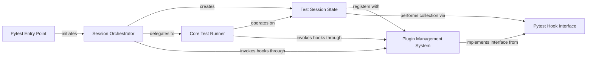

## Component Details

The `Core Test Orchestration` subsystem in pytest is responsible for managing the entire lifecycle of a test run. It starts from the command-line invocation, orchestrates the creation and management of the test session, handles test collection and execution, and ensures proper reporting and error handling. This central hub coordinates various components, leveraging a robust plugin system to allow for extensibility and customization at different stages of the testing process.

### Pytest Entry Point
This is the initial function called when pytest is executed from the command line, responsible for starting the test run by delegating to the session wrapper.

**Related Classes/Methods**:

- <a href="https://github.com/pytest-dev/pytest/blob/master/src/_pytest/main.py#L335-L336" target="_blank" rel="noopener noreferrer">`_pytest.main.pytest_cmdline_main` (335:336)</a>

### Session Orchestrator
This component manages the overall lifecycle of a pytest test session, including session initialization, execution of the main test logic, and robust error handling. It acts as a wrapper around the core test execution.

**Related Classes/Methods**:

- <a href="https://github.com/pytest-dev/pytest/blob/master/src/_pytest/main.py#L276-L332" target="_blank" rel="noopener noreferrer">`_pytest.main.wrap_session` (276:332)</a>

### Core Test Runner
This component contains the fundamental logic for collecting and running tests within a pytest session, invoking relevant hooks for collection and test execution.

**Related Classes/Methods**:

- <a href="https://github.com/pytest-dev/pytest/blob/master/src/_pytest/main.py#L339-L349" target="_blank" rel="noopener noreferrer">`_pytest.main._main` (339:349)</a>

### Test Session State
This class encapsulates the state and data related to an active pytest session, such as collected test items, test results, and provides methods for interacting with the plugin system and performing collection.

**Related Classes/Methods**:

- <a href="https://github.com/pytest-dev/pytest/blob/master/src/_pytest/main.py#L548-L981" target="_blank" rel="noopener noreferrer">`_pytest.main.Session` (548:981)</a>

### Plugin Management System
This component is responsible for the discovery, loading, and management of pytest plugins, providing the mechanism for extending pytest's core functionality through a hook-based architecture.

**Related Classes/Methods**:

- `_pytest.config.PytestPluginManager` (102:102)

### Pytest Hook Interface
This module defines the formal specifications for all available pytest hooks, serving as a contract for plugins to extend or modify pytest's behavior at various stages of the test run.

**Related Classes/Methods**:

- <a href="https://github.com/pytest-dev/pytest/blob/master/src/_pytest/hookspec.py#L1-L100" target="_blank" rel="noopener noreferrer">`_pytest.hookspec` (1:100)</a>

### [FAQ](https://github.com/CodeBoarding/GeneratedOnBoardings/tree/main?tab=readme-ov-file#faq)