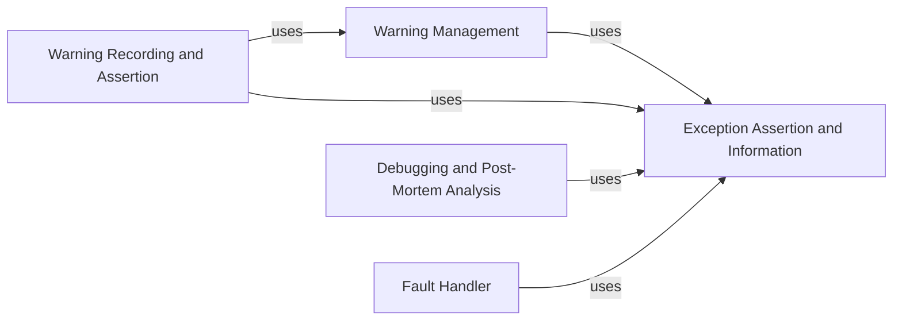

## Component Details

This subsystem is responsible for comprehensive error and warning handling within the pytest framework. It encompasses the management, recording, and assertion of various warning types, integration with debugging tools for post-mortem analysis, and robust fault handling mechanisms. The core purpose is to provide detailed exception information and allow for programmatic assertion of expected errors and warnings, aiding in test stability and debugging.

### Warning Management
This component is responsible for handling and recording warnings during the pytest execution. It provides context managers to catch warnings at different stages (config, collect, runtest) and applies warning filters based on configuration and markers. It also defines various PytestWarning types for different scenarios.

**Related Classes/Methods**:

- <a href="https://github.com/pytest-dev/pytest/blob/master/src/_pytest/warnings.py#L1-L100" target="_blank" rel="noopener noreferrer">`_pytest.warnings` (1:100)</a>
- <a href="https://github.com/pytest-dev/pytest/blob/master/src/_pytest/warning_types.py#L13-L16" target="_blank" rel="noopener noreferrer">`_pytest.warning_types.PytestWarning` (13:16)</a>
- <a href="https://github.com/pytest-dev/pytest/blob/master/src/_pytest/warning_types.py#L20-L23" target="_blank" rel="noopener noreferrer">`_pytest.warning_types.PytestAssertRewriteWarning` (20:23)</a>
- <a href="https://github.com/pytest-dev/pytest/blob/master/src/_pytest/warning_types.py#L27-L30" target="_blank" rel="noopener noreferrer">`_pytest.warning_types.PytestCacheWarning` (27:30)</a>
- <a href="https://github.com/pytest-dev/pytest/blob/master/src/_pytest/warning_types.py#L34-L37" target="_blank" rel="noopener noreferrer">`_pytest.warning_types.PytestConfigWarning` (34:37)</a>
- <a href="https://github.com/pytest-dev/pytest/blob/master/src/_pytest/warning_types.py#L41-L44" target="_blank" rel="noopener noreferrer">`_pytest.warning_types.PytestCollectionWarning` (41:44)</a>
- <a href="https://github.com/pytest-dev/pytest/blob/master/src/_pytest/warning_types.py#L47-L50" target="_blank" rel="noopener noreferrer">`_pytest.warning_types.PytestDeprecationWarning` (47:50)</a>
- <a href="https://github.com/pytest-dev/pytest/blob/master/src/_pytest/warning_types.py#L53-L56" target="_blank" rel="noopener noreferrer">`_pytest.warning_types.PytestRemovedIn9Warning` (53:56)</a>
- <a href="https://github.com/pytest-dev/pytest/blob/master/src/_pytest/warning_types.py#L60-L71" target="_blank" rel="noopener noreferrer">`_pytest.warning_types.PytestExperimentalApiWarning` (60:71)</a>
- <a href="https://github.com/pytest-dev/pytest/blob/master/src/_pytest/warning_types.py#L75-L81" target="_blank" rel="noopener noreferrer">`_pytest.warning_types.PytestUnknownMarkWarning` (75:81)</a>
- <a href="https://github.com/pytest-dev/pytest/blob/master/src/_pytest/warning_types.py#L85-L93" target="_blank" rel="noopener noreferrer">`_pytest.warning_types.PytestUnraisableExceptionWarning` (85:93)</a>
- <a href="https://github.com/pytest-dev/pytest/blob/master/src/_pytest/warning_types.py#L97-L103" target="_blank" rel="noopener noreferrer">`_pytest.warning_types.PytestUnhandledThreadExceptionWarning` (97:103)</a>
- <a href="https://github.com/pytest-dev/pytest/blob/master/src/_pytest/warning_types.py#L111-L123" target="_blank" rel="noopener noreferrer">`_pytest.warning_types.UnformattedWarning` (111:123)</a>
- <a href="https://github.com/pytest-dev/pytest/blob/master/src/_pytest/warning_types.py#L127-L130" target="_blank" rel="noopener noreferrer">`_pytest.warning_types.PytestFDWarning` (127:130)</a>
- <a href="https://github.com/pytest-dev/pytest/blob/master/src/_pytest/warning_types.py#L133-L155" target="_blank" rel="noopener noreferrer">`_pytest.warning_types.warn_explicit_for` (133:155)</a>

### Warning Recording and Assertion
This component provides functionalities to record and assert warnings within tests. It offers a `recwarn` fixture to capture warnings and `warns` and `deprecated_call` functions to assert that specific warnings are raised by a code block or function call. It also includes `WarningsChecker` for detailed warning matching.

**Related Classes/Methods**:

- <a href="https://github.com/pytest-dev/pytest/blob/master/src/_pytest/recwarn.py#L260-L367" target="_blank" rel="noopener noreferrer">`_pytest.recwarn.WarningsChecker` (260:367)</a>
- <a href="https://github.com/pytest-dev/pytest/blob/master/src/_pytest/recwarn.py#L34-L42" target="_blank" rel="noopener noreferrer">`_pytest.recwarn.recwarn` (34:42)</a>
- <a href="https://github.com/pytest-dev/pytest/blob/master/src/_pytest/recwarn.py#L46-L48" target="_blank" rel="noopener noreferrer">`_pytest.recwarn.deprecated_call` (46:48)</a>
- <a href="https://github.com/pytest-dev/pytest/blob/master/src/_pytest/recwarn.py#L90-L94" target="_blank" rel="noopener noreferrer">`_pytest.recwarn.warns` (90:94)</a>
- <a href="https://github.com/pytest-dev/pytest/blob/master/src/_pytest/recwarn.py#L170-L256" target="_blank" rel="noopener noreferrer">`_pytest.recwarn.WarningsRecorder` (170:256)</a>

### Debugging and Post-Mortem Analysis
This component integrates Python's interactive debugger (PDB) into pytest. It allows users to start PDB on errors or KeyboardInterrupt, specify a custom debugger, and immediately break when running each test. It also handles post-mortem debugging for internal errors and provides utilities for capturing and displaying output during debugging sessions.

**Related Classes/Methods**:

- <a href="https://github.com/pytest-dev/pytest/blob/master/src/_pytest/debugging.py#L1-L100" target="_blank" rel="noopener noreferrer">`_pytest.debugging` (1:100)</a>
- <a href="https://github.com/pytest-dev/pytest/blob/master/src/_pytest/debugging.py#L30-L38" target="_blank" rel="noopener noreferrer">`_pytest.debugging._validate_usepdb_cls` (30:38)</a>
- <a href="https://github.com/pytest-dev/pytest/blob/master/src/_pytest/debugging.py#L41-L62" target="_blank" rel="noopener noreferrer">`_pytest.debugging.pytest_addoption` (41:62)</a>
- <a href="https://github.com/pytest-dev/pytest/blob/master/src/_pytest/debugging.py#L65-L89" target="_blank" rel="noopener noreferrer">`_pytest.debugging.pytest_configure` (65:89)</a>
- <a href="https://github.com/pytest-dev/pytest/blob/master/src/_pytest/debugging.py#L92-L284" target="_blank" rel="noopener noreferrer">`_pytest.debugging.pytestPDB` (92:284)</a>
- <a href="https://github.com/pytest-dev/pytest/blob/master/src/_pytest/debugging.py#L287-L304" target="_blank" rel="noopener noreferrer">`_pytest.debugging.PdbInvoke` (287:304)</a>
- <a href="https://github.com/pytest-dev/pytest/blob/master/src/_pytest/debugging.py#L307-L311" target="_blank" rel="noopener noreferrer">`_pytest.debugging.PdbTrace` (307:311)</a>
- <a href="https://github.com/pytest-dev/pytest/blob/master/src/_pytest/debugging.py#L314-L330" target="_blank" rel="noopener noreferrer">`_pytest.debugging.wrap_pytest_function_for_tracing` (314:330)</a>
- <a href="https://github.com/pytest-dev/pytest/blob/master/src/_pytest/debugging.py#L333-L337" target="_blank" rel="noopener noreferrer">`_pytest.debugging.maybe_wrap_pytest_function_for_tracing` (333:337)</a>
- <a href="https://github.com/pytest-dev/pytest/blob/master/src/_pytest/debugging.py#L340-L368" target="_blank" rel="noopener noreferrer">`_pytest.debugging._enter_pdb` (340:368)</a>
- <a href="https://github.com/pytest-dev/pytest/blob/master/src/_pytest/debugging.py#L371-L399" target="_blank" rel="noopener noreferrer">`_pytest.debugging._postmortem_exc_or_tb` (371:399)</a>
- <a href="https://github.com/pytest-dev/pytest/blob/master/src/_pytest/debugging.py#L402-L407" target="_blank" rel="noopener noreferrer">`_pytest.debugging.post_mortem` (402:407)</a>

### Fault Handler
This component provides fault handling capabilities, specifically for dumping tracebacks of all threads if a test exceeds a specified timeout. It integrates with Python's `faulthandler` module to enable and disable traceback dumping and ensures proper file descriptor handling.

**Related Classes/Methods**:

- <a href="https://github.com/pytest-dev/pytest/blob/master/src/_pytest/faulthandler.py#L1-L100" target="_blank" rel="noopener noreferrer">`_pytest.faulthandler` (1:100)</a>
- <a href="https://github.com/pytest-dev/pytest/blob/master/src/_pytest/faulthandler.py#L100-L103" target="_blank" rel="noopener noreferrer">`_pytest.faulthandler.fault_handler_original_stderr_fd_key` (100:103)</a>
- <a href="https://github.com/pytest-dev/pytest/blob/master/src/_pytest/faulthandler.py#L105-L108" target="_blank" rel="noopener noreferrer">`_pytest.faulthandler.fault_handler_stderr_fd_key` (105:108)</a>
- <a href="https://github.com/pytest-dev/pytest/blob/master/src/_pytest/faulthandler.py#L18-L23" target="_blank" rel="noopener noreferrer">`_pytest.faulthandler.pytest_addoption` (18:23)</a>
- <a href="https://github.com/pytest-dev/pytest/blob/master/src/_pytest/faulthandler.py#L26-L38" target="_blank" rel="noopener noreferrer">`_pytest.faulthandler.pytest_configure` (26:38)</a>
- <a href="https://github.com/pytest-dev/pytest/blob/master/src/_pytest/faulthandler.py#L41-L52" target="_blank" rel="noopener noreferrer">`_pytest.faulthandler.pytest_unconfigure` (41:52)</a>
- <a href="https://github.com/pytest-dev/pytest/blob/master/src/_pytest/faulthandler.py#L55-L68" target="_blank" rel="noopener noreferrer">`_pytest.faulthandler.get_stderr_fileno` (55:68)</a>
- <a href="https://github.com/pytest-dev/pytest/blob/master/src/_pytest/faulthandler.py#L71-L72" target="_blank" rel="noopener noreferrer">`_pytest.faulthandler.get_timeout_config_value` (71:72)</a>
- <a href="https://github.com/pytest-dev/pytest/blob/master/src/_pytest/faulthandler.py#L76-L88" target="_blank" rel="noopener noreferrer">`_pytest.faulthandler.pytest_runtest_protocol` (76:88)</a>
- <a href="https://github.com/pytest-dev/pytest/blob/master/src/_pytest/faulthandler.py#L92-L96" target="_blank" rel="noopener noreferrer">`_pytest.faulthandler.pytest_enter_pdb` (92:96)</a>
- <a href="https://github.com/pytest-dev/pytest/blob/master/src/_pytest/faulthandler.py#L100-L105" target="_blank" rel="noopener noreferrer">`_pytest.faulthandler.pytest_exception_interact` (100:105)</a>

### Exception Assertion and Information
This component provides mechanisms for asserting that specific exceptions are raised and for capturing and inspecting detailed information about exceptions. It includes `pytest.raises` for asserting single exceptions or exception groups, and `ExceptionInfo` for encapsulating and navigating traceback information.

**Related Classes/Methods**:

- <a href="https://github.com/pytest-dev/pytest/blob/master/src/_pytest/raises.py#L382-L539" target="_blank" rel="noopener noreferrer">`_pytest.raises.AbstractRaises` (382:539)</a>
- <a href="https://github.com/pytest-dev/pytest/blob/master/src/_pytest/raises.py#L74-L79" target="_blank" rel="noopener noreferrer">`_pytest.raises.raises` (74:79)</a>
- <a href="https://github.com/pytest-dev/pytest/blob/master/src/_pytest/raises.py#L314-L316" target="_blank" rel="noopener noreferrer">`_pytest.raises._match_pattern` (314:316)</a>
- <a href="https://github.com/pytest-dev/pytest/blob/master/src/_pytest/raises.py#L319-L324" target="_blank" rel="noopener noreferrer">`_pytest.raises.repr_callable` (319:324)</a>
- <a href="https://github.com/pytest-dev/pytest/blob/master/src/_pytest/raises.py#L327-L328" target="_blank" rel="noopener noreferrer">`_pytest.raises.backquote` (327:328)</a>
- <a href="https://github.com/pytest-dev/pytest/blob/master/src/_pytest/raises.py#L331-L338" target="_blank" rel="noopener noreferrer">`_pytest.raises._exception_type_name` (331:338)</a>
- <a href="https://github.com/pytest-dev/pytest/blob/master/src/_pytest/raises.py#L341-L361" target="_blank" rel="noopener noreferrer">`_pytest.raises._check_raw_type` (341:361)</a>
- <a href="https://github.com/pytest-dev/pytest/blob/master/src/_pytest/raises.py#L364-L369" target="_blank" rel="noopener noreferrer">`_pytest.raises.is_fully_escaped` (364:369)</a>
- <a href="https://github.com/pytest-dev/pytest/blob/master/src/_pytest/raises.py#L372-L373" target="_blank" rel="noopener noreferrer">`_pytest.raises.unescape` (372:373)</a>
- <a href="https://github.com/pytest-dev/pytest/blob/master/src/_pytest/raises.py#L543-L730" target="_blank" rel="noopener noreferrer">`_pytest.raises.RaisesExc` (543:730)</a>
- <a href="https://github.com/pytest-dev/pytest/blob/master/src/_pytest/raises.py#L734-L1457" target="_blank" rel="noopener noreferrer">`_pytest.raises.RaisesGroup` (734:1457)</a>
- <a href="https://github.com/pytest-dev/pytest/blob/master/src/_pytest/raises.py#L1461-L1462" target="_blank" rel="noopener noreferrer">`_pytest.raises.NotChecked` (1461:1462)</a>
- <a href="https://github.com/pytest-dev/pytest/blob/master/src/_pytest/raises.py#L1465-L1507" target="_blank" rel="noopener noreferrer">`_pytest.raises.ResultHolder` (1465:1507)</a>
- <a href="https://github.com/pytest-dev/pytest/blob/master/src/_pytest/raises.py#L1510-L1519" target="_blank" rel="noopener noreferrer">`_pytest.raises.possible_match` (1510:1519)</a>
- <a href="https://github.com/pytest-dev/pytest/blob/master/src/_pytest/_code/code.py#L497-L853" target="_blank" rel="noopener noreferrer">`_pytest._code.code.ExceptionInfo` (497:853)</a>
- <a href="https://github.com/pytest-dev/pytest/blob/master/src/_pytest/_code/code.py#L61-L127" target="_blank" rel="noopener noreferrer">`_pytest._code.code.Code` (61:127)</a>
- <a href="https://github.com/pytest-dev/pytest/blob/master/src/_pytest/_code/code.py#L130-L189" target="_blank" rel="noopener noreferrer">`_pytest._code.code.Frame` (130:189)</a>
- <a href="https://github.com/pytest-dev/pytest/blob/master/src/_pytest/_code/code.py#L192-L353" target="_blank" rel="noopener noreferrer">`_pytest._code.code.TracebackEntry` (192:353)</a>
- <a href="https://github.com/pytest-dev/pytest/blob/master/src/_pytest/_code/code.py#L356-L462" target="_blank" rel="noopener noreferrer">`_pytest._code.code.Traceback` (356:462)</a>
- <a href="https://github.com/pytest-dev/pytest/blob/master/src/_pytest/_code/code.py#L465-L489" target="_blank" rel="noopener noreferrer">`_pytest._code.code.stringify_exception` (465:489)</a>
- <a href="https://github.com/pytest-dev/pytest/blob/master/src/_pytest/_code/code.py#L868-L1224" target="_blank" rel="noopener noreferrer">`_pytest._code.code.FormattedExcinfo` (868:1224)</a>
- <a href="https://github.com/pytest-dev/pytest/blob/master/src/_pytest/_code/code.py#L1228-L1241" target="_blank" rel="noopener noreferrer">`_pytest._code.code.TerminalRepr` (1228:1241)</a>
- <a href="https://github.com/pytest-dev/pytest/blob/master/src/_pytest/_code/code.py#L1246-L1260" target="_blank" rel="noopener noreferrer">`_pytest._code.code.ExceptionRepr` (1246:1260)</a>
- <a href="https://github.com/pytest-dev/pytest/blob/master/src/_pytest/_code/code.py#L1264-L1285" target="_blank" rel="noopener noreferrer">`_pytest._code.code.ExceptionChainRepr` (1264:1285)</a>
- <a href="https://github.com/pytest-dev/pytest/blob/master/src/_pytest/_code/code.py#L1289-L1295" target="_blank" rel="noopener noreferrer">`_pytest._code.code.ReprExceptionInfo` (1289:1295)</a>
- <a href="https://github.com/pytest-dev/pytest/blob/master/src/_pytest/_code/code.py#L1299-L1320" target="_blank" rel="noopener noreferrer">`_pytest._code.code.ReprTraceback` (1299:1320)</a>
- <a href="https://github.com/pytest-dev/pytest/blob/master/src/_pytest/_code/code.py#L1323-L1327" target="_blank" rel="noopener noreferrer">`_pytest._code.code.ReprTracebackNative` (1323:1327)</a>
- <a href="https://github.com/pytest-dev/pytest/blob/master/src/_pytest/_code/code.py#L1331-L1337" target="_blank" rel="noopener noreferrer">`_pytest._code.code.ReprEntryNative` (1331:1337)</a>
- <a href="https://github.com/pytest-dev/pytest/blob/master/src/_pytest/_code/code.py#L1341-L1422" target="_blank" rel="noopener noreferrer">`_pytest._code.code.ReprEntry` (1341:1422)</a>
- <a href="https://github.com/pytest-dev/pytest/blob/master/src/_pytest/_code/code.py#L1426-L1442" target="_blank" rel="noopener noreferrer">`_pytest._code.code.ReprFileLocation` (1426:1442)</a>
- <a href="https://github.com/pytest-dev/pytest/blob/master/src/_pytest/_code/code.py#L1446-L1451" target="_blank" rel="noopener noreferrer">`_pytest._code.code.ReprLocals` (1446:1451)</a>
- <a href="https://github.com/pytest-dev/pytest/blob/master/src/_pytest/_code/code.py#L1455-L1474" target="_blank" rel="noopener noreferrer">`_pytest._code.code.ReprFuncArgs` (1455:1474)</a>
- <a href="https://github.com/pytest-dev/pytest/blob/master/src/_pytest/_code/code.py#L1477-L1508" target="_blank" rel="noopener noreferrer">`_pytest._code.code.getfslineno` (1477:1508)</a>
- <a href="https://github.com/pytest-dev/pytest/blob/master/src/_pytest/_code/code.py#L1511-L1514" target="_blank" rel="noopener noreferrer">`_pytest._code.code._byte_offset_to_character_offset` (1511:1514)</a>
- <a href="https://github.com/pytest-dev/pytest/blob/master/src/_pytest/_code/code.py#L1529-L1555" target="_blank" rel="noopener noreferrer">`_pytest._code.code.filter_traceback` (1529:1555)</a>
- <a href="https://github.com/pytest-dev/pytest/blob/master/src/_pytest/_code/code.py#L1558-L1567" target="_blank" rel="noopener noreferrer">`_pytest._code.code.filter_excinfo_traceback` (1558:1567)</a>

### [FAQ](https://github.com/CodeBoarding/GeneratedOnBoardings/tree/main?tab=readme-ov-file#faq)