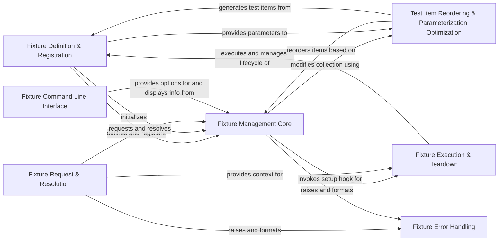

## Component Details

This component overview details the 'Fixture & Parameterization Management' subsystem in pytest, which is crucial for defining, discovering, injecting, and managing test fixtures and their parameterization. The core flow involves defining fixtures using the `@pytest.fixture` decorator, which are then registered with the `FixtureManager`. When tests are collected, `FixtureManager` identifies required fixtures and their dependencies, resolving them through `FixtureRequest` objects. Fixtures are executed, their values cached, and teardown logic is ensured via finalizers. The system also optimizes test execution order for parametrized fixtures and provides command-line tools for inspecting fixture information. Error handling is in place for issues related to fixture lookup and scope mismatches.

### Fixture Definition & Registration
This component is responsible for defining and registering fixtures within the pytest framework. It includes the decorator used to mark functions as fixtures, the internal representations of these marked functions, and the core definition object that holds all properties of a fixture. It also handles the initial processing of parameterized fixtures.

**Related Classes/Methods**:

- <a href="https://github.com/pytest-dev/pytest/blob/master/src/_pytest/fixtures.py#L1300-L1308" target="_blank" rel="noopener noreferrer">`_pytest.fixtures.fixture` (1300:1308)</a>
- <a href="https://github.com/pytest-dev/pytest/blob/master/src/_pytest/fixtures.py#L1211-L1247" target="_blank" rel="noopener noreferrer">`_pytest.fixtures.FixtureFunctionMarker` (1211:1247)</a>
- <a href="https://github.com/pytest-dev/pytest/blob/master/src/_pytest/fixtures.py#L1251-L1296" target="_blank" rel="noopener noreferrer">`_pytest.fixtures.FixtureFunctionDefinition` (1251:1296)</a>
- <a href="https://github.com/pytest-dev/pytest/blob/master/src/_pytest/fixtures.py#L975-L1139" target="_blank" rel="noopener noreferrer">`_pytest.fixtures.FixtureDef` (975:1139)</a>
- <a href="https://github.com/pytest-dev/pytest/blob/master/src/_pytest/fixtures.py#L118-L119" target="_blank" rel="noopener noreferrer">`_pytest.fixtures.pytest_sessionstart` (118:119)</a>
- <a href="https://github.com/pytest-dev/pytest/blob/master/src/_pytest/mark/structures.py#L80-L230" target="_blank" rel="noopener noreferrer">`_pytest.mark.structures.ParameterSet` (80:230)</a>

### Fixture Management Core
This central component manages the discovery, storage, and resolution of all fixtures across the test session. It maintains a registry of fixture definitions and provides mechanisms to retrieve fixture information for specific test items, including resolving their transitive dependencies.

**Related Classes/Methods**:

- <a href="https://github.com/pytest-dev/pytest/blob/master/src/_pytest/fixtures.py#L1500-L1878" target="_blank" rel="noopener noreferrer">`_pytest.fixtures.FixtureManager` (1500:1878)</a>
- <a href="https://github.com/pytest-dev/pytest/blob/master/src/_pytest/fixtures.py#L313-L368" target="_blank" rel="noopener noreferrer">`_pytest.fixtures.FuncFixtureInfo` (313:368)</a>
- <a href="https://github.com/pytest-dev/pytest/blob/master/src/_pytest/fixtures.py#L1546-L1580" target="_blank" rel="noopener noreferrer">`_pytest.fixtures.FixtureManager.getfixtureinfo` (1546:1580)</a>
- <a href="https://github.com/pytest-dev/pytest/blob/master/src/_pytest/fixtures.py#L1624-L1664" target="_blank" rel="noopener noreferrer">`_pytest.fixtures.FixtureManager.getfixtureclosure` (1624:1664)</a>
- <a href="https://github.com/pytest-dev/pytest/blob/master/src/_pytest/fixtures.py#L1772-L1776" target="_blank" rel="noopener noreferrer">`_pytest.fixtures.FixtureManager.parsefactories` (1772:1776)</a>
- <a href="https://github.com/pytest-dev/pytest/blob/master/src/_pytest/fixtures.py#L1852-L1870" target="_blank" rel="noopener noreferrer">`_pytest.fixtures.FixtureManager.getfixturedefs` (1852:1870)</a>
- <a href="https://github.com/pytest-dev/pytest/blob/master/src/_pytest/fixtures.py#L1872-L1878" target="_blank" rel="noopener noreferrer">`_pytest.fixtures.FixtureManager._matchfactories` (1872:1878)</a>
- <a href="https://github.com/pytest-dev/pytest/blob/master/src/_pytest/fixtures.py#L1715-L1769" target="_blank" rel="noopener noreferrer">`_pytest.fixtures.FixtureManager._register_fixture` (1715:1769)</a>

### Fixture Request & Resolution
This component handles how test functions and other fixtures request and obtain the values of required fixtures. It defines the 'request' object passed to fixtures and tests, enabling dynamic fixture lookup and managing the chain of fixture requests.

**Related Classes/Methods**:

- <a href="https://github.com/pytest-dev/pytest/blob/master/src/_pytest/fixtures.py#L371-L680" target="_blank" rel="noopener noreferrer">`_pytest.fixtures.FixtureRequest` (371:680)</a>
- <a href="https://github.com/pytest-dev/pytest/blob/master/src/_pytest/fixtures.py#L684-L722" target="_blank" rel="noopener noreferrer">`_pytest.fixtures.TopRequest` (684:722)</a>
- <a href="https://github.com/pytest-dev/pytest/blob/master/src/_pytest/fixtures.py#L726-L811" target="_blank" rel="noopener noreferrer">`_pytest.fixtures.SubRequest` (726:811)</a>
- <a href="https://github.com/pytest-dev/pytest/blob/master/src/_pytest/fixtures.py#L526-L553" target="_blank" rel="noopener noreferrer">`_pytest.fixtures.FixtureRequest.getfixturevalue` (526:553)</a>
- <a href="https://github.com/pytest-dev/pytest/blob/master/src/_pytest/fixtures.py#L565-L642" target="_blank" rel="noopener noreferrer">`_pytest.fixtures.FixtureRequest._get_active_fixturedef` (565:642)</a>
- <a href="https://github.com/pytest-dev/pytest/blob/master/src/_pytest/fixtures.py#L555-L563" target="_blank" rel="noopener noreferrer">`_pytest.fixtures.FixtureRequest._iter_chain` (555:563)</a>

### Fixture Execution & Teardown
This component is responsible for the lifecycle of a fixture, including its setup (execution of the fixture function), caching of its result, and proper teardown (execution of finalizers) regardless of the test outcome. It integrates with pytest's hook system for fixture setup.

**Related Classes/Methods**:

- <a href="https://github.com/pytest-dev/pytest/blob/master/src/_pytest/fixtures.py#L1166-L1206" target="_blank" rel="noopener noreferrer">`_pytest.fixtures.pytest_fixture_setup` (1166:1206)</a>
- <a href="https://github.com/pytest-dev/pytest/blob/master/src/_pytest/fixtures.py#L915-L930" target="_blank" rel="noopener noreferrer">`_pytest.fixtures.call_fixture_func` (915:930)</a>
- <a href="https://github.com/pytest-dev/pytest/blob/master/src/_pytest/fixtures.py#L933-L948" target="_blank" rel="noopener noreferrer">`_pytest.fixtures._teardown_yield_fixture` (933:948)</a>
- <a href="https://github.com/pytest-dev/pytest/blob/master/src/_pytest/fixtures.py#L1073-L1133" target="_blank" rel="noopener noreferrer">`_pytest.fixtures.FixtureDef.execute` (1073:1133)</a>
- <a href="https://github.com/pytest-dev/pytest/blob/master/src/_pytest/fixtures.py#L1052-L1071" target="_blank" rel="noopener noreferrer">`_pytest.fixtures.FixtureDef.finish` (1052:1071)</a>
- <a href="https://github.com/pytest-dev/pytest/blob/master/src/_pytest/fixtures.py#L502-L505" target="_blank" rel="noopener noreferrer">`_pytest.fixtures.FixtureRequest.addfinalizer` (502:505)</a>
- <a href="https://github.com/pytest-dev/pytest/blob/master/src/_pytest/fixtures.py#L1049-L1050" target="_blank" rel="noopener noreferrer">`_pytest.fixtures.FixtureDef.addfinalizer` (1049:1050)</a>

### Test Item Reordering & Parameterization Optimization
This component optimizes the order of test execution, particularly for tests that use parametrized fixtures with higher scopes (e.g., session, module, class). It aims to minimize redundant setup and teardown operations by grouping tests that share the same fixture parameters. It also manages the generation of test items based on parameter sets.

**Related Classes/Methods**:

- <a href="https://github.com/pytest-dev/pytest/blob/master/src/_pytest/fixtures.py#L226-L244" target="_blank" rel="noopener noreferrer">`_pytest.fixtures.reorder_items` (226:244)</a>
- <a href="https://github.com/pytest-dev/pytest/blob/master/src/_pytest/fixtures.py#L247-L309" target="_blank" rel="noopener noreferrer">`_pytest.fixtures.reorder_items_atscope` (247:309)</a>
- <a href="https://github.com/pytest-dev/pytest/blob/master/src/_pytest/fixtures.py#L196-L223" target="_blank" rel="noopener noreferrer">`_pytest.fixtures.get_param_argkeys` (196:223)</a>
- <a href="https://github.com/pytest-dev/pytest/blob/master/src/_pytest/fixtures.py#L174-L189" target="_blank" rel="noopener noreferrer">`_pytest.fixtures.ParamArgKey` (174:189)</a>
- <a href="https://github.com/pytest-dev/pytest/blob/master/src/_pytest/fixtures.py#L1708-L1710" target="_blank" rel="noopener noreferrer">`_pytest.fixtures.pytest_collection_modifyitems` (1708:1710)</a>
- <a href="https://github.com/pytest-dev/pytest/blob/master/src/_pytest/fixtures.py#L1-L100" target="_blank" rel="noopener noreferrer">`_pytest.fixtures.pytest_generate_tests` (1:100)</a>

### Fixture Command Line Interface
This component provides command-line options for users to inspect and understand the available fixtures in their project. It handles the parsing of relevant command-line arguments and displays detailed information about fixtures.

**Related Classes/Methods**:

- <a href="https://github.com/pytest-dev/pytest/blob/master/src/_pytest/fixtures.py#L1439-L1462" target="_blank" rel="noopener noreferrer">`_pytest.fixtures.pytest_addoption` (1439:1462)</a>
- <a href="https://github.com/pytest-dev/pytest/blob/master/src/_pytest/fixtures.py#L1465-L1472" target="_blank" rel="noopener noreferrer">`_pytest.fixtures.pytest_cmdline_main` (1465:1472)</a>
- <a href="https://github.com/pytest-dev/pytest/blob/master/src/_pytest/fixtures.py#L1952-L1955" target="_blank" rel="noopener noreferrer">`_pytest.fixtures.showfixtures` (1952:1955)</a>
- <a href="https://github.com/pytest-dev/pytest/blob/master/src/_pytest/fixtures.py#L1881-L1884" target="_blank" rel="noopener noreferrer">`_pytest.fixtures.show_fixtures_per_test` (1881:1884)</a>
- <a href="https://github.com/pytest-dev/pytest/blob/master/src/_pytest/fixtures.py#L1958-L2012" target="_blank" rel="noopener noreferrer">`_pytest.fixtures._showfixtures_main` (1958:2012)</a>
- <a href="https://github.com/pytest-dev/pytest/blob/master/src/_pytest/fixtures.py#L1899-L1949" target="_blank" rel="noopener noreferrer">`_pytest.fixtures._show_fixtures_per_test` (1899:1949)</a>
- <a href="https://github.com/pytest-dev/pytest/blob/master/src/_pytest/fixtures.py#L2015-L2017" target="_blank" rel="noopener noreferrer">`_pytest.fixtures.write_docstring` (2015:2017)</a>
- <a href="https://github.com/pytest-dev/pytest/blob/master/src/_pytest/fixtures.py#L1890-L1896" target="_blank" rel="noopener noreferrer">`_pytest.fixtures._pretty_fixture_path` (1890:1896)</a>

### Fixture Error Handling
This component defines and handles specific exceptions related to fixture lookup and resolution. It provides mechanisms to format and present these errors to the user in a clear and informative way, aiding in debugging fixture-related issues.

**Related Classes/Methods**:

- <a href="https://github.com/pytest-dev/pytest/blob/master/src/_pytest/fixtures.py#L815-L878" target="_blank" rel="noopener noreferrer">`_pytest.fixtures.FixtureLookupError` (815:878)</a>
- <a href="https://github.com/pytest-dev/pytest/blob/master/src/_pytest/fixtures.py#L881-L912" target="_blank" rel="noopener noreferrer">`_pytest.fixtures.FixtureLookupErrorRepr` (881:912)</a>
- <a href="https://github.com/pytest-dev/pytest/blob/master/src/_pytest/fixtures.py#L826-L878" target="_blank" rel="noopener noreferrer">`_pytest.fixtures.FixtureLookupError.formatrepr` (826:878)</a>
- <a href="https://github.com/pytest-dev/pytest/blob/master/src/_pytest/fixtures.py#L896-L912" target="_blank" rel="noopener noreferrer">`_pytest.fixtures.FixtureLookupErrorRepr.toterminal` (896:912)</a>

### [FAQ](https://github.com/CodeBoarding/GeneratedOnBoardings/tree/main?tab=readme-ov-file#faq)