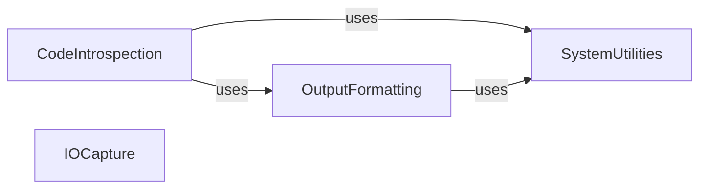

## Component Details

This graph illustrates the core utilities within the pytest framework, focusing on how code introspection, output formatting, system-level operations, and I/O capturing are structured and interact. The main flow involves introspecting code for error reporting, formatting this information for user output, utilizing system utilities for file and environment management, and capturing I/O streams during test execution to ensure isolated and inspectable test runs.

### CodeIntrospection
This component is responsible for introspecting Python code objects, execution frames, and managing exception tracebacks. It provides classes to represent and manipulate code, frames, and traceback entries, enabling detailed error reporting and debugging within pytest.

**Related Classes/Methods**:

- <a href="https://github.com/pytest-dev/pytest/blob/master/src/_pytest/_code/code.py#L61-L127" target="_blank" rel="noopener noreferrer">`_pytest._code.code.Code` (61:127)</a>
- <a href="https://github.com/pytest-dev/pytest/blob/master/src/_pytest/_code/code.py#L130-L189" target="_blank" rel="noopener noreferrer">`_pytest._code.code.Frame` (130:189)</a>
- <a href="https://github.com/pytest-dev/pytest/blob/master/src/_pytest/_code/code.py#L192-L353" target="_blank" rel="noopener noreferrer">`_pytest._code.code.TracebackEntry` (192:353)</a>
- <a href="https://github.com/pytest-dev/pytest/blob/master/src/_pytest/_code/code.py#L356-L462" target="_blank" rel="noopener noreferrer">`_pytest._code.code.Traceback` (356:462)</a>
- <a href="https://github.com/pytest-dev/pytest/blob/master/src/_pytest/_code/code.py#L497-L853" target="_blank" rel="noopener noreferrer">`_pytest._code.code.ExceptionInfo` (497:853)</a>
- <a href="https://github.com/pytest-dev/pytest/blob/master/src/_pytest/_code/code.py#L868-L1224" target="_blank" rel="noopener noreferrer">`_pytest._code.code.FormattedExcinfo` (868:1224)</a>
- <a href="https://github.com/pytest-dev/pytest/blob/master/src/_pytest/_code/code.py#L1228-L1241" target="_blank" rel="noopener noreferrer">`_pytest._code.code.TerminalRepr` (1228:1241)</a>
- <a href="https://github.com/pytest-dev/pytest/blob/master/src/_pytest/_code/code.py#L1246-L1260" target="_blank" rel="noopener noreferrer">`_pytest._code.code.ExceptionRepr` (1246:1260)</a>
- <a href="https://github.com/pytest-dev/pytest/blob/master/src/_pytest/_code/code.py#L1264-L1285" target="_blank" rel="noopener noreferrer">`_pytest._code.code.ExceptionChainRepr` (1264:1285)</a>
- <a href="https://github.com/pytest-dev/pytest/blob/master/src/_pytest/_code/code.py#L1289-L1295" target="_blank" rel="noopener noreferrer">`_pytest._code.code.ReprExceptionInfo` (1289:1295)</a>
- <a href="https://github.com/pytest-dev/pytest/blob/master/src/_pytest/_code/code.py#L1299-L1320" target="_blank" rel="noopener noreferrer">`_pytest._code.code.ReprTraceback` (1299:1320)</a>
- <a href="https://github.com/pytest-dev/pytest/blob/master/src/_pytest/_code/code.py#L1323-L1327" target="_blank" rel="noopener noreferrer">`_pytest._code.code.ReprTracebackNative` (1323:1327)</a>
- <a href="https://github.com/pytest-dev/pytest/blob/master/src/_pytest/_code/code.py#L1331-L1337" target="_blank" rel="noopener noreferrer">`_pytest._code.code.ReprEntryNative` (1331:1337)</a>
- <a href="https://github.com/pytest-dev/pytest/blob/master/src/_pytest/_code/code.py#L1341-L1422" target="_blank" rel="noopener noreferrer">`_pytest._code.code.ReprEntry` (1341:1422)</a>
- <a href="https://github.com/pytest-dev/pytest/blob/master/src/_pytest/_code/code.py#L1426-L1442" target="_blank" rel="noopener noreferrer">`_pytest._code.code.ReprFileLocation` (1426:1442)</a>
- <a href="https://github.com/pytest-dev/pytest/blob/master/src/_pytest/_code/code.py#L1446-L1451" target="_blank" rel="noopener noreferrer">`_pytest._code.code.ReprLocals` (1446:1451)</a>
- <a href="https://github.com/pytest-dev/pytest/blob/master/src/_pytest/_code/code.py#L1455-L1474" target="_blank" rel="noopener noreferrer">`_pytest._code.code.ReprFuncArgs` (1455:1474)</a>
- <a href="https://github.com/pytest-dev/pytest/blob/master/src/_pytest/_code/code.py#L465-L489" target="_blank" rel="noopener noreferrer">`_pytest._code.code.stringify_exception` (465:489)</a>
- <a href="https://github.com/pytest-dev/pytest/blob/master/src/_pytest/_code/code.py#L1477-L1508" target="_blank" rel="noopener noreferrer">`_pytest._code.code.getfslineno` (1477:1508)</a>
- <a href="https://github.com/pytest-dev/pytest/blob/master/src/_pytest/_code/code.py#L1511-L1514" target="_blank" rel="noopener noreferrer">`_pytest._code.code._byte_offset_to_character_offset` (1511:1514)</a>
- <a href="https://github.com/pytest-dev/pytest/blob/master/src/_pytest/_code/code.py#L1529-L1555" target="_blank" rel="noopener noreferrer">`_pytest._code.code.filter_traceback` (1529:1555)</a>
- <a href="https://github.com/pytest-dev/pytest/blob/master/src/_pytest/_code/code.py#L1558-L1567" target="_blank" rel="noopener noreferrer">`_pytest._code.code.filter_excinfo_traceback` (1558:1567)</a>
- <a href="https://github.com/pytest-dev/pytest/blob/master/src/_pytest/_code/source.py#L16-L117" target="_blank" rel="noopener noreferrer">`_pytest._code.source.Source` (16:117)</a>
- <a href="https://github.com/pytest-dev/pytest/blob/master/src/_pytest/_code/source.py#L125-L133" target="_blank" rel="noopener noreferrer">`_pytest._code.source.findsource` (125:133)</a>
- <a href="https://github.com/pytest-dev/pytest/blob/master/src/_pytest/_code/source.py#L136-L146" target="_blank" rel="noopener noreferrer">`_pytest._code.source.getrawcode` (136:146)</a>
- <a href="https://github.com/pytest-dev/pytest/blob/master/src/_pytest/_code/source.py#L149-L150" target="_blank" rel="noopener noreferrer">`_pytest._code.source.deindent` (149:150)</a>
- <a href="https://github.com/pytest-dev/pytest/blob/master/src/_pytest/_code/source.py#L153-L176" target="_blank" rel="noopener noreferrer">`_pytest._code.source.get_statement_startend2` (153:176)</a>
- <a href="https://github.com/pytest-dev/pytest/blob/master/src/_pytest/_code/source.py#L179-L225" target="_blank" rel="noopener noreferrer">`_pytest._code.source.getstatementrange_ast` (179:225)</a>

### OutputFormatting
This component handles the formatting and safe representation of data for terminal output. It ensures that objects can be safely represented as strings, even if their __repr__ methods fail, and provides utilities for writing colored and structured information to the console.

**Related Classes/Methods**:

- <a href="https://github.com/pytest-dev/pytest/blob/master/src/_pytest/_io/saferepr.py#L7-L13" target="_blank" rel="noopener noreferrer">`_pytest._io.saferepr._try_repr_or_str` (7:13)</a>
- <a href="https://github.com/pytest-dev/pytest/blob/master/src/_pytest/_io/saferepr.py#L16-L25" target="_blank" rel="noopener noreferrer">`_pytest._io.saferepr._format_repr_exception` (16:25)</a>
- <a href="https://github.com/pytest-dev/pytest/blob/master/src/_pytest/_io/saferepr.py#L28-L33" target="_blank" rel="noopener noreferrer">`_pytest._io.saferepr._ellipsize` (28:33)</a>
- <a href="https://github.com/pytest-dev/pytest/blob/master/src/_pytest/_io/saferepr.py#L36-L80" target="_blank" rel="noopener noreferrer">`_pytest._io.saferepr.SafeRepr` (36:80)</a>
- <a href="https://github.com/pytest-dev/pytest/blob/master/src/_pytest/_io/saferepr.py#L83-L92" target="_blank" rel="noopener noreferrer">`_pytest._io.saferepr.safeformat` (83:92)</a>
- <a href="https://github.com/pytest-dev/pytest/blob/master/src/_pytest/_io/saferepr.py#L99-L111" target="_blank" rel="noopener noreferrer">`_pytest._io.saferepr.saferepr` (99:111)</a>
- <a href="https://github.com/pytest-dev/pytest/blob/master/src/_pytest/_io/saferepr.py#L114-L130" target="_blank" rel="noopener noreferrer">`_pytest._io.saferepr.saferepr_unlimited` (114:130)</a>
- <a href="https://github.com/pytest-dev/pytest/blob/master/src/_pytest/_io/pprint.py#L1-L100" target="_blank" rel="noopener noreferrer">`_pytest._io.pprint` (1:100)</a>
- <a href="https://github.com/pytest-dev/pytest/blob/master/src/_pytest/_io/terminalwriter.py#L26-L33" target="_blank" rel="noopener noreferrer">`_pytest._io.terminalwriter.get_terminal_width` (26:33)</a>
- <a href="https://github.com/pytest-dev/pytest/blob/master/src/_pytest/_io/terminalwriter.py#L36-L47" target="_blank" rel="noopener noreferrer">`_pytest._io.terminalwriter.should_do_markup` (36:47)</a>
- <a href="https://github.com/pytest-dev/pytest/blob/master/src/_pytest/_io/terminalwriter.py#L51-L254" target="_blank" rel="noopener noreferrer">`_pytest._io.terminalwriter.TerminalWriter` (51:254)</a>
- <a href="https://github.com/pytest-dev/pytest/blob/master/src/_pytest/_io/terminalwriter.py#L1-L100" target="_blank" rel="noopener noreferrer">`_pytest._io.terminalwriter._get_pygments_lexer` (1:100)</a>
- <a href="https://github.com/pytest-dev/pytest/blob/master/src/_pytest/_io/terminalwriter.py#L1-L100" target="_blank" rel="noopener noreferrer">`_pytest._io.terminalwriter._get_pygments_formatter` (1:100)</a>
- <a href="https://github.com/pytest-dev/pytest/blob/master/src/_pytest/_io/terminalwriter.py#L1-L100" target="_blank" rel="noopener noreferrer">`_pytest._io.terminalwriter._highlight` (1:100)</a>

### SystemUtilities
This component provides a collection of utility functions for system-level operations, including Python version compatibility, robust path manipulation, and the management of temporary directories. It ensures cross-platform compatibility and reliable file system interactions for pytest.

**Related Classes/Methods**:

- <a href="https://github.com/pytest-dev/pytest/blob/master/src/_pytest/compat.py#L1-L100" target="_blank" rel="noopener noreferrer">`_pytest.compat` (1:100)</a>
- <a href="https://github.com/pytest-dev/pytest/blob/master/src/_pytest/pathlib.py#L1-L100" target="_blank" rel="noopener noreferrer">`_pytest.pathlib.Path` (1:100)</a>
- <a href="https://github.com/pytest-dev/pytest/blob/master/src/_pytest/pathlib.py#L69-L70" target="_blank" rel="noopener noreferrer">`_pytest.pathlib.get_lock_path` (69:70)</a>
- <a href="https://github.com/pytest-dev/pytest/blob/master/src/_pytest/pathlib.py#L73-L129" target="_blank" rel="noopener noreferrer">`_pytest.pathlib.on_rm_rf_error` (73:129)</a>
- <a href="https://github.com/pytest-dev/pytest/blob/master/src/_pytest/pathlib.py#L132-L147" target="_blank" rel="noopener noreferrer">`_pytest.pathlib.ensure_extended_length_path` (132:147)</a>
- <a href="https://github.com/pytest-dev/pytest/blob/master/src/_pytest/pathlib.py#L150-L159" target="_blank" rel="noopener noreferrer">`_pytest.pathlib.get_extended_length_path_str` (150:159)</a>
- <a href="https://github.com/pytest-dev/pytest/blob/master/src/_pytest/pathlib.py#L162-L170" target="_blank" rel="noopener noreferrer">`_pytest.pathlib.rm_rf` (162:170)</a>
- <a href="https://github.com/pytest-dev/pytest/blob/master/src/_pytest/pathlib.py#L173-L178" target="_blank" rel="noopener noreferrer">`_pytest.pathlib.find_prefixed` (173:178)</a>
- <a href="https://github.com/pytest-dev/pytest/blob/master/src/_pytest/pathlib.py#L181-L189" target="_blank" rel="noopener noreferrer">`_pytest.pathlib.extract_suffixes` (181:189)</a>
- <a href="https://github.com/pytest-dev/pytest/blob/master/src/_pytest/pathlib.py#L192-L194" target="_blank" rel="noopener noreferrer">`_pytest.pathlib.find_suffixes` (192:194)</a>
- <a href="https://github.com/pytest-dev/pytest/blob/master/src/_pytest/pathlib.py#L197-L202" target="_blank" rel="noopener noreferrer">`_pytest.pathlib.parse_num` (197:202)</a>
- <a href="https://github.com/pytest-dev/pytest/blob/master/src/_pytest/pathlib.py#L205-L222" target="_blank" rel="noopener noreferrer">`_pytest.pathlib._force_symlink` (205:222)</a>
- <a href="https://github.com/pytest-dev/pytest/blob/master/src/_pytest/pathlib.py#L225-L243" target="_blank" rel="noopener noreferrer">`_pytest.pathlib.make_numbered_dir` (225:243)</a>
- <a href="https://github.com/pytest-dev/pytest/blob/master/src/_pytest/pathlib.py#L246-L260" target="_blank" rel="noopener noreferrer">`_pytest.pathlib.create_cleanup_lock` (246:260)</a>
- <a href="https://github.com/pytest-dev/pytest/blob/master/src/_pytest/pathlib.py#L263-L279" target="_blank" rel="noopener noreferrer">`_pytest.pathlib.register_cleanup_lock_removal` (263:279)</a>
- <a href="https://github.com/pytest-dev/pytest/blob/master/src/_pytest/pathlib.py#L282-L307" target="_blank" rel="noopener noreferrer">`_pytest.pathlib.maybe_delete_a_numbered_dir` (282:307)</a>
- <a href="https://github.com/pytest-dev/pytest/blob/master/src/_pytest/pathlib.py#L310-L335" target="_blank" rel="noopener noreferrer">`_pytest.pathlib.ensure_deletable` (310:335)</a>
- <a href="https://github.com/pytest-dev/pytest/blob/master/src/_pytest/pathlib.py#L338-L341" target="_blank" rel="noopener noreferrer">`_pytest.pathlib.try_cleanup` (338:341)</a>
- <a href="https://github.com/pytest-dev/pytest/blob/master/src/_pytest/pathlib.py#L344-L353" target="_blank" rel="noopener noreferrer">`_pytest.pathlib.cleanup_candidates` (344:353)</a>
- <a href="https://github.com/pytest-dev/pytest/blob/master/src/_pytest/pathlib.py#L356-L360" target="_blank" rel="noopener noreferrer">`_pytest.pathlib.cleanup_dead_symlinks` (356:360)</a>
- <a href="https://github.com/pytest-dev/pytest/blob/master/src/_pytest/pathlib.py#L363-L374" target="_blank" rel="noopener noreferrer">`_pytest.pathlib.cleanup_numbered_dir` (363:374)</a>
- <a href="https://github.com/pytest-dev/pytest/blob/master/src/_pytest/pathlib.py#L377-L407" target="_blank" rel="noopener noreferrer">`_pytest.pathlib.make_numbered_dir_with_cleanup` (377:407)</a>
- <a href="https://github.com/pytest-dev/pytest/blob/master/src/_pytest/pathlib.py#L410-L416" target="_blank" rel="noopener noreferrer">`_pytest.pathlib.resolve_from_str` (410:416)</a>
- <a href="https://github.com/pytest-dev/pytest/blob/master/src/_pytest/pathlib.py#L419-L452" target="_blank" rel="noopener noreferrer">`_pytest.pathlib.fnmatch_ex` (419:452)</a>
- <a href="https://github.com/pytest-dev/pytest/blob/master/src/_pytest/pathlib.py#L455-L457" target="_blank" rel="noopener noreferrer">`_pytest.pathlib.parts` (455:457)</a>
- <a href="https://github.com/pytest-dev/pytest/blob/master/src/_pytest/pathlib.py#L460-L469" target="_blank" rel="noopener noreferrer">`_pytest.pathlib.symlink_or_skip` (460:469)</a>
- <a href="https://github.com/pytest-dev/pytest/blob/master/src/_pytest/pathlib.py#L472-L477" target="_blank" rel="noopener noreferrer">`_pytest.pathlib.ImportMode` (472:477)</a>
- <a href="https://github.com/pytest-dev/pytest/blob/master/src/_pytest/pathlib.py#L480-L486" target="_blank" rel="noopener noreferrer">`_pytest.pathlib.ImportPathMismatchError` (480:486)</a>
- <a href="https://github.com/pytest-dev/pytest/blob/master/src/_pytest/pathlib.py#L489-L612" target="_blank" rel="noopener noreferrer">`_pytest.pathlib.import_path` (489:612)</a>
- <a href="https://github.com/pytest-dev/pytest/blob/master/src/_pytest/pathlib.py#L615-L735" target="_blank" rel="noopener noreferrer">`_pytest.pathlib._import_module_using_spec` (615:735)</a>
- <a href="https://github.com/pytest-dev/pytest/blob/master/src/_pytest/pathlib.py#L738-L754" target="_blank" rel="noopener noreferrer">`_pytest.pathlib.spec_matches_module_path` (738:754)</a>
- <a href="https://github.com/pytest-dev/pytest/blob/master/src/_pytest/pathlib.py#L1-L100" target="_blank" rel="noopener noreferrer">`_pytest.pathlib._is_same` (1:100)</a>
- <a href="https://github.com/pytest-dev/pytest/blob/master/src/_pytest/pathlib.py#L770-L798" target="_blank" rel="noopener noreferrer">`_pytest.pathlib.module_name_from_path` (770:798)</a>
- <a href="https://github.com/pytest-dev/pytest/blob/master/src/_pytest/pathlib.py#L801-L836" target="_blank" rel="noopener noreferrer">`_pytest.pathlib.insert_missing_modules` (801:836)</a>
- <a href="https://github.com/pytest-dev/pytest/blob/master/src/_pytest/pathlib.py#L839-L853" target="_blank" rel="noopener noreferrer">`_pytest.pathlib.resolve_package_path` (839:853)</a>
- <a href="https://github.com/pytest-dev/pytest/blob/master/src/_pytest/pathlib.py#L856-L897" target="_blank" rel="noopener noreferrer">`_pytest.pathlib.resolve_pkg_root_and_module_name` (856:897)</a>
- <a href="https://github.com/pytest-dev/pytest/blob/master/src/_pytest/pathlib.py#L900-L923" target="_blank" rel="noopener noreferrer">`_pytest.pathlib.is_importable` (900:923)</a>
- <a href="https://github.com/pytest-dev/pytest/blob/master/src/_pytest/pathlib.py#L926-L943" target="_blank" rel="noopener noreferrer">`_pytest.pathlib.compute_module_name` (926:943)</a>
- <a href="https://github.com/pytest-dev/pytest/blob/master/src/_pytest/pathlib.py#L946-L947" target="_blank" rel="noopener noreferrer">`_pytest.pathlib.CouldNotResolvePathError` (946:947)</a>
- <a href="https://github.com/pytest-dev/pytest/blob/master/src/_pytest/pathlib.py#L950-L979" target="_blank" rel="noopener noreferrer">`_pytest.pathlib.scandir` (950:979)</a>
- <a href="https://github.com/pytest-dev/pytest/blob/master/src/_pytest/pathlib.py#L982-L995" target="_blank" rel="noopener noreferrer">`_pytest.pathlib.visit` (982:995)</a>
- <a href="https://github.com/pytest-dev/pytest/blob/master/src/_pytest/pathlib.py#L998-L1004" target="_blank" rel="noopener noreferrer">`_pytest.pathlib.absolutepath` (998:1004)</a>
- <a href="https://github.com/pytest-dev/pytest/blob/master/src/_pytest/pathlib.py#L1007-L1016" target="_blank" rel="noopener noreferrer">`_pytest.pathlib.commonpath` (1007:1016)</a>
- <a href="https://github.com/pytest-dev/pytest/blob/master/src/_pytest/pathlib.py#L1019-L1045" target="_blank" rel="noopener noreferrer">`_pytest.pathlib.bestrelpath` (1019:1045)</a>
- <a href="https://github.com/pytest-dev/pytest/blob/master/src/_pytest/pathlib.py#L1048-L1055" target="_blank" rel="noopener noreferrer">`_pytest.pathlib.safe_exists` (1048:1055)</a>
- <a href="https://github.com/pytest-dev/pytest/blob/master/src/_pytest/tmpdir.py#L42-L196" target="_blank" rel="noopener noreferrer">`_pytest.tmpdir.TempPathFactory` (42:196)</a>
- <a href="https://github.com/pytest-dev/pytest/blob/master/src/_pytest/tmpdir.py#L199-L208" target="_blank" rel="noopener noreferrer">`_pytest.tmpdir.get_user` (199:208)</a>
- <a href="https://github.com/pytest-dev/pytest/blob/master/src/_pytest/tmpdir.py#L211-L221" target="_blank" rel="noopener noreferrer">`_pytest.tmpdir.pytest_configure` (211:221)</a>
- <a href="https://github.com/pytest-dev/pytest/blob/master/src/_pytest/tmpdir.py#L224-L236" target="_blank" rel="noopener noreferrer">`_pytest.tmpdir.pytest_addoption` (224:236)</a>
- <a href="https://github.com/pytest-dev/pytest/blob/master/src/_pytest/tmpdir.py#L240-L243" target="_blank" rel="noopener noreferrer">`_pytest.tmpdir.tmp_path_factory` (240:243)</a>
- <a href="https://github.com/pytest-dev/pytest/blob/master/src/_pytest/tmpdir.py#L246-L251" target="_blank" rel="noopener noreferrer">`_pytest.tmpdir._mk_tmp` (246:251)</a>
- <a href="https://github.com/pytest-dev/pytest/blob/master/src/_pytest/tmpdir.py#L255-L276" target="_blank" rel="noopener noreferrer">`_pytest.tmpdir.tmp_path` (255:276)</a>
- <a href="https://github.com/pytest-dev/pytest/blob/master/src/_pytest/tmpdir.py#L279-L301" target="_blank" rel="noopener noreferrer">`_pytest.tmpdir.pytest_sessionfinish` (279:301)</a>
- <a href="https://github.com/pytest-dev/pytest/blob/master/src/_pytest/tmpdir.py#L305-L312" target="_blank" rel="noopener noreferrer">`_pytest.tmpdir.pytest_runtest_makereport` (305:312)</a>

### IOCapture
Manages the capturing and restoration of standard I/O streams (stdout, stderr) during test execution, providing mechanisms to isolate and inspect output.

**Related Classes/Methods**:

- <a href="https://github.com/pytest-dev/pytest/blob/master/src/_pytest/capture.py#L302-L331" target="_blank" rel="noopener noreferrer">`_pytest.capture.CaptureBase` (302:331)</a>
- <a href="https://github.com/pytest-dev/pytest/blob/master/src/_pytest/capture.py#L581-L601" target="_blank" rel="noopener noreferrer">`_pytest.capture.FDCapture` (581:601)</a>
- <a href="https://github.com/pytest-dev/pytest/blob/master/src/_pytest/capture.py#L464-L556" target="_blank" rel="noopener noreferrer">`_pytest.capture.FDCaptureBase` (464:556)</a>
- <a href="https://github.com/pytest-dev/pytest/blob/master/src/_pytest/capture.py#L559-L578" target="_blank" rel="noopener noreferrer">`_pytest.capture.FDCaptureBinary` (559:578)</a>
- <a href="https://github.com/pytest-dev/pytest/blob/master/src/_pytest/capture.py#L337-L359" target="_blank" rel="noopener noreferrer">`_pytest.capture.NoCapture` (337:359)</a>
- <a href="https://github.com/pytest-dev/pytest/blob/master/src/_pytest/capture.py#L447-L461" target="_blank" rel="noopener noreferrer">`_pytest.capture.SysCapture` (447:461)</a>
- <a href="https://github.com/pytest-dev/pytest/blob/master/src/_pytest/capture.py#L362-L426" target="_blank" rel="noopener noreferrer">`_pytest.capture.SysCaptureBase` (362:426)</a>
- <a href="https://github.com/pytest-dev/pytest/blob/master/src/_pytest/capture.py#L429-L444" target="_blank" rel="noopener noreferrer">`_pytest.capture.SysCaptureBinary` (429:444)</a>
- <a href="https://github.com/pytest-dev/pytest/blob/master/src/_pytest/capture.py#L212-L219" target="_blank" rel="noopener noreferrer">`_pytest.capture.TeeCaptureIO` (212:219)</a>
- <a href="https://github.com/pytest-dev/pytest/blob/master/src/_pytest/capture.py#L628-L709" target="_blank" rel="noopener noreferrer">`_pytest.capture.MultiCapture` (628:709)</a>
- <a href="https://github.com/pytest-dev/pytest/blob/master/src/_pytest/capture.py#L186-L200" target="_blank" rel="noopener noreferrer">`_pytest.capture.EncodedFile` (186:200)</a>
- <a href="https://github.com/pytest-dev/pytest/blob/master/src/_pytest/capture.py#L203-L209" target="_blank" rel="noopener noreferrer">`_pytest.capture.CaptureIO` (203:209)</a>
- <a href="https://github.com/pytest-dev/pytest/blob/master/src/_pytest/capture.py#L916-L993" target="_blank" rel="noopener noreferrer">`_pytest.capture.CaptureFixture` (916:993)</a>
- <a href="https://github.com/pytest-dev/pytest/blob/master/src/_pytest/capture.py#L729-L913" target="_blank" rel="noopener noreferrer">`_pytest.capture.CaptureManager` (729:913)</a>

### [FAQ](https://github.com/CodeBoarding/GeneratedOnBoardings/tree/main?tab=readme-ov-file#faq)