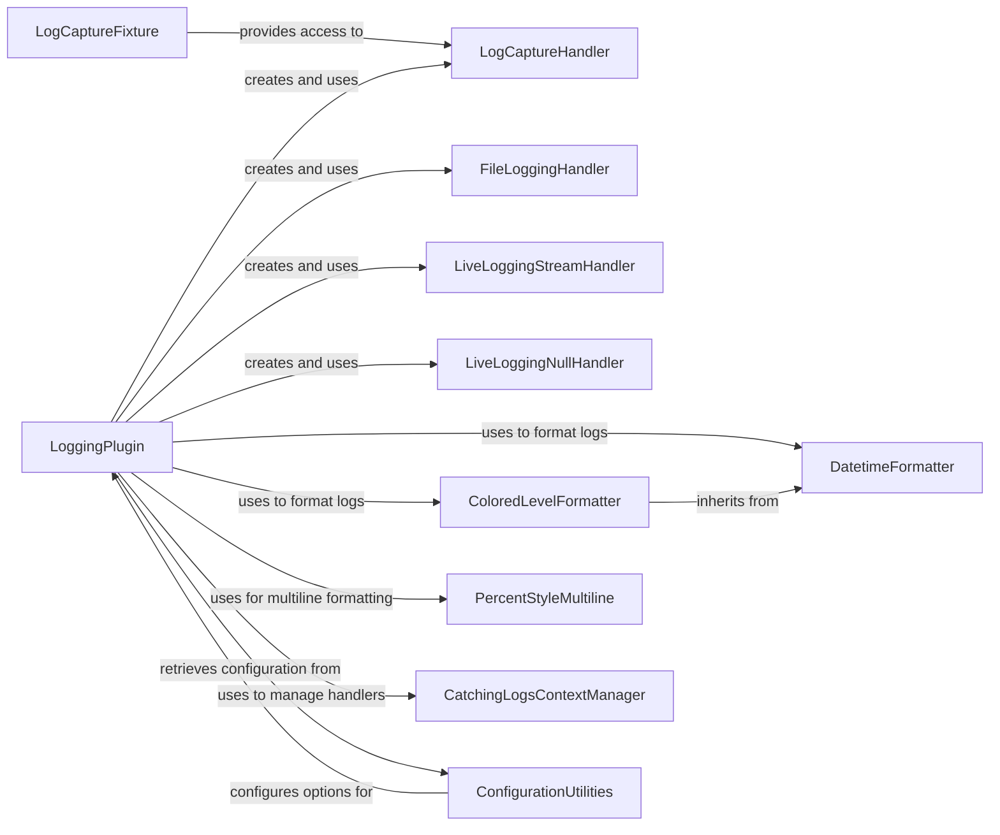

## Component Details

The Logging Integration subsystem in pytest provides a comprehensive mechanism for capturing, processing, and displaying log messages generated during test execution. It seamlessly integrates with Python's standard logging module, allowing users to configure logging behavior, capture logs from various sources, and present them as part of the test report. The core functionality revolves around the `LoggingPlugin`, which orchestrates the setup and teardown of logging handlers, manages log levels, and interacts with specialized handlers like `LogCaptureHandler` for in-memory log storage and `LiveLoggingStreamHandler` for real-time console output. Test authors can interact with captured logs through the `LogCaptureFixture` (caplog fixture) to assert logging behavior. Custom formatters ensure logs are presented clearly, with options for timestamps, colored levels, and multiline message handling.

### LoggingPlugin
The central plugin responsible for integrating Python's logging module with pytest. It manages the lifecycle of log handlers and formatters, configures logging based on pytest options, and orchestrates log capturing during different phases of test execution.

**Related Classes/Methods**:

- <a href="https://github.com/pytest-dev/pytest/blob/master/src/_pytest/logging.py#L641-L879" target="_blank" rel="noopener noreferrer">`_pytest.logging.LoggingPlugin` (641:879)</a>
- <a href="https://github.com/pytest-dev/pytest/blob/master/src/_pytest/logging.py#L644-L709" target="_blank" rel="noopener noreferrer">`_pytest.logging.LoggingPlugin.__init__` (644:709)</a>
- <a href="https://github.com/pytest-dev/pytest/blob/master/src/_pytest/logging.py#L711-L717" target="_blank" rel="noopener noreferrer">`_pytest.logging.LoggingPlugin._disable_loggers` (711:717)</a>
- <a href="https://github.com/pytest-dev/pytest/blob/master/src/_pytest/logging.py#L719-L735" target="_blank" rel="noopener noreferrer">`_pytest.logging.LoggingPlugin._create_formatter` (719:735)</a>
- <a href="https://github.com/pytest-dev/pytest/blob/master/src/_pytest/logging.py#L737-L757" target="_blank" rel="noopener noreferrer">`_pytest.logging.LoggingPlugin.set_log_path` (737:757)</a>
- <a href="https://github.com/pytest-dev/pytest/blob/master/src/_pytest/logging.py#L759-L772" target="_blank" rel="noopener noreferrer">`_pytest.logging.LoggingPlugin._log_cli_enabled` (759:772)</a>
- <a href="https://github.com/pytest-dev/pytest/blob/master/src/_pytest/logging.py#L775-L780" target="_blank" rel="noopener noreferrer">`_pytest.logging.LoggingPlugin.pytest_sessionstart` (775:780)</a>
- <a href="https://github.com/pytest-dev/pytest/blob/master/src/_pytest/logging.py#L783-L788" target="_blank" rel="noopener noreferrer">`_pytest.logging.LoggingPlugin.pytest_collection` (783:788)</a>
- <a href="https://github.com/pytest-dev/pytest/blob/master/src/_pytest/logging.py#L791-L801" target="_blank" rel="noopener noreferrer">`_pytest.logging.LoggingPlugin.pytest_runtestloop` (791:801)</a>
- <a href="https://github.com/pytest-dev/pytest/blob/master/src/_pytest/logging.py#L804-L806" target="_blank" rel="noopener noreferrer">`_pytest.logging.LoggingPlugin.pytest_runtest_logstart` (804:806)</a>
- <a href="https://github.com/pytest-dev/pytest/blob/master/src/_pytest/logging.py#L809-L810" target="_blank" rel="noopener noreferrer">`_pytest.logging.LoggingPlugin.pytest_runtest_logreport` (809:810)</a>
- <a href="https://github.com/pytest-dev/pytest/blob/master/src/_pytest/logging.py#L813-L834" target="_blank" rel="noopener noreferrer">`_pytest.logging.LoggingPlugin._runtest_for` (813:834)</a>
- <a href="https://github.com/pytest-dev/pytest/blob/master/src/_pytest/logging.py#L837-L843" target="_blank" rel="noopener noreferrer">`_pytest.logging.LoggingPlugin.pytest_runtest_setup` (837:843)</a>
- <a href="https://github.com/pytest-dev/pytest/blob/master/src/_pytest/logging.py#L846-L850" target="_blank" rel="noopener noreferrer">`_pytest.logging.LoggingPlugin.pytest_runtest_call` (846:850)</a>
- <a href="https://github.com/pytest-dev/pytest/blob/master/src/_pytest/logging.py#L853-L861" target="_blank" rel="noopener noreferrer">`_pytest.logging.LoggingPlugin.pytest_runtest_teardown` (853:861)</a>
- <a href="https://github.com/pytest-dev/pytest/blob/master/src/_pytest/logging.py#L864-L865" target="_blank" rel="noopener noreferrer">`_pytest.logging.LoggingPlugin.pytest_runtest_logfinish` (864:865)</a>
- <a href="https://github.com/pytest-dev/pytest/blob/master/src/_pytest/logging.py#L868-L873" target="_blank" rel="noopener noreferrer">`_pytest.logging.LoggingPlugin.pytest_sessionfinish` (868:873)</a>
- <a href="https://github.com/pytest-dev/pytest/blob/master/src/_pytest/logging.py#L876-L879" target="_blank" rel="noopener noreferrer">`_pytest.logging.LoggingPlugin.pytest_unconfigure` (876:879)</a>

### LogCaptureHandler
A specialized logging handler that captures log records and their formatted text into an in-memory buffer and a list of LogRecord objects, enabling pytest to inspect and report logs after test execution.

**Related Classes/Methods**:

- <a href="https://github.com/pytest-dev/pytest/blob/master/src/_pytest/logging.py#L373-L400" target="_blank" rel="noopener noreferrer">`_pytest.logging.LogCaptureHandler` (373:400)</a>
- <a href="https://github.com/pytest-dev/pytest/blob/master/src/_pytest/logging.py#L376-L379" target="_blank" rel="noopener noreferrer">`_pytest.logging.LogCaptureHandler.__init__` (376:379)</a>
- <a href="https://github.com/pytest-dev/pytest/blob/master/src/_pytest/logging.py#L381-L384" target="_blank" rel="noopener noreferrer">`_pytest.logging.LogCaptureHandler.emit` (381:384)</a>
- <a href="https://github.com/pytest-dev/pytest/blob/master/src/_pytest/logging.py#L386-L388" target="_blank" rel="noopener noreferrer">`_pytest.logging.LogCaptureHandler.reset` (386:388)</a>
- <a href="https://github.com/pytest-dev/pytest/blob/master/src/_pytest/logging.py#L390-L392" target="_blank" rel="noopener noreferrer">`_pytest.logging.LogCaptureHandler.clear` (390:392)</a>
- <a href="https://github.com/pytest-dev/pytest/blob/master/src/_pytest/logging.py#L394-L400" target="_blank" rel="noopener noreferrer">`_pytest.logging.LogCaptureHandler.handleError` (394:400)</a>

### DatetimeFormatter
A custom logging formatter that extends `logging.Formatter` to provide enhanced datetime formatting, specifically handling microseconds in log timestamps.

**Related Classes/Methods**:

- <a href="https://github.com/pytest-dev/pytest/blob/master/src/_pytest/logging.py#L61-L77" target="_blank" rel="noopener noreferrer">`_pytest.logging.DatetimeFormatter` (61:77)</a>
- <a href="https://github.com/pytest-dev/pytest/blob/master/src/_pytest/logging.py#L67-L77" target="_blank" rel="noopener noreferrer">`_pytest.logging.DatetimeFormatter.formatTime` (67:77)</a>

### ColoredLevelFormatter
A logging formatter that inherits from `DatetimeFormatter` and adds ANSI escape sequences to log level names for colored output in the terminal.

**Related Classes/Methods**:

- <a href="https://github.com/pytest-dev/pytest/blob/master/src/_pytest/logging.py#L80-L137" target="_blank" rel="noopener noreferrer">`_pytest.logging.ColoredLevelFormatter` (80:137)</a>
- <a href="https://github.com/pytest-dev/pytest/blob/master/src/_pytest/logging.py#L95-L102" target="_blank" rel="noopener noreferrer">`_pytest.logging.ColoredLevelFormatter.__init__` (95:102)</a>
- <a href="https://github.com/pytest-dev/pytest/blob/master/src/_pytest/logging.py#L104-L132" target="_blank" rel="noopener noreferrer">`_pytest.logging.ColoredLevelFormatter.add_color_level` (104:132)</a>
- <a href="https://github.com/pytest-dev/pytest/blob/master/src/_pytest/logging.py#L134-L137" target="_blank" rel="noopener noreferrer">`_pytest.logging.ColoredLevelFormatter.format` (134:137)</a>

### PercentStyleMultiline
A custom logging style that extends `logging.PercentStyle` to handle multiline log messages by automatically indenting them for improved readability.

**Related Classes/Methods**:

- <a href="https://github.com/pytest-dev/pytest/blob/master/src/_pytest/logging.py#L140-L226" target="_blank" rel="noopener noreferrer">`_pytest.logging.PercentStyleMultiline` (140:226)</a>
- <a href="https://github.com/pytest-dev/pytest/blob/master/src/_pytest/logging.py#L147-L149" target="_blank" rel="noopener noreferrer">`_pytest.logging.PercentStyleMultiline.__init__` (147:149)</a>
- <a href="https://github.com/pytest-dev/pytest/blob/master/src/_pytest/logging.py#L152-L203" target="_blank" rel="noopener noreferrer">`_pytest.logging.PercentStyleMultiline._get_auto_indent` (152:203)</a>
- <a href="https://github.com/pytest-dev/pytest/blob/master/src/_pytest/logging.py#L205-L226" target="_blank" rel="noopener noreferrer">`_pytest.logging.PercentStyleMultiline.format` (205:226)</a>

### CatchingLogsContextManager
A generic context manager (`catching_logs`) used by `LoggingPlugin` to temporarily add/remove logging handlers and set/restore log levels, simplifying log capturing management during test execution.

**Related Classes/Methods**:

- <a href="https://github.com/pytest-dev/pytest/blob/master/src/_pytest/logging.py#L342-L370" target="_blank" rel="noopener noreferrer">`_pytest.logging.catching_logs` (342:370)</a>
- <a href="https://github.com/pytest-dev/pytest/blob/master/src/_pytest/logging.py#L347-L349" target="_blank" rel="noopener noreferrer">`_pytest.logging.catching_logs.__init__` (347:349)</a>
- <a href="https://github.com/pytest-dev/pytest/blob/master/src/_pytest/logging.py#L351-L359" target="_blank" rel="noopener noreferrer">`_pytest.logging.catching_logs.__enter__` (351:359)</a>
- <a href="https://github.com/pytest-dev/pytest/blob/master/src/_pytest/logging.py#L361-L370" target="_blank" rel="noopener noreferrer">`_pytest.logging.catching_logs.__exit__` (361:370)</a>

### LogCaptureFixture
A pytest fixture (`caplog`) that provides an interface for tests to access and control captured log messages, allowing retrieval of log records, formatted text, and clearing of captured logs for assertions.

**Related Classes/Methods**:

- <a href="https://github.com/pytest-dev/pytest/blob/master/src/_pytest/logging.py#L404-L592" target="_blank" rel="noopener noreferrer">`_pytest.logging.LogCaptureFixture` (404:592)</a>
- <a href="https://github.com/pytest-dev/pytest/blob/master/src/_pytest/logging.py#L407-L413" target="_blank" rel="noopener noreferrer">`_pytest.logging.LogCaptureFixture.__init__` (407:413)</a>
- <a href="https://github.com/pytest-dev/pytest/blob/master/src/_pytest/logging.py#L415-L429" target="_blank" rel="noopener noreferrer">`_pytest.logging.LogCaptureFixture._finalize` (415:429)</a>
- <a href="https://github.com/pytest-dev/pytest/blob/master/src/_pytest/logging.py#L432-L434" target="_blank" rel="noopener noreferrer">`_pytest.logging.LogCaptureFixture.handler` (432:434)</a>
- <a href="https://github.com/pytest-dev/pytest/blob/master/src/_pytest/logging.py#L436-L449" target="_blank" rel="noopener noreferrer">`_pytest.logging.LogCaptureFixture.get_records` (436:449)</a>
- <a href="https://github.com/pytest-dev/pytest/blob/master/src/_pytest/logging.py#L452-L454" target="_blank" rel="noopener noreferrer">`_pytest.logging.LogCaptureFixture.text` (452:454)</a>
- <a href="https://github.com/pytest-dev/pytest/blob/master/src/_pytest/logging.py#L457-L459" target="_blank" rel="noopener noreferrer">`_pytest.logging.LogCaptureFixture.records` (457:459)</a>
- <a href="https://github.com/pytest-dev/pytest/blob/master/src/_pytest/logging.py#L462-L470" target="_blank" rel="noopener noreferrer">`_pytest.logging.LogCaptureFixture.record_tuples` (462:470)</a>
- <a href="https://github.com/pytest-dev/pytest/blob/master/src/_pytest/logging.py#L473-L489" target="_blank" rel="noopener noreferrer">`_pytest.logging.LogCaptureFixture.messages` (473:489)</a>
- <a href="https://github.com/pytest-dev/pytest/blob/master/src/_pytest/logging.py#L491-L493" target="_blank" rel="noopener noreferrer">`_pytest.logging.LogCaptureFixture.clear` (491:493)</a>
- <a href="https://github.com/pytest-dev/pytest/blob/master/src/_pytest/logging.py#L495-L527" target="_blank" rel="noopener noreferrer">`_pytest.logging.LogCaptureFixture._force_enable_logging` (495:527)</a>
- <a href="https://github.com/pytest-dev/pytest/blob/master/src/_pytest/logging.py#L529-L552" target="_blank" rel="noopener noreferrer">`_pytest.logging.LogCaptureFixture.set_level` (529:552)</a>
- <a href="https://github.com/pytest-dev/pytest/blob/master/src/_pytest/logging.py#L555-L576" target="_blank" rel="noopener noreferrer">`_pytest.logging.LogCaptureFixture.at_level` (555:576)</a>
- <a href="https://github.com/pytest-dev/pytest/blob/master/src/_pytest/logging.py#L579-L592" target="_blank" rel="noopener noreferrer">`_pytest.logging.LogCaptureFixture.filtering` (579:592)</a>
- <a href="https://github.com/pytest-dev/pytest/blob/master/src/_pytest/logging.py#L596-L609" target="_blank" rel="noopener noreferrer">`_pytest.logging.caplog` (596:609)</a>

### FileLoggingHandler
A specialized `logging.FileHandler` (`_FileHandler`) used by `LoggingPlugin` to write log messages to a specified file, including custom error handling.

**Related Classes/Methods**:

- <a href="https://github.com/pytest-dev/pytest/blob/master/src/_pytest/logging.py#L882-L887" target="_blank" rel="noopener noreferrer">`_pytest.logging._FileHandler` (882:887)</a>
- <a href="https://github.com/pytest-dev/pytest/blob/master/src/_pytest/logging.py#L885-L887" target="_blank" rel="noopener noreferrer">`_pytest.logging._FileHandler.handleError` (885:887)</a>

### LiveLoggingStreamHandler
A `logging.StreamHandler` (`_LiveLoggingStreamHandler`) for displaying live log messages to the terminal during test execution, handling formatting, sectioning, and interaction with the capture manager.

**Related Classes/Methods**:

- <a href="https://github.com/pytest-dev/pytest/blob/master/src/_pytest/logging.py#L890-L946" target="_blank" rel="noopener noreferrer">`_pytest.logging._LiveLoggingStreamHandler` (890:946)</a>
- <a href="https://github.com/pytest-dev/pytest/blob/master/src/_pytest/logging.py#L903-L912" target="_blank" rel="noopener noreferrer">`_pytest.logging._LiveLoggingStreamHandler.__init__` (903:912)</a>
- <a href="https://github.com/pytest-dev/pytest/blob/master/src/_pytest/logging.py#L914-L916" target="_blank" rel="noopener noreferrer">`_pytest.logging._LiveLoggingStreamHandler.reset` (914:916)</a>
- <a href="https://github.com/pytest-dev/pytest/blob/master/src/_pytest/logging.py#L918-L923" target="_blank" rel="noopener noreferrer">`_pytest.logging._LiveLoggingStreamHandler.set_when` (918:923)</a>
- <a href="https://github.com/pytest-dev/pytest/blob/master/src/_pytest/logging.py#L925-L942" target="_blank" rel="noopener noreferrer">`_pytest.logging._LiveLoggingStreamHandler.emit` (925:942)</a>
- <a href="https://github.com/pytest-dev/pytest/blob/master/src/_pytest/logging.py#L944-L946" target="_blank" rel="noopener noreferrer">`_pytest.logging._LiveLoggingStreamHandler.handleError` (944:946)</a>

### LiveLoggingNullHandler
A `logging.NullHandler` (`_LiveLoggingNullHandler`) acting as a placeholder when live logging to the CLI is disabled, preventing errors when the `log_cli_handler` is accessed.

**Related Classes/Methods**:

- <a href="https://github.com/pytest-dev/pytest/blob/master/src/_pytest/logging.py#L949-L960" target="_blank" rel="noopener noreferrer">`_pytest.logging._LiveLoggingNullHandler` (949:960)</a>
- <a href="https://github.com/pytest-dev/pytest/blob/master/src/_pytest/logging.py#L952-L953" target="_blank" rel="noopener noreferrer">`_pytest.logging._LiveLoggingNullHandler.reset` (952:953)</a>
- <a href="https://github.com/pytest-dev/pytest/blob/master/src/_pytest/logging.py#L955-L956" target="_blank" rel="noopener noreferrer">`_pytest.logging._LiveLoggingNullHandler.set_when` (955:956)</a>
- <a href="https://github.com/pytest-dev/pytest/blob/master/src/_pytest/logging.py#L958-L960" target="_blank" rel="noopener noreferrer">`_pytest.logging._LiveLoggingNullHandler.handleError` (958:960)</a>

### ConfigurationUtilities
A collection of utility functions responsible for parsing and retrieving logging-related configuration options from pytest's `Config` object, ensuring correct plugin configuration.

**Related Classes/Methods**:

- <a href="https://github.com/pytest-dev/pytest/blob/master/src/_pytest/logging.py#L229-L235" target="_blank" rel="noopener noreferrer">`_pytest.logging.get_option_ini` (229:235)</a>
- <a href="https://github.com/pytest-dev/pytest/blob/master/src/_pytest/logging.py#L238-L335" target="_blank" rel="noopener noreferrer">`_pytest.logging.pytest_addoption` (238:335)</a>
- <a href="https://github.com/pytest-dev/pytest/blob/master/src/_pytest/logging.py#L612-L632" target="_blank" rel="noopener noreferrer">`_pytest.logging.get_log_level_for_setting` (612:632)</a>

### [FAQ](https://github.com/CodeBoarding/GeneratedOnBoardings/tree/main?tab=readme-ov-file#faq)