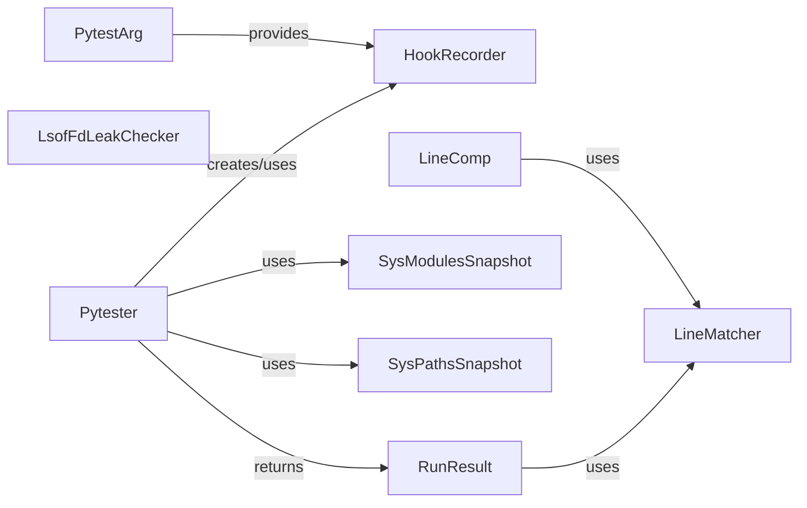

## Component Details

A dedicated set of utilities designed for testing the pytest framework itself. It allows simulating pytest runs in isolated environments and asserting on their behavior and output.

### Pytester
Provides a comprehensive set of utilities for black-box testing of pytest plugins and pytest itself. It manages temporary directories, creates test files, and executes pytest in isolated environments (in-process or subprocess). It also handles environment variables and system path/module snapshots for clean test runs.

**Related Classes/Methods**:

- <a href="https://github.com/pytest-dev/pytest/blob/master/src/_pytest/pytester.py#L649-L1525" target="_blank" rel="noopener noreferrer">`_pytest.pytester.Pytester` (649:1525)</a>
- <a href="https://github.com/pytest-dev/pytest/blob/master/src/_pytest/pytester.py#L665-L707" target="_blank" rel="noopener noreferrer">`_pytest.pytester.Pytester.__init__` (665:707)</a>
- <a href="https://github.com/pytest-dev/pytest/blob/master/src/_pytest/pytester.py#L717-L726" target="_blank" rel="noopener noreferrer">`_pytest.pytester.Pytester._finalize` (717:726)</a>
- <a href="https://github.com/pytest-dev/pytest/blob/master/src/_pytest/pytester.py#L728-L738" target="_blank" rel="noopener noreferrer">`_pytest.pytester.Pytester.__take_sys_modules_snapshot` (728:738)</a>
- <a href="https://github.com/pytest-dev/pytest/blob/master/src/_pytest/pytester.py#L740-L744" target="_blank" rel="noopener noreferrer">`_pytest.pytester.Pytester.make_hook_recorder` (740:744)</a>
- <a href="https://github.com/pytest-dev/pytest/blob/master/src/_pytest/pytester.py#L746-L751" target="_blank" rel="noopener noreferrer">`_pytest.pytester.Pytester.chdir` (746:751)</a>
- <a href="https://github.com/pytest-dev/pytest/blob/master/src/_pytest/pytester.py#L753-L788" target="_blank" rel="noopener noreferrer">`_pytest.pytester.Pytester._makefile` (753:788)</a>
- <a href="https://github.com/pytest-dev/pytest/blob/master/src/_pytest/pytester.py#L790-L820" target="_blank" rel="noopener noreferrer">`_pytest.pytester.Pytester.makefile` (790:820)</a>
- <a href="https://github.com/pytest-dev/pytest/blob/master/src/_pytest/pytester.py#L822-L828" target="_blank" rel="noopener noreferrer">`_pytest.pytester.Pytester.makeconftest` (822:828)</a>
- <a href="https://github.com/pytest-dev/pytest/blob/master/src/_pytest/pytester.py#L830-L836" target="_blank" rel="noopener noreferrer">`_pytest.pytester.Pytester.makeini` (830:836)</a>
- <a href="https://github.com/pytest-dev/pytest/blob/master/src/_pytest/pytester.py#L838-L841" target="_blank" rel="noopener noreferrer">`_pytest.pytester.Pytester.getinicfg` (838:841)</a>
- <a href="https://github.com/pytest-dev/pytest/blob/master/src/_pytest/pytester.py#L843-L851" target="_blank" rel="noopener noreferrer">`_pytest.pytester.Pytester.makepyprojecttoml` (843:851)</a>
- <a href="https://github.com/pytest-dev/pytest/blob/master/src/_pytest/pytester.py#L853-L871" target="_blank" rel="noopener noreferrer">`_pytest.pytester.Pytester.makepyfile` (853:871)</a>
- <a href="https://github.com/pytest-dev/pytest/blob/master/src/_pytest/pytester.py#L873-L891" target="_blank" rel="noopener noreferrer">`_pytest.pytester.Pytester.maketxtfile` (873:891)</a>
- <a href="https://github.com/pytest-dev/pytest/blob/master/src/_pytest/pytester.py#L893-L905" target="_blank" rel="noopener noreferrer">`_pytest.pytester.Pytester.syspathinsert` (893:905)</a>
- <a href="https://github.com/pytest-dev/pytest/blob/master/src/_pytest/pytester.py#L907-L918" target="_blank" rel="noopener noreferrer">`_pytest.pytester.Pytester.mkdir` (907:918)</a>
- <a href="https://github.com/pytest-dev/pytest/blob/master/src/_pytest/pytester.py#L920-L929" target="_blank" rel="noopener noreferrer">`_pytest.pytester.Pytester.mkpydir` (920:929)</a>
- <a href="https://github.com/pytest-dev/pytest/blob/master/src/_pytest/pytester.py#L931-L975" target="_blank" rel="noopener noreferrer">`_pytest.pytester.Pytester.copy_example` (931:975)</a>
- <a href="https://github.com/pytest-dev/pytest/blob/master/src/_pytest/pytester.py#L977-L994" target="_blank" rel="noopener noreferrer">`_pytest.pytester.Pytester.getnode` (977:994)</a>
- <a href="https://github.com/pytest-dev/pytest/blob/master/src/_pytest/pytester.py#L996-L1014" target="_blank" rel="noopener noreferrer">`_pytest.pytester.Pytester.getpathnode` (996:1014)</a>
- <a href="https://github.com/pytest-dev/pytest/blob/master/src/_pytest/pytester.py#L1016-L1031" target="_blank" rel="noopener noreferrer">`_pytest.pytester.Pytester.genitems` (1016:1031)</a>
- <a href="https://github.com/pytest-dev/pytest/blob/master/src/_pytest/pytester.py#L1033-L1046" target="_blank" rel="noopener noreferrer">`_pytest.pytester.Pytester.runitem` (1033:1046)</a>
- <a href="https://github.com/pytest-dev/pytest/blob/master/src/_pytest/pytester.py#L1048-L1060" target="_blank" rel="noopener noreferrer">`_pytest.pytester.Pytester.inline_runsource` (1048:1060)</a>
- <a href="https://github.com/pytest-dev/pytest/blob/master/src/_pytest/pytester.py#L1062-L1071" target="_blank" rel="noopener noreferrer">`_pytest.pytester.Pytester.inline_genitems` (1062:1071)</a>
- <a href="https://github.com/pytest-dev/pytest/blob/master/src/_pytest/pytester.py#L1073-L1143" target="_blank" rel="noopener noreferrer">`_pytest.pytester.Pytester.inline_run` (1073:1143)</a>
- <a href="https://github.com/pytest-dev/pytest/blob/master/src/_pytest/pytester.py#L1145-L1187" target="_blank" rel="noopener noreferrer">`_pytest.pytester.Pytester.runpytest_inprocess` (1145:1187)</a>
- <a href="https://github.com/pytest-dev/pytest/blob/master/src/_pytest/pytester.py#L1189-L1197" target="_blank" rel="noopener noreferrer">`_pytest.pytester.Pytester.runpytest` (1189:1197)</a>
- <a href="https://github.com/pytest-dev/pytest/blob/master/src/_pytest/pytester.py#L1199-L1210" target="_blank" rel="noopener noreferrer">`_pytest.pytester.Pytester._ensure_basetemp` (1199:1210)</a>
- <a href="https://github.com/pytest-dev/pytest/blob/master/src/_pytest/pytester.py#L1212-L1234" target="_blank" rel="noopener noreferrer">`_pytest.pytester.Pytester.parseconfig` (1212:1234)</a>
- <a href="https://github.com/pytest-dev/pytest/blob/master/src/_pytest/pytester.py#L1236-L1245" target="_blank" rel="noopener noreferrer">`_pytest.pytester.Pytester.parseconfigure` (1236:1245)</a>
- <a href="https://github.com/pytest-dev/pytest/blob/master/src/_pytest/pytester.py#L1247-L1267" target="_blank" rel="noopener noreferrer">`_pytest.pytester.Pytester.getitem` (1247:1267)</a>
- <a href="https://github.com/pytest-dev/pytest/blob/master/src/_pytest/pytester.py#L1269-L1276" target="_blank" rel="noopener noreferrer">`_pytest.pytester.Pytester.getitems` (1269:1276)</a>
- <a href="https://github.com/pytest-dev/pytest/blob/master/src/_pytest/pytester.py#L1278-L1310" target="_blank" rel="noopener noreferrer">`_pytest.pytester.Pytester.getmodulecol` (1278:1310)</a>
- <a href="https://github.com/pytest-dev/pytest/blob/master/src/_pytest/pytester.py#L1312-L1326" target="_blank" rel="noopener noreferrer">`_pytest.pytester.Pytester.collect_by_name` (1312:1326)</a>
- <a href="https://github.com/pytest-dev/pytest/blob/master/src/_pytest/pytester.py#L1328-L1364" target="_blank" rel="noopener noreferrer">`_pytest.pytester.Pytester.popen` (1328:1364)</a>
- <a href="https://github.com/pytest-dev/pytest/blob/master/src/_pytest/pytester.py#L1366-L1449" target="_blank" rel="noopener noreferrer">`_pytest.pytester.Pytester.run` (1366:1449)</a>
- <a href="https://github.com/pytest-dev/pytest/blob/master/src/_pytest/pytester.py#L1451-L1456" target="_blank" rel="noopener noreferrer">`_pytest.pytester.Pytester._dump_lines` (1451:1456)</a>
- <a href="https://github.com/pytest-dev/pytest/blob/master/src/_pytest/pytester.py#L1458-L1459" target="_blank" rel="noopener noreferrer">`_pytest.pytester.Pytester._getpytestargs` (1458:1459)</a>
- <a href="https://github.com/pytest-dev/pytest/blob/master/src/_pytest/pytester.py#L1461-L1463" target="_blank" rel="noopener noreferrer">`_pytest.pytester.Pytester.runpython` (1461:1463)</a>
- <a href="https://github.com/pytest-dev/pytest/blob/master/src/_pytest/pytester.py#L1465-L1467" target="_blank" rel="noopener noreferrer">`_pytest.pytester.Pytester.runpython_c` (1465:1467)</a>
- <a href="https://github.com/pytest-dev/pytest/blob/master/src/_pytest/pytester.py#L1469-L1495" target="_blank" rel="noopener noreferrer">`_pytest.pytester.Pytester.runpytest_subprocess` (1469:1495)</a>
- <a href="https://github.com/pytest-dev/pytest/blob/master/src/_pytest/pytester.py#L1497-L1509" target="_blank" rel="noopener noreferrer">`_pytest.pytester.Pytester.spawn_pytest` (1497:1509)</a>
- <a href="https://github.com/pytest-dev/pytest/blob/master/src/_pytest/pytester.py#L1511-L1525" target="_blank" rel="noopener noreferrer">`_pytest.pytester.Pytester.spawn` (1511:1525)</a>

### HookRecorder
A utility class used to record all hook calls within a pytest plugin manager. It allows tests to inspect and assert the sequence and arguments of hooks invoked during a pytest run, crucial for verifying plugin behavior.

**Related Classes/Methods**:

- <a href="https://github.com/pytest-dev/pytest/blob/master/src/_pytest/pytester.py#L249-L456" target="_blank" rel="noopener noreferrer">`_pytest.pytester.HookRecorder` (249:456)</a>
- <a href="https://github.com/pytest-dev/pytest/blob/master/src/_pytest/pytester.py#L258-L273" target="_blank" rel="noopener noreferrer">`_pytest.pytester.HookRecorder.__init__` (258:273)</a>
- <a href="https://github.com/pytest-dev/pytest/blob/master/src/_pytest/pytester.py#L278-L282" target="_blank" rel="noopener noreferrer">`_pytest.pytester.HookRecorder.getcalls` (278:282)</a>
- <a href="https://github.com/pytest-dev/pytest/blob/master/src/_pytest/pytester.py#L284-L304" target="_blank" rel="noopener noreferrer">`_pytest.pytester.HookRecorder.assert_contains` (284:304)</a>
- <a href="https://github.com/pytest-dev/pytest/blob/master/src/_pytest/pytester.py#L306-L314" target="_blank" rel="noopener noreferrer">`_pytest.pytester.HookRecorder.popcall` (306:314)</a>
- <a href="https://github.com/pytest-dev/pytest/blob/master/src/_pytest/pytester.py#L316-L319" target="_blank" rel="noopener noreferrer">`_pytest.pytester.HookRecorder.getcall` (316:319)</a>
- <a href="https://github.com/pytest-dev/pytest/blob/master/src/_pytest/pytester.py#L324-L327" target="_blank" rel="noopener noreferrer">`_pytest.pytester.HookRecorder.getreports` (324:327)</a>
- <a href="https://github.com/pytest-dev/pytest/blob/master/src/_pytest/pytester.py#L353-L381" target="_blank" rel="noopener noreferrer">`_pytest.pytester.HookRecorder.matchreport` (353:381)</a>
- <a href="https://github.com/pytest-dev/pytest/blob/master/src/_pytest/pytester.py#L384-L387" target="_blank" rel="noopener noreferrer">`_pytest.pytester.HookRecorder.getfailures` (384:387)</a>
- <a href="https://github.com/pytest-dev/pytest/blob/master/src/_pytest/pytester.py#L413-L414" target="_blank" rel="noopener noreferrer">`_pytest.pytester.HookRecorder.getfailedcollections` (413:414)</a>
- <a href="https://github.com/pytest-dev/pytest/blob/master/src/_pytest/pytester.py#L416-L438" target="_blank" rel="noopener noreferrer">`_pytest.pytester.HookRecorder.listoutcomes` (416:438)</a>
- <a href="https://github.com/pytest-dev/pytest/blob/master/src/_pytest/pytester.py#L440-L441" target="_blank" rel="noopener noreferrer">`_pytest.pytester.HookRecorder.countoutcomes` (440:441)</a>
- <a href="https://github.com/pytest-dev/pytest/blob/master/src/_pytest/pytester.py#L443-L453" target="_blank" rel="noopener noreferrer">`_pytest.pytester.HookRecorder.assertoutcome` (443:453)</a>

### RunResult
Represents the outcome of a pytest execution, encapsulating the return code, captured standard output and error, and the duration of the run. It provides methods to parse and assert on the test outcomes (passed, failed, skipped, etc.).

**Related Classes/Methods**:

- <a href="https://github.com/pytest-dev/pytest/blob/master/src/_pytest/pytester.py#L518-L623" target="_blank" rel="noopener noreferrer">`_pytest.pytester.RunResult` (518:623)</a>
- <a href="https://github.com/pytest-dev/pytest/blob/master/src/_pytest/pytester.py#L556-L566" target="_blank" rel="noopener noreferrer">`_pytest.pytester.RunResult.parseoutcomes` (556:566)</a>
- <a href="https://github.com/pytest-dev/pytest/blob/master/src/_pytest/pytester.py#L569-L590" target="_blank" rel="noopener noreferrer">`_pytest.pytester.RunResult.parse_summary_nouns` (569:590)</a>
- <a href="https://github.com/pytest-dev/pytest/blob/master/src/_pytest/pytester.py#L592-L623" target="_blank" rel="noopener noreferrer">`_pytest.pytester.RunResult.assert_outcomes` (592:623)</a>

### LineMatcher
A flexible text matching utility designed for asserting patterns within large blocks of text, typically stdout or stderr from command executions. It supports fnmatch and re.match for various matching strategies.

**Related Classes/Methods**:

- <a href="https://github.com/pytest-dev/pytest/blob/master/src/_pytest/pytester.py#L1546-L1769" target="_blank" rel="noopener noreferrer">`_pytest.pytester.LineMatcher` (1546:1769)</a>
- <a href="https://github.com/pytest-dev/pytest/blob/master/src/_pytest/pytester.py#L1568-L1573" target="_blank" rel="noopener noreferrer">`_pytest.pytester.LineMatcher._getlines` (1568:1573)</a>
- <a href="https://github.com/pytest-dev/pytest/blob/master/src/_pytest/pytester.py#L1575-L1578" target="_blank" rel="noopener noreferrer">`_pytest.pytester.LineMatcher.fnmatch_lines_random` (1575:1578)</a>
- <a href="https://github.com/pytest-dev/pytest/blob/master/src/_pytest/pytester.py#L1580-L1583" target="_blank" rel="noopener noreferrer">`_pytest.pytester.LineMatcher.re_match_lines_random` (1580:1583)</a>
- <a href="https://github.com/pytest-dev/pytest/blob/master/src/_pytest/pytester.py#L1585-L1598" target="_blank" rel="noopener noreferrer">`_pytest.pytester.LineMatcher._match_lines_random` (1585:1598)</a>
- <a href="https://github.com/pytest-dev/pytest/blob/master/src/_pytest/pytester.py#L1600-L1608" target="_blank" rel="noopener noreferrer">`_pytest.pytester.LineMatcher.get_lines_after` (1600:1608)</a>
- <a href="https://github.com/pytest-dev/pytest/blob/master/src/_pytest/pytester.py#L1617-L1630" target="_blank" rel="noopener noreferrer">`_pytest.pytester.LineMatcher.fnmatch_lines` (1617:1630)</a>
- <a href="https://github.com/pytest-dev/pytest/blob/master/src/_pytest/pytester.py#L1632-L1651" target="_blank" rel="noopener noreferrer">`_pytest.pytester.LineMatcher.re_match_lines` (1632:1651)</a>
- <a href="https://github.com/pytest-dev/pytest/blob/master/src/_pytest/pytester.py#L1653-L1718" target="_blank" rel="noopener noreferrer">`_pytest.pytester.LineMatcher._match_lines` (1653:1718)</a>
- <a href="https://github.com/pytest-dev/pytest/blob/master/src/_pytest/pytester.py#L1720-L1726" target="_blank" rel="noopener noreferrer">`_pytest.pytester.LineMatcher.no_fnmatch_line` (1720:1726)</a>
- <a href="https://github.com/pytest-dev/pytest/blob/master/src/_pytest/pytester.py#L1728-L1736" target="_blank" rel="noopener noreferrer">`_pytest.pytester.LineMatcher.no_re_match_line` (1728:1736)</a>
- <a href="https://github.com/pytest-dev/pytest/blob/master/src/_pytest/pytester.py#L1738-L1759" target="_blank" rel="noopener noreferrer">`_pytest.pytester.LineMatcher._no_match_line` (1738:1759)</a>
- <a href="https://github.com/pytest-dev/pytest/blob/master/src/_pytest/pytester.py#L1761-L1765" target="_blank" rel="noopener noreferrer">`_pytest.pytester.LineMatcher._fail` (1761:1765)</a>

### LsofFdLeakChecker
A specialized component that checks for file descriptor leaks during pytest test runs. It uses the lsof command to identify open files before and after test protocols and warns if new file descriptors are detected.

**Related Classes/Methods**:

- <a href="https://github.com/pytest-dev/pytest/blob/master/src/_pytest/pytester.py#L121-L191" target="_blank" rel="noopener noreferrer">`_pytest.pytester.LsofFdLeakChecker` (121:191)</a>
- <a href="https://github.com/pytest-dev/pytest/blob/master/src/_pytest/pytester.py#L122-L157" target="_blank" rel="noopener noreferrer">`_pytest.pytester.LsofFdLeakChecker.get_open_files` (122:157)</a>
- <a href="https://github.com/pytest-dev/pytest/blob/master/src/_pytest/pytester.py#L159-L165" target="_blank" rel="noopener noreferrer">`_pytest.pytester.LsofFdLeakChecker.matching_platform` (159:165)</a>
- <a href="https://github.com/pytest-dev/pytest/blob/master/src/_pytest/pytester.py#L168-L191" target="_blank" rel="noopener noreferrer">`_pytest.pytester.LsofFdLeakChecker.pytest_runtest_protocol` (168:191)</a>

### SysModulesSnapshot
Captures and restores the state of sys.modules. This is crucial for isolating test runs, ensuring that modules loaded during one test do not interfere with subsequent tests.

**Related Classes/Methods**:

- <a href="https://github.com/pytest-dev/pytest/blob/master/src/_pytest/pytester.py#L626-L637" target="_blank" rel="noopener noreferrer">`_pytest.pytester.SysModulesSnapshot` (626:637)</a>
- <a href="https://github.com/pytest-dev/pytest/blob/master/src/_pytest/pytester.py#L631-L637" target="_blank" rel="noopener noreferrer">`_pytest.pytester.SysModulesSnapshot.restore` (631:637)</a>

### SysPathsSnapshot
Captures and restores the state of sys.path and sys.meta_path. Similar to SysModulesSnapshot, it ensures a clean and isolated environment for each test run by reverting any path modifications.

**Related Classes/Methods**:

- <a href="https://github.com/pytest-dev/pytest/blob/master/src/_pytest/pytester.py#L640-L645" target="_blank" rel="noopener noreferrer">`_pytest.pytester.SysPathsSnapshot` (640:645)</a>
- <a href="https://github.com/pytest-dev/pytest/blob/master/src/_pytest/pytester.py#L644-L645" target="_blank" rel="noopener noreferrer">`_pytest.pytester.SysPathsSnapshot.restore` (644:645)</a>

### PytestArg
A helper class that provides a gethookrecorder method, allowing tests to obtain a HookRecorder instance for monitoring pytest's internal hook calls.

**Related Classes/Methods**:

- <a href="https://github.com/pytest-dev/pytest/blob/master/src/_pytest/pytester.py#L205-L212" target="_blank" rel="noopener noreferrer">`_pytest.pytester.PytestArg` (205:212)</a>
- <a href="https://github.com/pytest-dev/pytest/blob/master/src/_pytest/pytester.py#L209-L212" target="_blank" rel="noopener noreferrer">`_pytest.pytester.PytestArg.gethookrecorder` (209:212)</a>

### LineComp
A utility that uses LineMatcher to assert that a sequence of lines is contained linearly within an input string, typically used for checking console output.

**Related Classes/Methods**:

- <a href="https://github.com/pytest-dev/pytest/blob/master/src/_pytest/pytester.py#L1528-L1543" target="_blank" rel="noopener noreferrer">`_pytest.pytester.LineComp` (1528:1543)</a>
- <a href="https://github.com/pytest-dev/pytest/blob/master/src/_pytest/pytester.py#L1533-L1543" target="_blank" rel="noopener noreferrer">`_pytest.pytester.LineComp.assert_contains_lines` (1533:1543)</a>

### [FAQ](https://github.com/CodeBoarding/GeneratedOnBoardings/tree/main?tab=readme-ov-file#faq)