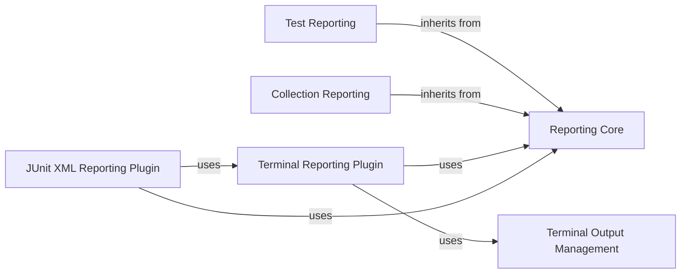

## Component Details

The Reporting & Output subsystem in pytest is responsible for collecting, processing, and presenting test results. It defines the core structures for test reports, handles the display of these results to the console, and supports exporting them to various formats like JUnit XML. The main flow involves test execution generating reports, which are then processed by terminal and XML reporting plugins for display and export.

### Reporting Core
This component defines the fundamental structure and behavior of test reports within pytest. It provides the base class for all reports, `BaseReport`, and common functionalities like converting report details to a terminal-friendly format, extracting captured output sections (stdout, stderr, logs), and handling serialization/deserialization of report data. It also defines properties for checking the outcome of a test (passed, failed, skipped) and retrieving file path information.

**Related Classes/Methods**:

- <a href="https://github.com/pytest-dev/pytest/blob/master/src/_pytest/reports.py#L56-L237" target="_blank" rel="noopener noreferrer">`_pytest.reports.BaseReport` (56:237)</a>
- <a href="https://github.com/pytest-dev/pytest/blob/master/src/_pytest/reports.py#L73-L91" target="_blank" rel="noopener noreferrer">`_pytest.reports.BaseReport.toterminal` (73:91)</a>
- <a href="https://github.com/pytest-dev/pytest/blob/master/src/_pytest/reports.py#L93-L96" target="_blank" rel="noopener noreferrer">`_pytest.reports.BaseReport.get_sections` (93:96)</a>
- <a href="https://github.com/pytest-dev/pytest/blob/master/src/_pytest/reports.py#L99-L110" target="_blank" rel="noopener noreferrer">`_pytest.reports.BaseReport.longreprtext` (99:110)</a>
- <a href="https://github.com/pytest-dev/pytest/blob/master/src/_pytest/reports.py#L113-L120" target="_blank" rel="noopener noreferrer">`_pytest.reports.BaseReport.caplog` (113:120)</a>
- <a href="https://github.com/pytest-dev/pytest/blob/master/src/_pytest/reports.py#L123-L130" target="_blank" rel="noopener noreferrer">`_pytest.reports.BaseReport.capstdout` (123:130)</a>
- <a href="https://github.com/pytest-dev/pytest/blob/master/src/_pytest/reports.py#L133-L140" target="_blank" rel="noopener noreferrer">`_pytest.reports.BaseReport.capstderr` (133:140)</a>
- <a href="https://github.com/pytest-dev/pytest/blob/master/src/_pytest/reports.py#L143-L145" target="_blank" rel="noopener noreferrer">`_pytest.reports.BaseReport.passed` (143:145)</a>
- <a href="https://github.com/pytest-dev/pytest/blob/master/src/_pytest/reports.py#L148-L150" target="_blank" rel="noopener noreferrer">`_pytest.reports.BaseReport.failed` (148:150)</a>
- <a href="https://github.com/pytest-dev/pytest/blob/master/src/_pytest/reports.py#L153-L155" target="_blank" rel="noopener noreferrer">`_pytest.reports.BaseReport.skipped` (153:155)</a>
- <a href="https://github.com/pytest-dev/pytest/blob/master/src/_pytest/reports.py#L158-L160" target="_blank" rel="noopener noreferrer">`_pytest.reports.BaseReport.fspath` (158:160)</a>
- <a href="https://github.com/pytest-dev/pytest/blob/master/src/_pytest/reports.py#L163-L172" target="_blank" rel="noopener noreferrer">`_pytest.reports.BaseReport.count_towards_summary` (163:172)</a>
- <a href="https://github.com/pytest-dev/pytest/blob/master/src/_pytest/reports.py#L175-L193" target="_blank" rel="noopener noreferrer">`_pytest.reports.BaseReport.head_line` (175:193)</a>
- <a href="https://github.com/pytest-dev/pytest/blob/master/src/_pytest/reports.py#L195-L214" target="_blank" rel="noopener noreferrer">`_pytest.reports.BaseReport._get_verbose_word_with_markup` (195:214)</a>
- <a href="https://github.com/pytest-dev/pytest/blob/master/src/_pytest/reports.py#L216-L224" target="_blank" rel="noopener noreferrer">`_pytest.reports.BaseReport._to_json` (216:224)</a>
- <a href="https://github.com/pytest-dev/pytest/blob/master/src/_pytest/reports.py#L227-L237" target="_blank" rel="noopener noreferrer">`_pytest.reports.BaseReport._from_json` (227:237)</a>
- <a href="https://github.com/pytest-dev/pytest/blob/master/src/_pytest/reports.py#L240-L251" target="_blank" rel="noopener noreferrer">`_pytest.reports._report_unserialization_failure` (240:251)</a>
- <a href="https://github.com/pytest-dev/pytest/blob/master/src/_pytest/reports.py#L459-L467" target="_blank" rel="noopener noreferrer">`_pytest.reports.pytest_report_to_serializable` (459:467)</a>
- <a href="https://github.com/pytest-dev/pytest/blob/master/src/_pytest/reports.py#L470-L481" target="_blank" rel="noopener noreferrer">`_pytest.reports.pytest_report_from_serializable` (470:481)</a>
- <a href="https://github.com/pytest-dev/pytest/blob/master/src/_pytest/reports.py#L484-L554" target="_blank" rel="noopener noreferrer">`_pytest.reports._report_to_json` (484:554)</a>
- <a href="https://github.com/pytest-dev/pytest/blob/master/src/_pytest/reports.py#L557-L637" target="_blank" rel="noopener noreferrer">`_pytest.reports._report_kwargs_from_json` (557:637)</a>
- <a href="https://github.com/pytest-dev/pytest/blob/master/src/_pytest/outcomes.py#L17-L37" target="_blank" rel="noopener noreferrer">`_pytest.outcomes.OutcomeException` (17:37)</a>

### Test Reporting
This component extends the `Reporting Core` to specifically handle reports for individual test executions. It defines the `TestReport` class, which captures details about the setup, call, and teardown phases of a test. It includes information about the test's node ID, location, keywords, outcome, duration, and any captured output or exceptions. It also provides a factory method `from_item_and_call` to create a `TestReport` from an `Item` and `CallInfo` object.

**Related Classes/Methods**:

- <a href="https://github.com/pytest-dev/pytest/blob/master/src/_pytest/reports.py#L255-L396" target="_blank" rel="noopener noreferrer">`_pytest.reports.TestReport` (255:396)</a>
- <a href="https://github.com/pytest-dev/pytest/blob/master/src/_pytest/reports.py#L334-L396" target="_blank" rel="noopener noreferrer">`_pytest.reports.TestReport.from_item_and_call` (334:396)</a>

### Collection Reporting
This component focuses on reports generated during the collection phase of tests. It defines the `CollectReport` class, which stores information about the collected items and any errors or skips that occurred during collection. It also includes a `CollectErrorRepr` class for representing collection errors in the terminal.

**Related Classes/Methods**:

- <a href="https://github.com/pytest-dev/pytest/blob/master/src/_pytest/reports.py#L400-L448" target="_blank" rel="noopener noreferrer">`_pytest.reports.CollectReport` (400:448)</a>
- <a href="https://github.com/pytest-dev/pytest/blob/master/src/_pytest/reports.py#L451-L456" target="_blank" rel="noopener noreferrer">`_pytest.reports.CollectErrorRepr` (451:456)</a>
- <a href="https://github.com/pytest-dev/pytest/blob/master/src/_pytest/reports.py#L455-L456" target="_blank" rel="noopener noreferrer">`_pytest.reports.CollectErrorRepr.toterminal` (455:456)</a>

### Terminal Output Management
This component is responsible for managing and formatting output to the terminal. It provides the `TerminalWriter` class, which handles writing lines, separators, and marked-up text to the console. It also includes functions for determining terminal width and whether markup should be used.

**Related Classes/Methods**:

- <a href="https://github.com/pytest-dev/pytest/blob/master/src/_pytest/_io/terminalwriter.py#L51-L254" target="_blank" rel="noopener noreferrer">`_pytest._io.terminalwriter.TerminalWriter` (51:254)</a>
- <a href="https://github.com/pytest-dev/pytest/blob/master/src/_pytest/_io/terminalwriter.py#L75-L90" target="_blank" rel="noopener noreferrer">`_pytest._io.terminalwriter.TerminalWriter.__init__` (75:90)</a>
- <a href="https://github.com/pytest-dev/pytest/blob/master/src/_pytest/_io/terminalwriter.py#L93-L96" target="_blank" rel="noopener noreferrer">`_pytest._io.terminalwriter.TerminalWriter.fullwidth` (93:96)</a>
- <a href="https://github.com/pytest-dev/pytest/blob/master/src/_pytest/_io/terminalwriter.py#L117-L152" target="_blank" rel="noopener noreferrer">`_pytest._io.terminalwriter.TerminalWriter.sep` (117:152)</a>
- <a href="https://github.com/pytest-dev/pytest/blob/master/src/_pytest/_io/terminalwriter.py#L154-L177" target="_blank" rel="noopener noreferrer">`_pytest._io.terminalwriter.TerminalWriter.write` (154:177)</a>
- <a href="https://github.com/pytest-dev/pytest/blob/master/src/_pytest/_io/terminalwriter.py#L179-L181" target="_blank" rel="noopener noreferrer">`_pytest._io.terminalwriter.TerminalWriter.line` (179:181)</a>
- <a href="https://github.com/pytest-dev/pytest/blob/master/src/_pytest/_io/terminalwriter.py#L186-L202" target="_blank" rel="noopener noreferrer">`_pytest._io.terminalwriter.TerminalWriter._write_source` (186:202)</a>
- <a href="https://github.com/pytest-dev/pytest/blob/master/src/_pytest/_io/terminalwriter.py#L231-L254" target="_blank" rel="noopener noreferrer">`_pytest._io.terminalwriter.TerminalWriter._highlight` (231:254)</a>
- <a href="https://github.com/pytest-dev/pytest/blob/master/src/_pytest/_io/terminalwriter.py#L26-L33" target="_blank" rel="noopener noreferrer">`_pytest._io.terminalwriter.get_terminal_width` (26:33)</a>
- <a href="https://github.com/pytest-dev/pytest/blob/master/src/_pytest/_io/terminalwriter.py#L36-L47" target="_blank" rel="noopener noreferrer">`_pytest._io.terminalwriter.should_do_markup` (36:47)</a>

### Terminal Reporting Plugin
This component implements the `TerminalReporter` plugin, which is responsible for displaying test progress and results in the terminal. It handles various pytest hooks related to session start/finish, test run logging, collection, and error reporting. It uses the `Terminal Output Management` component to format and write information to the console, including progress bars, summary statistics, and detailed error reports. It also interacts with `Reporting Core` to process and display test and collection reports.

**Related Classes/Methods**:

- <a href="https://github.com/pytest-dev/pytest/blob/master/src/_pytest/terminal.py#L370-L1454" target="_blank" rel="noopener noreferrer">`_pytest.terminal.TerminalReporter` (370:1454)</a>
- <a href="https://github.com/pytest-dev/pytest/blob/master/src/_pytest/terminal.py#L371-L399" target="_blank" rel="noopener noreferrer">`_pytest.terminal.TerminalReporter.__init__` (371:399)</a>
- <a href="https://github.com/pytest-dev/pytest/blob/master/src/_pytest/terminal.py#L401-L424" target="_blank" rel="noopener noreferrer">`_pytest.terminal.TerminalReporter._determine_show_progress_info` (401:424)</a>
- <a href="https://github.com/pytest-dev/pytest/blob/master/src/_pytest/terminal.py#L461-L470" target="_blank" rel="noopener noreferrer">`_pytest.terminal.TerminalReporter.write_fspath_result` (461:470)</a>
- <a href="https://github.com/pytest-dev/pytest/blob/master/src/_pytest/terminal.py#L472-L479" target="_blank" rel="noopener noreferrer">`_pytest.terminal.TerminalReporter.write_ensure_prefix` (472:479)</a>
- <a href="https://github.com/pytest-dev/pytest/blob/master/src/_pytest/terminal.py#L481-L484" target="_blank" rel="noopener noreferrer">`_pytest.terminal.TerminalReporter.ensure_newline` (481:484)</a>
- <a href="https://github.com/pytest-dev/pytest/blob/master/src/_pytest/terminal.py#L486-L506" target="_blank" rel="noopener noreferrer">`_pytest.terminal.TerminalReporter.wrap_write` (486:506)</a>
- <a href="https://github.com/pytest-dev/pytest/blob/master/src/_pytest/terminal.py#L508-L509" target="_blank" rel="noopener noreferrer">`_pytest.terminal.TerminalReporter.write` (508:509)</a>
- <a href="https://github.com/pytest-dev/pytest/blob/master/src/_pytest/terminal.py#L511-L512" target="_blank" rel="noopener noreferrer">`_pytest.terminal.TerminalReporter.flush` (511:512)</a>
- <a href="https://github.com/pytest-dev/pytest/blob/master/src/_pytest/terminal.py#L514-L518" target="_blank" rel="noopener noreferrer">`_pytest.terminal.TerminalReporter.write_line` (514:518)</a>
- <a href="https://github.com/pytest-dev/pytest/blob/master/src/_pytest/terminal.py#L520-L536" target="_blank" rel="noopener noreferrer">`_pytest.terminal.TerminalReporter.rewrite` (520:536)</a>
- <a href="https://github.com/pytest-dev/pytest/blob/master/src/_pytest/terminal.py#L538-L546" target="_blank" rel="noopener noreferrer">`_pytest.terminal.TerminalReporter.write_sep` (538:546)</a>
- <a href="https://github.com/pytest-dev/pytest/blob/master/src/_pytest/terminal.py#L548-L549" target="_blank" rel="noopener noreferrer">`_pytest.terminal.TerminalReporter.section` (548:549)</a>
- <a href="https://github.com/pytest-dev/pytest/blob/master/src/_pytest/terminal.py#L551-L552" target="_blank" rel="noopener noreferrer">`_pytest.terminal.TerminalReporter.line` (551:552)</a>
- <a href="https://github.com/pytest-dev/pytest/blob/master/src/_pytest/terminal.py#L554-L558" target="_blank" rel="noopener noreferrer">`_pytest.terminal.TerminalReporter._add_stats` (554:558)</a>
- <a href="https://github.com/pytest-dev/pytest/blob/master/src/_pytest/terminal.py#L560-L563" target="_blank" rel="noopener noreferrer">`_pytest.terminal.TerminalReporter.pytest_internalerror` (560:563)</a>
- <a href="https://github.com/pytest-dev/pytest/blob/master/src/_pytest/terminal.py#L565-L578" target="_blank" rel="noopener noreferrer">`_pytest.terminal.TerminalReporter.pytest_warning_recorded` (565:578)</a>
- <a href="https://github.com/pytest-dev/pytest/blob/master/src/_pytest/terminal.py#L580-L586" target="_blank" rel="noopener noreferrer">`_pytest.terminal.TerminalReporter.pytest_plugin_registered` (580:586)</a>
- <a href="https://github.com/pytest-dev/pytest/blob/master/src/_pytest/terminal.py#L588-L589" target="_blank" rel="noopener noreferrer">`_pytest.terminal.TerminalReporter.pytest_deselected` (588:589)</a>
- <a href="https://github.com/pytest-dev/pytest/blob/master/src/_pytest/terminal.py#L591-L603" target="_blank" rel="noopener noreferrer">`_pytest.terminal.TerminalReporter.pytest_runtest_logstart` (591:603)</a>
- <a href="https://github.com/pytest-dev/pytest/blob/master/src/_pytest/terminal.py#L605-L679" target="_blank" rel="noopener noreferrer">`_pytest.terminal.TerminalReporter.pytest_runtest_logreport` (605:679)</a>
- <a href="https://github.com/pytest-dev/pytest/blob/master/src/_pytest/terminal.py#L687-L698" target="_blank" rel="noopener noreferrer">`_pytest.terminal.TerminalReporter.pytest_runtestloop` (687:698)</a>
- <a href="https://github.com/pytest-dev/pytest/blob/master/src/_pytest/terminal.py#L700-L741" target="_blank" rel="noopener noreferrer">`_pytest.terminal.TerminalReporter._get_progress_information_message` (700:741)</a>
- <a href="https://github.com/pytest-dev/pytest/blob/master/src/_pytest/terminal.py#L743-L757" target="_blank" rel="noopener noreferrer">`_pytest.terminal.TerminalReporter._write_progress_information_if_past_edge` (743:757)</a>
- <a href="https://github.com/pytest-dev/pytest/blob/master/src/_pytest/terminal.py#L759-L764" target="_blank" rel="noopener noreferrer">`_pytest.terminal.TerminalReporter._write_progress_information_filling_space` (759:764)</a>
- <a href="https://github.com/pytest-dev/pytest/blob/master/src/_pytest/terminal.py#L771-L776" target="_blank" rel="noopener noreferrer">`_pytest.terminal.TerminalReporter.pytest_collection` (771:776)</a>
- <a href="https://github.com/pytest-dev/pytest/blob/master/src/_pytest/terminal.py#L778-L786" target="_blank" rel="noopener noreferrer">`_pytest.terminal.TerminalReporter.pytest_collectreport` (778:786)</a>
- <a href="https://github.com/pytest-dev/pytest/blob/master/src/_pytest/terminal.py#L788-L822" target="_blank" rel="noopener noreferrer">`_pytest.terminal.TerminalReporter.report_collect` (788:822)</a>
- <a href="https://github.com/pytest-dev/pytest/blob/master/src/_pytest/terminal.py#L825-L849" target="_blank" rel="noopener noreferrer">`_pytest.terminal.TerminalReporter.pytest_sessionstart` (825:849)</a>
- <a href="https://github.com/pytest-dev/pytest/blob/master/src/_pytest/terminal.py#L851-L859" target="_blank" rel="noopener noreferrer">`_pytest.terminal.TerminalReporter._write_report_lines_from_hooks` (851:859)</a>
- <a href="https://github.com/pytest-dev/pytest/blob/master/src/_pytest/terminal.py#L861-L876" target="_blank" rel="noopener noreferrer">`_pytest.terminal.TerminalReporter.pytest_report_header` (861:876)</a>
- <a href="https://github.com/pytest-dev/pytest/blob/master/src/_pytest/terminal.py#L878-L898" target="_blank" rel="noopener noreferrer">`_pytest.terminal.TerminalReporter.pytest_collection_finish` (878:898)</a>
- <a href="https://github.com/pytest-dev/pytest/blob/master/src/_pytest/terminal.py#L900-L928" target="_blank" rel="noopener noreferrer">`_pytest.terminal.TerminalReporter._printcollecteditems` (900:928)</a>
- <a href="https://github.com/pytest-dev/pytest/blob/master/src/_pytest/terminal.py#L931-L955" target="_blank" rel="noopener noreferrer">`_pytest.terminal.TerminalReporter.pytest_sessionfinish` (931:955)</a>
- <a href="https://github.com/pytest-dev/pytest/blob/master/src/_pytest/terminal.py#L958-L970" target="_blank" rel="noopener noreferrer">`_pytest.terminal.TerminalReporter.pytest_terminal_summary` (958:970)</a>
- <a href="https://github.com/pytest-dev/pytest/blob/master/src/_pytest/terminal.py#L972-L973" target="_blank" rel="noopener noreferrer">`_pytest.terminal.TerminalReporter.pytest_keyboard_interrupt` (972:973)</a>
- <a href="https://github.com/pytest-dev/pytest/blob/master/src/_pytest/terminal.py#L975-L977" target="_blank" rel="noopener noreferrer">`_pytest.terminal.TerminalReporter.pytest_unconfigure` (975:977)</a>
- <a href="https://github.com/pytest-dev/pytest/blob/master/src/_pytest/terminal.py#L979-L993" target="_blank" rel="noopener noreferrer">`_pytest.terminal.TerminalReporter._report_keyboardinterrupt` (979:993)</a>
- <a href="https://github.com/pytest-dev/pytest/blob/master/src/_pytest/terminal.py#L995-L1016" target="_blank" rel="noopener noreferrer">`_pytest.terminal.TerminalReporter._locationline` (995:1016)</a>
- <a href="https://github.com/pytest-dev/pytest/blob/master/src/_pytest/terminal.py#L1018-L1022" target="_blank" rel="noopener noreferrer">`_pytest.terminal.TerminalReporter._getfailureheadline` (1018:1022)</a>
- <a href="https://github.com/pytest-dev/pytest/blob/master/src/_pytest/terminal.py#L1024-L1031" target="_blank" rel="noopener noreferrer">`_pytest.terminal.TerminalReporter._getcrashline` (1024:1031)</a>
- <a href="https://github.com/pytest-dev/pytest/blob/master/src/_pytest/terminal.py#L1036-L1037" target="_blank" rel="noopener noreferrer">`_pytest.terminal.TerminalReporter.getreports` (1036:1037)</a>
- <a href="https://github.com/pytest-dev/pytest/blob/master/src/_pytest/terminal.py#L1039-L1091" target="_blank" rel="noopener noreferrer">`_pytest.terminal.TerminalReporter.summary_warnings` (1039:1091)</a>
- <a href="https://github.com/pytest-dev/pytest/blob/master/src/_pytest/terminal.py#L1093-L1094" target="_blank" rel="noopener noreferrer">`_pytest.terminal.TerminalReporter.summary_passes` (1093:1094)</a>
- <a href="https://github.com/pytest-dev/pytest/blob/master/src/_pytest/terminal.py#L1096-L1097" target="_blank" rel="noopener noreferrer">`_pytest.terminal.TerminalReporter.summary_xpasses` (1096:1097)</a>
- <a href="https://github.com/pytest-dev/pytest/blob/master/src/_pytest/terminal.py#L1099-L1113" target="_blank" rel="noopener noreferrer">`_pytest.terminal.TerminalReporter.summary_passes_combined` (1099:1113)</a>
- <a href="https://github.com/pytest-dev/pytest/blob/master/src/_pytest/terminal.py#L1115-L1121" target="_blank" rel="noopener noreferrer">`_pytest.terminal.TerminalReporter._get_teardown_reports` (1115:1121)</a>
- <a href="https://github.com/pytest-dev/pytest/blob/master/src/_pytest/terminal.py#L1123-L1125" target="_blank" rel="noopener noreferrer">`_pytest.terminal.TerminalReporter._handle_teardown_sections` (1123:1125)</a>
- <a href="https://github.com/pytest-dev/pytest/blob/master/src/_pytest/terminal.py#L1127-L1138" target="_blank" rel="noopener noreferrer">`_pytest.terminal.TerminalReporter.print_teardown_sections` (1127:1138)</a>
- <a href="https://github.com/pytest-dev/pytest/blob/master/src/_pytest/terminal.py#L1140-L1142" target="_blank" rel="noopener noreferrer">`_pytest.terminal.TerminalReporter.summary_failures` (1140:1142)</a>
- <a href="https://github.com/pytest-dev/pytest/blob/master/src/_pytest/terminal.py#L1144-L1147" target="_blank" rel="noopener noreferrer">`_pytest.terminal.TerminalReporter.summary_xfailures` (1144:1147)</a>
- <a href="https://github.com/pytest-dev/pytest/blob/master/src/_pytest/terminal.py#L1149-L1172" target="_blank" rel="noopener noreferrer">`_pytest.terminal.TerminalReporter.summary_failures_combined` (1149:1172)</a>
- <a href="https://github.com/pytest-dev/pytest/blob/master/src/_pytest/terminal.py#L1174-L1187" target="_blank" rel="noopener noreferrer">`_pytest.terminal.TerminalReporter.summary_errors` (1174:1187)</a>
- <a href="https://github.com/pytest-dev/pytest/blob/master/src/_pytest/terminal.py#L1189-L1200" target="_blank" rel="noopener noreferrer">`_pytest.terminal.TerminalReporter._outrep_summary` (1189:1200)</a>
- <a href="https://github.com/pytest-dev/pytest/blob/master/src/_pytest/terminal.py#L1202-L1237" target="_blank" rel="noopener noreferrer">`_pytest.terminal.TerminalReporter.summary_stats` (1202:1237)</a>
- <a href="https://github.com/pytest-dev/pytest/blob/master/src/_pytest/terminal.py#L1239-L1345" target="_blank" rel="noopener noreferrer">`_pytest.terminal.TerminalReporter.short_test_summary` (1239:1345)</a>
- <a href="https://github.com/pytest-dev/pytest/blob/master/src/_pytest/terminal.py#L1347-L1352" target="_blank" rel="noopener noreferrer">`_pytest.terminal.TerminalReporter._get_main_color` (1347:1352)</a>
- <a href="https://github.com/pytest-dev/pytest/blob/master/src/_pytest/terminal.py#L1366-L1373" target="_blank" rel="noopener noreferrer">`_pytest.terminal.TerminalReporter._set_main_color` (1366:1373)</a>
- <a href="https://github.com/pytest-dev/pytest/blob/master/src/_pytest/terminal.py#L1375-L1398" target="_blank" rel="noopener noreferrer">`_pytest.terminal.TerminalReporter.build_summary_stats_line` (1375:1398)</a>
- <a href="https://github.com/pytest-dev/pytest/blob/master/src/_pytest/terminal.py#L1400-L1403" target="_blank" rel="noopener noreferrer">`_pytest.terminal.TerminalReporter._get_reports_to_display` (1400:1403)</a>
- <a href="https://github.com/pytest-dev/pytest/blob/master/src/_pytest/terminal.py#L1405-L1422" target="_blank" rel="noopener noreferrer">`_pytest.terminal.TerminalReporter._build_normal_summary_stats_line` (1405:1422)</a>
- <a href="https://github.com/pytest-dev/pytest/blob/master/src/_pytest/terminal.py#L1424-L1454" target="_blank" rel="noopener noreferrer">`_pytest.terminal.TerminalReporter._build_collect_only_summary_stats_line` (1424:1454)</a>
- <a href="https://github.com/pytest-dev/pytest/blob/master/src/_pytest/terminal.py#L134-L284" target="_blank" rel="noopener noreferrer">`_pytest.terminal.pytest_addoption` (134:284)</a>
- <a href="https://github.com/pytest-dev/pytest/blob/master/src/_pytest/terminal.py#L287-L296" target="_blank" rel="noopener noreferrer">`_pytest.terminal.pytest_configure` (287:296)</a>
- <a href="https://github.com/pytest-dev/pytest/blob/master/src/_pytest/terminal.py#L299-L321" target="_blank" rel="noopener noreferrer">`_pytest.terminal.getreportopt` (299:321)</a>
- <a href="https://github.com/pytest-dev/pytest/blob/master/src/_pytest/terminal.py#L325-L337" target="_blank" rel="noopener noreferrer">`_pytest.terminal.pytest_report_teststatus` (325:337)</a>
- <a href="https://github.com/pytest-dev/pytest/blob/master/src/_pytest/terminal.py#L1457-L1464" target="_blank" rel="noopener noreferrer">`_pytest.terminal._get_node_id_with_markup` (1457:1464)</a>
- <a href="https://github.com/pytest-dev/pytest/blob/master/src/_pytest/terminal.py#L1467-L1489" target="_blank" rel="noopener noreferrer">`_pytest.terminal._format_trimmed` (1467:1489)</a>
- <a href="https://github.com/pytest-dev/pytest/blob/master/src/_pytest/terminal.py#L1492-L1521" target="_blank" rel="noopener noreferrer">`_pytest.terminal._get_line_with_reprcrash_message` (1492:1521)</a>
- <a href="https://github.com/pytest-dev/pytest/blob/master/src/_pytest/terminal.py#L1524-L1552" target="_blank" rel="noopener noreferrer">`_pytest.terminal._folded_skips` (1524:1552)</a>
- <a href="https://github.com/pytest-dev/pytest/blob/master/src/_pytest/terminal.py#L1564-L1574" target="_blank" rel="noopener noreferrer">`_pytest.terminal.pluralize` (1564:1574)</a>
- <a href="https://github.com/pytest-dev/pytest/blob/master/src/_pytest/terminal.py#L1577-L1588" target="_blank" rel="noopener noreferrer">`_pytest.terminal._plugin_nameversions` (1577:1588)</a>
- <a href="https://github.com/pytest-dev/pytest/blob/master/src/_pytest/terminal.py#L1591-L1597" target="_blank" rel="noopener noreferrer">`_pytest.terminal.format_session_duration` (1591:1597)</a>
- <a href="https://github.com/pytest-dev/pytest/blob/master/src/_pytest/terminal.py#L1600-L1620" target="_blank" rel="noopener noreferrer">`_pytest.terminal.format_node_duration` (1600:1620)</a>

### JUnit XML Reporting Plugin
This component provides functionality for generating JUnit XML reports from pytest test results. It defines the `LogXML` class, which manages the XML report generation process, including handling test cases, properties, and captured output. It interacts with the `NodeReporter` to record individual test outcomes and their details. This component also includes functions for escaping XML characters and managing global properties for the JUnit XML report. It relies on `Reporting Core` for report data and interacts with `Terminal Reporting Plugin` for overall reporting context.

**Related Classes/Methods**:

- <a href="https://github.com/pytest-dev/pytest/blob/master/src/_pytest/junitxml.py#L458-L692" target="_blank" rel="noopener noreferrer">`_pytest.junitxml.LogXML` (458:692)</a>
- <a href="https://github.com/pytest-dev/pytest/blob/master/src/_pytest/junitxml.py#L459-L490" target="_blank" rel="noopener noreferrer">`_pytest.junitxml.LogXML.__init__` (459:490)</a>
- <a href="https://github.com/pytest-dev/pytest/blob/master/src/_pytest/junitxml.py#L492-L502" target="_blank" rel="noopener noreferrer">`_pytest.junitxml.LogXML.finalize` (492:502)</a>
- <a href="https://github.com/pytest-dev/pytest/blob/master/src/_pytest/junitxml.py#L504-L520" target="_blank" rel="noopener noreferrer">`_pytest.junitxml.LogXML.node_reporter` (504:520)</a>
- <a href="https://github.com/pytest-dev/pytest/blob/master/src/_pytest/junitxml.py#L526-L529" target="_blank" rel="noopener noreferrer">`_pytest.junitxml.LogXML._opentestcase` (526:529)</a>
- <a href="https://github.com/pytest-dev/pytest/blob/master/src/_pytest/junitxml.py#L531-L614" target="_blank" rel="noopener noreferrer">`_pytest.junitxml.LogXML.pytest_runtest_logreport` (531:614)</a>
- <a href="https://github.com/pytest-dev/pytest/blob/master/src/_pytest/junitxml.py#L616-L621" target="_blank" rel="noopener noreferrer">`_pytest.junitxml.LogXML.update_testcase_duration` (616:621)</a>
- <a href="https://github.com/pytest-dev/pytest/blob/master/src/_pytest/junitxml.py#L623-L629" target="_blank" rel="noopener noreferrer">`_pytest.junitxml.LogXML.pytest_collectreport` (623:629)</a>
- <a href="https://github.com/pytest-dev/pytest/blob/master/src/_pytest/junitxml.py#L631-L634" target="_blank" rel="noopener noreferrer">`_pytest.junitxml.LogXML.pytest_internalerror` (631:634)</a>
- <a href="https://github.com/pytest-dev/pytest/blob/master/src/_pytest/junitxml.py#L636-L637" target="_blank" rel="noopener noreferrer">`_pytest.junitxml.LogXML.pytest_sessionstart` (636:637)</a>
- <a href="https://github.com/pytest-dev/pytest/blob/master/src/_pytest/junitxml.py#L639-L675" target="_blank" rel="noopener noreferrer">`_pytest.junitxml.LogXML.pytest_sessionfinish` (639:675)</a>
- <a href="https://github.com/pytest-dev/pytest/blob/master/src/_pytest/junitxml.py#L677-L678" target="_blank" rel="noopener noreferrer">`_pytest.junitxml.LogXML.pytest_terminal_summary` (677:678)</a>
- <a href="https://github.com/pytest-dev/pytest/blob/master/src/_pytest/junitxml.py#L680-L683" target="_blank" rel="noopener noreferrer">`_pytest.junitxml.LogXML.add_global_property` (680:683)</a>
- <a href="https://github.com/pytest-dev/pytest/blob/master/src/_pytest/junitxml.py#L685-L692" target="_blank" rel="noopener noreferrer">`_pytest.junitxml.LogXML._get_global_properties_node` (685:692)</a>
- <a href="https://github.com/pytest-dev/pytest/blob/master/src/_pytest/junitxml.py#L86-L258" target="_blank" rel="noopener noreferrer">`_pytest.junitxml._NodeReporter` (86:258)</a>
- <a href="https://github.com/pytest-dev/pytest/blob/master/src/_pytest/junitxml.py#L87-L95" target="_blank" rel="noopener noreferrer">`_pytest.junitxml._NodeReporter.__init__` (87:95)</a>
- <a href="https://github.com/pytest-dev/pytest/blob/master/src/_pytest/junitxml.py#L97-L99" target="_blank" rel="noopener noreferrer">`_pytest.junitxml._NodeReporter.append` (97:99)</a>
- <a href="https://github.com/pytest-dev/pytest/blob/master/src/_pytest/junitxml.py#L101-L102" target="_blank" rel="noopener noreferrer">`_pytest.junitxml._NodeReporter.add_property` (101:102)</a>
- <a href="https://github.com/pytest-dev/pytest/blob/master/src/_pytest/junitxml.py#L104-L105" target="_blank" rel="noopener noreferrer">`_pytest.junitxml._NodeReporter.add_attribute` (104:105)</a>
- <a href="https://github.com/pytest-dev/pytest/blob/master/src/_pytest/junitxml.py#L107-L114" target="_blank" rel="noopener noreferrer">`_pytest.junitxml._NodeReporter.make_properties_node` (107:114)</a>
- <a href="https://github.com/pytest-dev/pytest/blob/master/src/_pytest/junitxml.py#L116-L144" target="_blank" rel="noopener noreferrer">`_pytest.junitxml._NodeReporter.record_testreport` (116:144)</a>
- <a href="https://github.com/pytest-dev/pytest/blob/master/src/_pytest/junitxml.py#L146-L152" target="_blank" rel="noopener noreferrer">`_pytest.junitxml._NodeReporter.to_xml` (146:152)</a>
- <a href="https://github.com/pytest-dev/pytest/blob/master/src/_pytest/junitxml.py#L154-L157" target="_blank" rel="noopener noreferrer">`_pytest.junitxml._NodeReporter._add_simple` (154:157)</a>
- <a href="https://github.com/pytest-dev/pytest/blob/master/src/_pytest/junitxml.py#L159-L180" target="_blank" rel="noopener noreferrer">`_pytest.junitxml._NodeReporter.write_captured_output` (159:180)</a>
- <a href="https://github.com/pytest-dev/pytest/blob/master/src/_pytest/junitxml.py#L182-L183" target="_blank" rel="noopener noreferrer">`_pytest.junitxml._NodeReporter._prepare_content` (182:183)</a>
- <a href="https://github.com/pytest-dev/pytest/blob/master/src/_pytest/junitxml.py#L185-L188" target="_blank" rel="noopener noreferrer">`_pytest.junitxml._NodeReporter._write_content` (185:188)</a>
- <a href="https://github.com/pytest-dev/pytest/blob/master/src/_pytest/junitxml.py#L190-L191" target="_blank" rel="noopener noreferrer">`_pytest.junitxml._NodeReporter.append_pass` (190:191)</a>
- <a href="https://github.com/pytest-dev/pytest/blob/master/src/_pytest/junitxml.py#L193-L207" target="_blank" rel="noopener noreferrer">`_pytest.junitxml._NodeReporter.append_failure` (193:207)</a>
- <a href="https://github.com/pytest-dev/pytest/blob/master/src/_pytest/junitxml.py#L209-L212" target="_blank" rel="noopener noreferrer">`_pytest.junitxml._NodeReporter.append_collect_error` (209:212)</a>
- <a href="https://github.com/pytest-dev/pytest/blob/master/src/_pytest/junitxml.py#L214-L215" target="_blank" rel="noopener noreferrer">`_pytest.junitxml._NodeReporter.append_collect_skipped` (214:215)</a>
- <a href="https://github.com/pytest-dev/pytest/blob/master/src/_pytest/junitxml.py#L217-L229" target="_blank" rel="noopener noreferrer">`_pytest.junitxml._NodeReporter.append_error` (217:229)</a>
- <a href="https://github.com/pytest-dev/pytest/blob/master/src/_pytest/junitxml.py#L231-L251" target="_blank" rel="noopener noreferrer">`_pytest.junitxml._NodeReporter.append_skipped` (231:251)</a>
- <a href="https://github.com/pytest-dev/pytest/blob/master/src/_pytest/junitxml.py#L253-L258" target="_blank" rel="noopener noreferrer">`_pytest.junitxml._NodeReporter.finalize` (253:258)</a>
- <a href="https://github.com/pytest-dev/pytest/blob/master/src/_pytest/junitxml.py#L37-L61" target="_blank" rel="noopener noreferrer">`_pytest.junitxml.bin_xml_escape` (37:61)</a>
- <a href="https://github.com/pytest-dev/pytest/blob/master/src/_pytest/junitxml.py#L64-L71" target="_blank" rel="noopener noreferrer">`_pytest.junitxml.merge_family` (64:71)</a>
- <a href="https://github.com/pytest-dev/pytest/blob/master/src/_pytest/junitxml.py#L261-L273" target="_blank" rel="noopener noreferrer">`_pytest.junitxml._warn_incompatibility_with_xunit2` (261:273)</a>
- <a href="https://github.com/pytest-dev/pytest/blob/master/src/_pytest/junitxml.py#L277-L296" target="_blank" rel="noopener noreferrer">`_pytest.junitxml.record_property` (277:296)</a>
- <a href="https://github.com/pytest-dev/pytest/blob/master/src/_pytest/junitxml.py#L300-L325" target="_blank" rel="noopener noreferrer">`_pytest.junitxml.record_xml_attribute` (300:325)</a>
- <a href="https://github.com/pytest-dev/pytest/blob/master/src/_pytest/junitxml.py#L328-L334" target="_blank" rel="noopener noreferrer">`_pytest.junitxml._check_record_param_type` (328:334)</a>
- <a href="https://github.com/pytest-dev/pytest/blob/master/src/_pytest/junitxml.py#L338-L373" target="_blank" rel="noopener noreferrer">`_pytest.junitxml.record_testsuite_property` (338:373)</a>
- <a href="https://github.com/pytest-dev/pytest/blob/master/src/_pytest/junitxml.py#L376-L420" target="_blank" rel="noopener noreferrer">`_pytest.junitxml.pytest_addoption` (376:420)</a>
- <a href="https://github.com/pytest-dev/pytest/blob/master/src/_pytest/junitxml.py#L423-L437" target="_blank" rel="noopener noreferrer">`_pytest.junitxml.pytest_configure` (423:437)</a>
- <a href="https://github.com/pytest-dev/pytest/blob/master/src/_pytest/junitxml.py#L440-L444" target="_blank" rel="noopener noreferrer">`_pytest.junitxml.pytest_unconfigure` (440:444)</a>
- <a href="https://github.com/pytest-dev/pytest/blob/master/src/_pytest/junitxml.py#L447-L455" target="_blank" rel="noopener noreferrer">`_pytest.junitxml.mangle_test_address` (447:455)</a>

### [FAQ](https://github.com/CodeBoarding/GeneratedOnBoardings/tree/main?tab=readme-ov-file#faq)