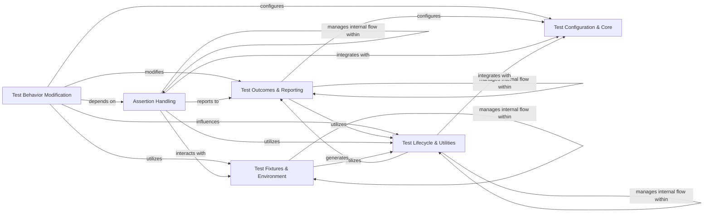

## Component Details

This graph illustrates the 'Test Behavior Modification' component within the pytest framework and its interactions with other core components. The 'Test Behavior Modification' component is central to altering test execution, encompassing functionalities like applying markers (skip, xfail), enhancing assertion messages, temporarily modifying runtime objects (monkeypatching), and controlling stepwise test execution. It interacts with configuration, test outcomes, fixtures, assertion handling, and the overall test lifecycle to provide flexible and powerful test control.

### Test Behavior Modification
Provides mechanisms to alter test execution and behavior, including applying markers (e.g., skip, xfail), rewriting assertions for enhanced failure messages, temporarily modifying objects (monkeypatching), and controlling stepwise execution.

**Related Classes/Methods**:

- <a href="https://github.com/pytest-dev/pytest/blob/master/src/_pytest/mark/structures.py#L309-L404" target="_blank" rel="noopener noreferrer">`_pytest.mark.structures.MarkDecorator` (309:404)</a>
- <a href="https://github.com/pytest-dev/pytest/blob/master/src/_pytest/mark/structures.py#L534-L603" target="_blank" rel="noopener noreferrer">`_pytest.mark.structures.MarkGenerator` (534:603)</a>
- <a href="https://github.com/pytest-dev/pytest/blob/master/src/_pytest/skipping.py#L1-L100" target="_blank" rel="noopener noreferrer">`_pytest.skipping` (1:100)</a>
- <a href="https://github.com/pytest-dev/pytest/blob/master/src/_pytest/assertion/rewrite.py#L1-L100" target="_blank" rel="noopener noreferrer">`_pytest.assertion.rewrite.RewriteHook` (1:100)</a>
- <a href="https://github.com/pytest-dev/pytest/blob/master/src/_pytest/assertion/util.py#L1-L100" target="_blank" rel="noopener noreferrer">`_pytest.assertion.util` (1:100)</a>
- <a href="https://github.com/pytest-dev/pytest/blob/master/src/_pytest/monkeypatch.py#L117-L415" target="_blank" rel="noopener noreferrer">`_pytest.monkeypatch.MonkeyPatch` (117:415)</a>
- <a href="https://github.com/pytest-dev/pytest/blob/master/src/_pytest/stepwise.py#L99-L209" target="_blank" rel="noopener noreferrer">`_pytest.stepwise.StepwisePlugin` (99:209)</a>

### Test Configuration & Core
Manages the overall configuration of pytest, including argument parsing, and provides core functionalities for test execution and node management.

**Related Classes/Methods**:

- `_pytest.config` (1:100)
- <a href="https://github.com/pytest-dev/pytest/blob/master/src/_pytest/config/argparsing.py#L1-L100" target="_blank" rel="noopener noreferrer">`_pytest.config.argparsing` (1:100)</a>
- <a href="https://github.com/pytest-dev/pytest/blob/master/src/_pytest/main.py#L1-L100" target="_blank" rel="noopener noreferrer">`_pytest.main` (1:100)</a>
- <a href="https://github.com/pytest-dev/pytest/blob/master/src/_pytest/nodes.py#L1-L100" target="_blank" rel="noopener noreferrer">`_pytest.nodes` (1:100)</a>
- `_pytest` (1:100)
- <a href="https://github.com/pytest-dev/pytest/blob/master/src/_pytest/runner.py#L1-L100" target="_blank" rel="noopener noreferrer">`_pytest.runner` (1:100)</a>

### Test Fixtures & Environment
Handles the setup and teardown of test environments through fixtures and provides utilities for modifying the environment during tests (monkeypatching).

**Related Classes/Methods**:

- <a href="https://github.com/pytest-dev/pytest/blob/master/src/_pytest/fixtures.py#L1-L100" target="_blank" rel="noopener noreferrer">`_pytest.fixtures` (1:100)</a>
- <a href="https://github.com/pytest-dev/pytest/blob/master/src/_pytest/monkeypatch.py#L31-L57" target="_blank" rel="noopener noreferrer">`_pytest.monkeypatch` (31:57)</a>

### Test Outcomes & Reporting
Responsible for determining and managing test outcomes (pass, fail, skip), handling exceptions, and generating comprehensive test reports.

**Related Classes/Methods**:

- <a href="https://github.com/pytest-dev/pytest/blob/master/src/_pytest/outcomes.py#L1-L100" target="_blank" rel="noopener noreferrer">`_pytest.outcomes` (1:100)</a>
- <a href="https://github.com/pytest-dev/pytest/blob/master/src/_pytest/raises.py#L74-L79" target="_blank" rel="noopener noreferrer">`_pytest.raises` (74:79)</a>
- <a href="https://github.com/pytest-dev/pytest/blob/master/src/_pytest/reports.py#L1-L100" target="_blank" rel="noopener noreferrer">`_pytest.reports` (1:100)</a>
- <a href="https://github.com/pytest-dev/pytest/blob/master/src/_pytest/skipping.py#L1-L100" target="_blank" rel="noopener noreferrer">`_pytest.skipping` (1:100)</a>
- <a href="https://github.com/pytest-dev/pytest/blob/master/src/_pytest/mark/structures.py#L1-L100" target="_blank" rel="noopener noreferrer">`_pytest.mark.structures` (1:100)</a>

### Assertion Handling
Provides mechanisms for rewriting assertions to offer more detailed failure explanations and utility functions to support assertion processing.

**Related Classes/Methods**:

- <a href="https://github.com/pytest-dev/pytest/blob/master/src/_pytest/assertion/rewrite.py#L1-L100" target="_blank" rel="noopener noreferrer">`_pytest.assertion.rewrite` (1:100)</a>
- <a href="https://github.com/pytest-dev/pytest/blob/master/src/_pytest/assertion/util.py#L1-L100" target="_blank" rel="noopener noreferrer">`_pytest.assertion.util` (1:100)</a>
- `_pytest.assertion` (1:100)

### Test Lifecycle & Utilities
Manages specific aspects of the test lifecycle, such as stepwise execution and caching, and includes various internal utilities for I/O, code introspection, path handling, and warning management.

**Related Classes/Methods**:

- <a href="https://github.com/pytest-dev/pytest/blob/master/src/_pytest/stepwise.py#L1-L100" target="_blank" rel="noopener noreferrer">`_pytest.stepwise` (1:100)</a>
- <a href="https://github.com/pytest-dev/pytest/blob/master/src/_pytest/cacheprovider.py#L1-L100" target="_blank" rel="noopener noreferrer">`_pytest.cacheprovider` (1:100)</a>
- <a href="https://github.com/pytest-dev/pytest/blob/master/src/_pytest/_io/saferepr.py#L99-L111" target="_blank" rel="noopener noreferrer">`_pytest._io.saferepr` (99:111)</a>
- `_pytest._code` (1:100)
- <a href="https://github.com/pytest-dev/pytest/blob/master/src/_pytest/_io/pprint.py#L1-L100" target="_blank" rel="noopener noreferrer">`_pytest._io.pprint` (1:100)</a>
- <a href="https://github.com/pytest-dev/pytest/blob/master/src/_pytest/python_api.py#L1-L100" target="_blank" rel="noopener noreferrer">`_pytest.python_api` (1:100)</a>
- <a href="https://github.com/pytest-dev/pytest/blob/master/src/_pytest/pathlib.py#L1-L100" target="_blank" rel="noopener noreferrer">`_pytest.pathlib` (1:100)</a>
- <a href="https://github.com/pytest-dev/pytest/blob/master/src/_pytest/stash.py#L1-L100" target="_blank" rel="noopener noreferrer">`_pytest.stash` (1:100)</a>
- <a href="https://github.com/pytest-dev/pytest/blob/master/src/_pytest/deprecated.py#L1-L100" target="_blank" rel="noopener noreferrer">`_pytest.deprecated` (1:100)</a>
- <a href="https://github.com/pytest-dev/pytest/blob/master/src/_pytest/scope.py#L1-L100" target="_blank" rel="noopener noreferrer">`_pytest.scope` (1:100)</a>
- <a href="https://github.com/pytest-dev/pytest/blob/master/src/_pytest/warning_types.py#L1-L100" target="_blank" rel="noopener noreferrer">`_pytest.warning_types` (1:100)</a>
- <a href="https://github.com/pytest-dev/pytest/blob/master/src/_pytest/warnings.py#L1-L100" target="_blank" rel="noopener noreferrer">`_pytest.warnings` (1:100)</a>

### [FAQ](https://github.com/CodeBoarding/GeneratedOnBoardings/tree/main?tab=readme-ov-file#faq)