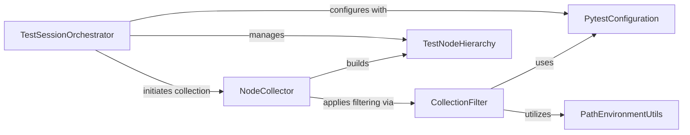

## Component Details

The Test Discovery & Node Hierarchy component is responsible for identifying and organizing test-related entities within a project. It starts by orchestrating the collection process, which involves scanning directories and files based on configured patterns. During this scan, it filters out irrelevant paths and builds a hierarchical tree of test nodes, representing modules, classes, and individual test functions. This hierarchy is then used to determine which tests are available for execution and to manage their lifecycle, including setup and teardown phases.

### TestSessionOrchestrator
This component orchestrates the entire test collection phase within a pytest session. It initiates the collection process, handles the reporting of collection results, and allows for modification of the collected test items. It acts as the central hub for managing the collection lifecycle.

**Related Classes/Methods**:

- <a href="https://github.com/pytest-dev/pytest/blob/master/src/_pytest/main.py#L739-L741" target="_blank" rel="noopener noreferrer">`_pytest.main.Session.perform_collect` (739:741)</a>
- <a href="https://github.com/pytest-dev/pytest/blob/master/src/_pytest/main.py#L352-L353" target="_blank" rel="noopener noreferrer">`_pytest.main.pytest_collection` (352:353)</a>
- <a href="https://github.com/pytest-dev/pytest/blob/master/src/_pytest/main.py#L440-L455" target="_blank" rel="noopener noreferrer">`_pytest.main.pytest_collection_modifyitems` (440:455)</a>
- `_pytest.main.Session.ihook.pytest_collectreport` (757:757)
- <a href="https://github.com/pytest-dev/pytest/blob/master/src/_pytest/main.py#L964-L981" target="_blank" rel="noopener noreferrer">`_pytest.main.Session.genitems` (964:981)</a>
- `_pytest.main.Session.config.hook.pytest_collection_modifyitems` (763:763)
- <a href="https://github.com/pytest-dev/pytest/blob/master/src/_pytest/main.py#L548-L981" target="_blank" rel="noopener noreferrer">`_pytest.main.Session` (548:981)</a>

### CollectionFilter
This component determines which files and directories should be ignored during the test collection process. It uses various configuration options and path matching utilities to decide whether a given path should be excluded from collection.

**Related Classes/Methods**:

- <a href="https://github.com/pytest-dev/pytest/blob/master/src/_pytest/main.py#L396-L431" target="_blank" rel="noopener noreferrer">`_pytest.main.pytest_ignore_collect` (396:431)</a>
- `_pytest.config.Config._getconftest_pathlist` (1000:1000)
- `_pytest.config.Config.getoption` (950:950)
- `_pytest.config.Config.getini` (960:960)
- <a href="https://github.com/pytest-dev/pytest/blob/master/src/_pytest/pathlib.py#L998-L1004" target="_blank" rel="noopener noreferrer">`_pytest.pathlib.absolutepath` (998:1004)</a>
- `fnmatch.fnmatch` (full file reference)
- <a href="https://github.com/pytest-dev/pytest/blob/master/src/_pytest/main.py#L375-L393" target="_blank" rel="noopener noreferrer">`_pytest.main._in_venv` (375:393)</a>
- <a href="https://github.com/pytest-dev/pytest/blob/master/src/_pytest/pathlib.py#L419-L452" target="_blank" rel="noopener noreferrer">`_pytest.pathlib.fnmatch_ex` (419:452)</a>

### NodeCollector
This component is responsible for the recursive collection of test nodes, including directories, files, modules, classes, and functions. It interacts with the collection filtering mechanism to respect ignore rules and uses a generic node collection function to process individual nodes, building the test node hierarchy.

**Related Classes/Methods**:

- <a href="https://github.com/pytest-dev/pytest/blob/master/src/_pytest/main.py#L434-L437" target="_blank" rel="noopener noreferrer">`_pytest.main.pytest_collect_directory` (434:437)</a>
- <a href="https://github.com/pytest-dev/pytest/blob/master/src/_pytest/main.py#L509-L521" target="_blank" rel="noopener noreferrer">`_pytest.main.Dir.from_parent` (509:521)</a>
- <a href="https://github.com/pytest-dev/pytest/blob/master/src/_pytest/runner.py#L564-L571" target="_blank" rel="noopener noreferrer">`_pytest.runner.collect_one_node` (564:571)</a>
- <a href="https://github.com/pytest-dev/pytest/blob/master/src/_pytest/main.py#L523-L544" target="_blank" rel="noopener noreferrer">`_pytest.main.Dir.collect` (523:544)</a>
- <a href="https://github.com/pytest-dev/pytest/blob/master/src/_pytest/nodes.py#L499-L543" target="_blank" rel="noopener noreferrer">`_pytest.nodes.Collector` (499:543)</a>
- <a href="https://github.com/pytest-dev/pytest/blob/master/src/_pytest/nodes.py#L560-L627" target="_blank" rel="noopener noreferrer">`_pytest.nodes.FSCollector` (560:627)</a>
- <a href="https://github.com/pytest-dev/pytest/blob/master/src/_pytest/python.py#L342-L487" target="_blank" rel="noopener noreferrer">`_pytest.python.PyCollector` (342:487)</a>

### PytestConfiguration
This component provides an interface to access and retrieve various configuration settings and options within pytest, such as command-line arguments and ini-file settings. It is crucial for other components to adapt their behavior based on user-defined configurations.

**Related Classes/Methods**:

- `_pytest.config.Config.getoption` (950:950)
- `_pytest.config.Config.getini` (960:960)
- `_pytest.config.Config._getconftest_pathlist` (1000:1000)
- `_pytest.config.Config.hook` (1010:1010)
- `_pytest.config.Config` (500:1050)

### PathEnvironmentUtils
This component provides utility functions related to file system paths and environment checks, such as resolving absolute paths, checking for virtual environments, and performing flexible filename matching.

**Related Classes/Methods**:

- <a href="https://github.com/pytest-dev/pytest/blob/master/src/_pytest/pathlib.py#L998-L1004" target="_blank" rel="noopener noreferrer">`_pytest.pathlib.absolutepath` (998:1004)</a>
- <a href="https://github.com/pytest-dev/pytest/blob/master/src/_pytest/main.py#L375-L393" target="_blank" rel="noopener noreferrer">`_pytest.main._in_venv` (375:393)</a>
- <a href="https://github.com/pytest-dev/pytest/blob/master/src/_pytest/pathlib.py#L419-L452" target="_blank" rel="noopener noreferrer">`_pytest.pathlib.fnmatch_ex` (419:452)</a>
- `fnmatch.fnmatch` (full file reference)

### TestNodeHierarchy
Represents the hierarchical structure of collected test items, including directories, files, modules, classes, and individual test functions. It defines the base types for all discoverable test entities.

**Related Classes/Methods**:

- <a href="https://github.com/pytest-dev/pytest/blob/master/src/_pytest/nodes.py#L128-L477" target="_blank" rel="noopener noreferrer">`_pytest.nodes.Node` (128:477)</a>
- <a href="https://github.com/pytest-dev/pytest/blob/master/src/_pytest/nodes.py#L655-L772" target="_blank" rel="noopener noreferrer">`_pytest.nodes.Item` (655:772)</a>
- <a href="https://github.com/pytest-dev/pytest/blob/master/src/_pytest/nodes.py#L637-L652" target="_blank" rel="noopener noreferrer">`_pytest.nodes.Directory` (637:652)</a>
- <a href="https://github.com/pytest-dev/pytest/blob/master/src/_pytest/nodes.py#L630-L634" target="_blank" rel="noopener noreferrer">`_pytest.nodes.File` (630:634)</a>
- <a href="https://github.com/pytest-dev/pytest/blob/master/src/_pytest/python.py#L546-L626" target="_blank" rel="noopener noreferrer">`_pytest.python.Module` (546:626)</a>
- <a href="https://github.com/pytest-dev/pytest/blob/master/src/_pytest/python.py#L735-L838" target="_blank" rel="noopener noreferrer">`_pytest.python.Class` (735:838)</a>
- <a href="https://github.com/pytest-dev/pytest/blob/master/src/_pytest/python.py#L1537-L1712" target="_blank" rel="noopener noreferrer">`_pytest.python.Function` (1537:1712)</a>

### [FAQ](https://github.com/CodeBoarding/GeneratedOnBoardings/tree/main?tab=readme-ov-file#faq)