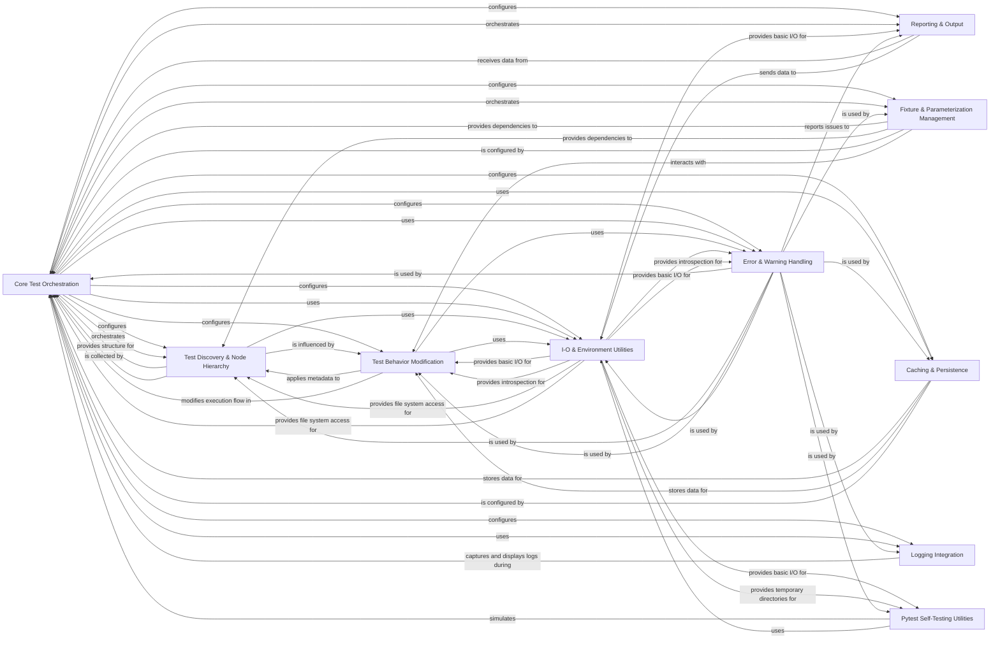

## Component Details

Pytest is a Python testing framework that facilitates writing simple yet powerful tests. Its core functionality revolves around a plugin-driven architecture, allowing extensive customization and extension. The main flow involves a central 'Core Test Orchestration' component that manages the entire test lifecycle: from parsing command-line arguments and loading plugins, to discovering and collecting tests, executing them, and finally reporting the results. It leverages a hierarchical 'Test Discovery & Node Hierarchy' to organize tests, a 'Fixture & Parameterization Management' system for test setup/teardown and data injection, and 'Reporting & Output' for presenting test outcomes. Various 'Test Behavior Modification' components allow for fine-grained control over test execution, while 'I/O & Environment Utilities' provide essential low-level functionalities. 'Error & Warning Handling' ensures robust error reporting, and 'Caching & Persistence' optimizes repeated test runs. 'Logging Integration' provides comprehensive logging, and 'Pytest Self-Testing Utilities' aid in the framework's development.

### Core Test Orchestration
Manages the entire pytest lifecycle, from initial configuration and plugin loading to orchestrating test collection, execution, and final reporting. It's the central hub for controlling the test run.

**Related Classes/Methods**:

- <a href="https://github.com/pytest-dev/pytest/blob/master/src/_pytest/main.py#L548-L981" target="_blank" rel="noopener noreferrer">`_pytest.main.Session` (548:981)</a>
- `_pytest.config.PytestPluginManager` (102:102)
- <a href="https://github.com/pytest-dev/pytest/blob/master/src/_pytest/hookspec.py#L1-L100" target="_blank" rel="noopener noreferrer">`_pytest.hookspec` (1:100)</a>
- <a href="https://github.com/pytest-dev/pytest/blob/master/src/_pytest/main.py#L276-L332" target="_blank" rel="noopener noreferrer">`_pytest.main.wrap_session` (276:332)</a>
- <a href="https://github.com/pytest-dev/pytest/blob/master/src/_pytest/main.py#L339-L349" target="_blank" rel="noopener noreferrer">`_pytest.main._main` (339:349)</a>
- <a href="https://github.com/pytest-dev/pytest/blob/master/src/_pytest/main.py#L335-L336" target="_blank" rel="noopener noreferrer">`_pytest.main.pytest_cmdline_main` (335:336)</a>

### Test Discovery & Node Hierarchy
Responsible for identifying test files, modules, classes, and functions, and organizing them into a hierarchical tree of test nodes. It determines which tests are available for execution.

**Related Classes/Methods**:

- <a href="https://github.com/pytest-dev/pytest/blob/master/src/_pytest/nodes.py#L128-L477" target="_blank" rel="noopener noreferrer">`_pytest.nodes.Node` (128:477)</a>
- <a href="https://github.com/pytest-dev/pytest/blob/master/src/_pytest/nodes.py#L499-L543" target="_blank" rel="noopener noreferrer">`_pytest.nodes.Collector` (499:543)</a>
- <a href="https://github.com/pytest-dev/pytest/blob/master/src/_pytest/nodes.py#L655-L772" target="_blank" rel="noopener noreferrer">`_pytest.nodes.Item` (655:772)</a>
- <a href="https://github.com/pytest-dev/pytest/blob/master/src/_pytest/nodes.py#L637-L652" target="_blank" rel="noopener noreferrer">`_pytest.nodes.Directory` (637:652)</a>
- <a href="https://github.com/pytest-dev/pytest/blob/master/src/_pytest/nodes.py#L630-L634" target="_blank" rel="noopener noreferrer">`_pytest.nodes.File` (630:634)</a>
- <a href="https://github.com/pytest-dev/pytest/blob/master/src/_pytest/python.py#L342-L487" target="_blank" rel="noopener noreferrer">`_pytest.python.PyCollector` (342:487)</a>
- <a href="https://github.com/pytest-dev/pytest/blob/master/src/_pytest/python.py#L546-L626" target="_blank" rel="noopener noreferrer">`_pytest.python.Module` (546:626)</a>
- <a href="https://github.com/pytest-dev/pytest/blob/master/src/_pytest/python.py#L735-L838" target="_blank" rel="noopener noreferrer">`_pytest.python.Class` (735:838)</a>
- <a href="https://github.com/pytest-dev/pytest/blob/master/src/_pytest/python.py#L1537-L1712" target="_blank" rel="noopener noreferrer">`_pytest.python.Function` (1537:1712)</a>
- <a href="https://github.com/pytest-dev/pytest/blob/master/src/_pytest/main.py#L739-L741" target="_blank" rel="noopener noreferrer">`_pytest.main.Session.perform_collect` (739:741)</a>
- <a href="https://github.com/pytest-dev/pytest/blob/master/src/_pytest/main.py#L352-L353" target="_blank" rel="noopener noreferrer">`_pytest.main.pytest_collection` (352:353)</a>
- <a href="https://github.com/pytest-dev/pytest/blob/master/src/_pytest/main.py#L396-L431" target="_blank" rel="noopener noreferrer">`_pytest.main.pytest_ignore_collect` (396:431)</a>
- <a href="https://github.com/pytest-dev/pytest/blob/master/src/_pytest/main.py#L434-L437" target="_blank" rel="noopener noreferrer">`_pytest.main.pytest_collect_directory` (434:437)</a>
- <a href="https://github.com/pytest-dev/pytest/blob/master/src/_pytest/main.py#L440-L455" target="_blank" rel="noopener noreferrer">`_pytest.main.pytest_collection_modifyitems` (440:455)</a>

### Fixture & Parameterization Management
Handles the definition, discovery, and injection of test fixtures, which provide reusable setup and teardown logic. It also manages test parameterization, allowing tests to be run with different input values.

**Related Classes/Methods**:

- <a href="https://github.com/pytest-dev/pytest/blob/master/src/_pytest/fixtures.py#L1500-L1878" target="_blank" rel="noopener noreferrer">`_pytest.fixtures.FixtureManager` (1500:1878)</a>
- <a href="https://github.com/pytest-dev/pytest/blob/master/src/_pytest/fixtures.py#L975-L1139" target="_blank" rel="noopener noreferrer">`_pytest.fixtures.FixtureDef` (975:1139)</a>
- <a href="https://github.com/pytest-dev/pytest/blob/master/src/_pytest/fixtures.py#L371-L680" target="_blank" rel="noopener noreferrer">`_pytest.fixtures.FixtureRequest` (371:680)</a>
- <a href="https://github.com/pytest-dev/pytest/blob/master/src/_pytest/fixtures.py#L726-L811" target="_blank" rel="noopener noreferrer">`_pytest.fixtures.SubRequest` (726:811)</a>
- <a href="https://github.com/pytest-dev/pytest/blob/master/src/_pytest/fixtures.py#L684-L722" target="_blank" rel="noopener noreferrer">`_pytest.fixtures.TopRequest` (684:722)</a>
- <a href="https://github.com/pytest-dev/pytest/blob/master/src/_pytest/fixtures.py#L1166-L1206" target="_blank" rel="noopener noreferrer">`_pytest.fixtures.pytest_fixture_setup` (1166:1206)</a>
- <a href="https://github.com/pytest-dev/pytest/blob/master/src/_pytest/fixtures.py#L1-L100" target="_blank" rel="noopener noreferrer">`_pytest.fixtures.pytest_generate_tests` (1:100)</a>
- <a href="https://github.com/pytest-dev/pytest/blob/master/src/_pytest/fixtures.py#L226-L244" target="_blank" rel="noopener noreferrer">`_pytest.fixtures.reorder_items` (226:244)</a>
- <a href="https://github.com/pytest-dev/pytest/blob/master/src/_pytest/mark/structures.py#L80-L230" target="_blank" rel="noopener noreferrer">`_pytest.mark.structures.ParameterSet` (80:230)</a>

### Reporting & Output
Collects and processes test results, generating comprehensive reports on test outcomes (pass, fail, skip, xfail). It also manages the display of these results to the console and can export them to various formats like JUnit XML.

**Related Classes/Methods**:

- <a href="https://github.com/pytest-dev/pytest/blob/master/src/_pytest/reports.py#L56-L237" target="_blank" rel="noopener noreferrer">`_pytest.reports.BaseReport` (56:237)</a>
- <a href="https://github.com/pytest-dev/pytest/blob/master/src/_pytest/reports.py#L255-L396" target="_blank" rel="noopener noreferrer">`_pytest.reports.TestReport` (255:396)</a>
- <a href="https://github.com/pytest-dev/pytest/blob/master/src/_pytest/reports.py#L400-L448" target="_blank" rel="noopener noreferrer">`_pytest.reports.CollectReport` (400:448)</a>
- <a href="https://github.com/pytest-dev/pytest/blob/master/src/_pytest/outcomes.py#L17-L37" target="_blank" rel="noopener noreferrer">`_pytest.outcomes.OutcomeException` (17:37)</a>
- <a href="https://github.com/pytest-dev/pytest/blob/master/src/_pytest/terminal.py#L370-L1454" target="_blank" rel="noopener noreferrer">`_pytest.terminal.TerminalReporter` (370:1454)</a>
- <a href="https://github.com/pytest-dev/pytest/blob/master/src/_pytest/_io/terminalwriter.py#L51-L254" target="_blank" rel="noopener noreferrer">`_pytest._io.terminalwriter.TerminalWriter` (51:254)</a>
- <a href="https://github.com/pytest-dev/pytest/blob/master/src/_pytest/junitxml.py#L458-L692" target="_blank" rel="noopener noreferrer">`_pytest.junitxml.LogXML` (458:692)</a>

### Test Behavior Modification
Provides mechanisms to alter test execution and behavior, including applying markers (e.g., skip, xfail), rewriting assertions for enhanced failure messages, temporarily modifying objects (monkeypatching), and controlling stepwise execution.

**Related Classes/Methods**:

- <a href="https://github.com/pytest-dev/pytest/blob/master/src/_pytest/mark/structures.py#L309-L404" target="_blank" rel="noopener noreferrer">`_pytest.mark.structures.MarkDecorator` (309:404)</a>
- <a href="https://github.com/pytest-dev/pytest/blob/master/src/_pytest/mark/structures.py#L534-L603" target="_blank" rel="noopener noreferrer">`_pytest.mark.structures.MarkGenerator` (534:603)</a>
- <a href="https://github.com/pytest-dev/pytest/blob/master/src/_pytest/skipping.py#L1-L100" target="_blank" rel="noopener noreferrer">`_pytest.skipping` (1:100)</a>
- <a href="https://github.com/pytest-dev/pytest/blob/master/src/_pytest/assertion/rewrite.py#L1-L100" target="_blank" rel="noopener noreferrer">`_pytest.assertion.rewrite.RewriteHook` (1:100)</a>
- <a href="https://github.com/pytest-dev/pytest/blob/master/src/_pytest/assertion/util.py#L1-L100" target="_blank" rel="noopener noreferrer">`_pytest.assertion.util` (1:100)</a>
- <a href="https://github.com/pytest-dev/pytest/blob/master/src/_pytest/monkeypatch.py#L117-L415" target="_blank" rel="noopener noreferrer">`_pytest.monkeypatch.MonkeyPatch` (117:415)</a>
- <a href="https://github.com/pytest-dev/pytest/blob/master/src/_pytest/stepwise.py#L99-L209" target="_blank" rel="noopener noreferrer">`_pytest.stepwise.StepwisePlugin` (99:209)</a>

### I-O & Environment Utilities
Offers fundamental utilities for file system operations, path manipulation, safe representation of Python objects, and capturing standard I/O streams during test execution. It also includes compatibility layers for different Python environments.

**Related Classes/Methods**:

- <a href="https://github.com/pytest-dev/pytest/blob/master/src/_pytest/_io/saferepr.py#L99-L111" target="_blank" rel="noopener noreferrer">`_pytest._io.saferepr` (99:111)</a>
- <a href="https://github.com/pytest-dev/pytest/blob/master/src/_pytest/_io/pprint.py#L1-L100" target="_blank" rel="noopener noreferrer">`_pytest._io.pprint` (1:100)</a>
- <a href="https://github.com/pytest-dev/pytest/blob/master/src/_pytest/_io/terminalwriter.py#L1-L100" target="_blank" rel="noopener noreferrer">`_pytest._io.terminalwriter` (1:100)</a>
- <a href="https://github.com/pytest-dev/pytest/blob/master/src/_pytest/_code/code.py#L1-L100" target="_blank" rel="noopener noreferrer">`_pytest._code.code` (1:100)</a>
- <a href="https://github.com/pytest-dev/pytest/blob/master/src/_pytest/_code/source.py#L1-L100" target="_blank" rel="noopener noreferrer">`_pytest._code.source` (1:100)</a>
- <a href="https://github.com/pytest-dev/pytest/blob/master/src/_pytest/capture.py#L302-L331" target="_blank" rel="noopener noreferrer">`_pytest.capture.CaptureBase` (302:331)</a>
- <a href="https://github.com/pytest-dev/pytest/blob/master/src/_pytest/tmpdir.py#L42-L196" target="_blank" rel="noopener noreferrer">`_pytest.tmpdir.TempPathFactory` (42:196)</a>
- <a href="https://github.com/pytest-dev/pytest/blob/master/src/_pytest/pathlib.py#L1-L100" target="_blank" rel="noopener noreferrer">`_pytest.pathlib.Path` (1:100)</a>
- <a href="https://github.com/pytest-dev/pytest/blob/master/src/_pytest/compat.py#L1-L100" target="_blank" rel="noopener noreferrer">`_pytest.compat` (1:100)</a>

### Error & Warning Handling
Manages the detection, filtering, and reporting of various errors and warnings that occur during the test run, including exceptions, deprecation warnings, and unraisable exceptions, providing debugging support.

**Related Classes/Methods**:

- <a href="https://github.com/pytest-dev/pytest/blob/master/src/_pytest/warnings.py#L1-L100" target="_blank" rel="noopener noreferrer">`_pytest.warnings` (1:100)</a>
- <a href="https://github.com/pytest-dev/pytest/blob/master/src/_pytest/warning_types.py#L13-L16" target="_blank" rel="noopener noreferrer">`_pytest.warning_types.PytestWarning` (13:16)</a>
- <a href="https://github.com/pytest-dev/pytest/blob/master/src/_pytest/recwarn.py#L260-L367" target="_blank" rel="noopener noreferrer">`_pytest.recwarn.WarningsChecker` (260:367)</a>
- <a href="https://github.com/pytest-dev/pytest/blob/master/src/_pytest/debugging.py#L1-L100" target="_blank" rel="noopener noreferrer">`_pytest.debugging` (1:100)</a>
- <a href="https://github.com/pytest-dev/pytest/blob/master/src/_pytest/faulthandler.py#L1-L100" target="_blank" rel="noopener noreferrer">`_pytest.faulthandler` (1:100)</a>
- <a href="https://github.com/pytest-dev/pytest/blob/master/src/_pytest/raises.py#L382-L539" target="_blank" rel="noopener noreferrer">`_pytest.raises.AbstractRaises` (382:539)</a>
- <a href="https://github.com/pytest-dev/pytest/blob/master/src/_pytest/_code/code.py#L497-L853" target="_blank" rel="noopener noreferrer">`_pytest._code.code.ExceptionInfo` (497:853)</a>

### Caching & Persistence
Implements a caching system to store and retrieve data across test runs, optimizing performance for features like re-running last-failed tests or stepwise execution.

**Related Classes/Methods**:

- <a href="https://github.com/pytest-dev/pytest/blob/master/src/_pytest/cacheprovider.py#L57-L246" target="_blank" rel="noopener noreferrer">`_pytest.cacheprovider.Cache` (57:246)</a>
- <a href="https://github.com/pytest-dev/pytest/blob/master/src/_pytest/cacheprovider.py#L319-L429" target="_blank" rel="noopener noreferrer">`_pytest.cacheprovider.LFPlugin` (319:429)</a>
- <a href="https://github.com/pytest-dev/pytest/blob/master/src/_pytest/stepwise.py#L99-L209" target="_blank" rel="noopener noreferrer">`_pytest.stepwise.StepwisePlugin` (99:209)</a>

### Logging Integration
Provides seamless integration with Python's standard logging module, allowing test-generated logs to be captured, processed, and displayed as part of the test report.

**Related Classes/Methods**:

- <a href="https://github.com/pytest-dev/pytest/blob/master/src/_pytest/logging.py#L641-L879" target="_blank" rel="noopener noreferrer">`_pytest.logging.LoggingPlugin` (641:879)</a>
- <a href="https://github.com/pytest-dev/pytest/blob/master/src/_pytest/logging.py#L373-L400" target="_blank" rel="noopener noreferrer">`_pytest.logging.LogCaptureHandler` (373:400)</a>

### Pytest Self-Testing Utilities
A dedicated set of utilities designed for testing the pytest framework itself. It allows simulating pytest runs in isolated environments and asserting on their behavior and output.

**Related Classes/Methods**:

- <a href="https://github.com/pytest-dev/pytest/blob/master/src/_pytest/pytester.py#L649-L1525" target="_blank" rel="noopener noreferrer">`_pytest.pytester.Pytester` (649:1525)</a>
- <a href="https://github.com/pytest-dev/pytest/blob/master/src/_pytest/pytester.py#L518-L623" target="_blank" rel="noopener noreferrer">`_pytest.pytester.RunResult` (518:623)</a>
- <a href="https://github.com/pytest-dev/pytest/blob/master/src/_pytest/pytester_assertions.py#L1-L100" target="_blank" rel="noopener noreferrer">`_pytest.pytester_assertions` (1:100)</a>

### [FAQ](https://github.com/CodeBoarding/GeneratedOnBoardings/tree/main?tab=readme-ov-file#faq)