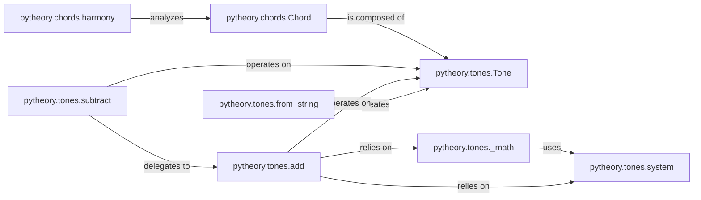

## Details

The `Core Data Models` subsystem defines the foundational data structures for musical concepts within `pytheory`, specifically `Tone` and `Chord`, and provides core operations for their creation, manipulation, and analysis. This subsystem adheres to the project's architectural bias towards functional decomposition and clear API design, emphasizing the flow of musical data.

### pytheory.tones.Tone
Represents a single musical tone, serving as the atomic unit for pitch and other tone-specific properties. It acts as the foundational data model for all pitch-related operations.

**Related Classes/Methods**:

- <a href="https://github.com/kennethreitz/pytheory/blob/master/pytheory/tones.py" target="_blank" rel="noopener noreferrer">`pytheory.tones.Tone`</a>

### pytheory.chords.Chord
Represents a collection of `Tone` objects forming a musical chord, embodying harmonic structures. It serves as the primary data model for harmonic analysis and manipulation.

**Related Classes/Methods**:

- <a href="https://github.com/kennethreitz/pytheory/blob/master/pytheory/chords.py#L1-L79" target="_blank" rel="noopener noreferrer">`pytheory.chords.Chord`:1-79</a>

### pytheory.tones.from_string
A factory function responsible for creating `Tone` instances from string representations, providing a user-friendly API for tone instantiation.

**Related Classes/Methods**:

- <a href="https://github.com/kennethreitz/pytheory/blob/master/pytheory/tones.py#L70-L82" target="_blank" rel="noopener noreferrer">`pytheory.tones.from_string`:70-82</a>

### pytheory.tones.add
Performs musical addition operations on `Tone` instances, likely involving pitch calculations. It is a fundamental operation for interval manipulation.

**Related Classes/Methods**:

- <a href="https://github.com/kennethreitz/pytheory/blob/master/pytheory/tones.py#L121-L123" target="_blank" rel="noopener noreferrer">`pytheory.tones.add`:121-123</a>

### pytheory.tones.subtract
Performs musical subtraction operations on `Tone` instances, delegating to `pytheory.tones.add` for underlying logic. It complements `add` for interval calculations.

**Related Classes/Methods**:

- <a href="https://github.com/kennethreitz/pytheory/blob/master/pytheory/tones.py#L125-L126" target="_blank" rel="noopener noreferrer">`pytheory.tones.subtract`:125-126</a>

### pytheory.chords.harmony
Calculates and returns the harmonic quality or type of a given `Chord`, providing analytical capabilities essential for understanding chord structures.

**Related Classes/Methods**:

- <a href="https://github.com/kennethreitz/pytheory/blob/master/pytheory/chords.py#L9-L20" target="_blank" rel="noopener noreferrer">`pytheory.chords.harmony`:9-20</a>

### pytheory.tones.system
Defines the global musical system (e.g., temperament, tuning) that contextualizes `Tone` instances and their operations. It ensures consistency in pitch calculations across the library.

**Related Classes/Methods**:

- <a href="https://github.com/kennethreitz/pytheory/blob/master/pytheory/tones.py" target="_blank" rel="noopener noreferrer">`pytheory.tones.system`</a>

### pytheory.tones._math
Provides fundamental mathematical calculations related to pitch and intervals, serving as an internal utility for `Tone` operations like `add` and `subtract`.

**Related Classes/Methods**:

- <a href="https://github.com/kennethreitz/pytheory/blob/master/pytheory/tones.py#L105-L119" target="_blank" rel="noopener noreferrer">`pytheory.tones._math`:105-119</a>

### [FAQ](https://github.com/CodeBoarding/GeneratedOnBoardings/tree/main?tab=readme-ov-file#faq)