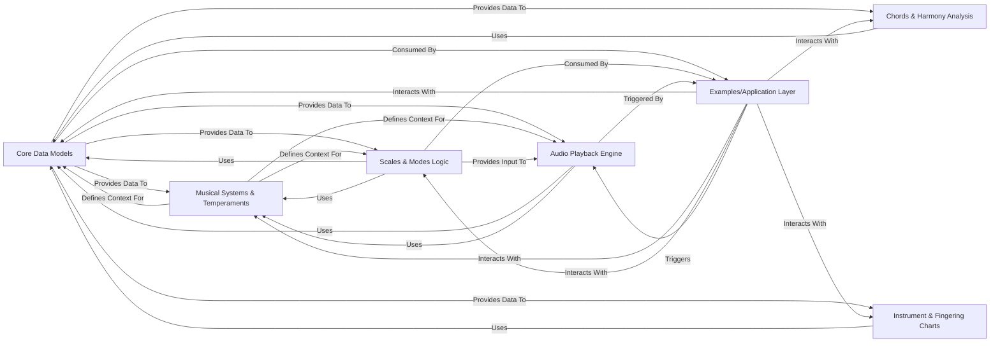

## Details

The pytheory library is designed with a clear functional decomposition, centered around a robust Core Data Models component that defines fundamental musical entities like Tone and Chord. This core is contextualized by the Musical Systems & Temperaments component, which dictates how these musical elements behave within various frameworks. Specialized components such as Scales & Modes Logic and Chords & Harmony Analysis build upon these foundations to provide comprehensive musical structure generation and analysis. For practical application, the Instrument & Fingering Charts component leverages the core data models for instrument-specific layouts, while the Audio Playback Engine translates musical data into audible output. The Examples/Application Layer serves as an illustrative consumer, demonstrating the seamless flow of musical data from conceptualization through processing to tangible results, making pytheory a modular and extensible tool for music theory applications.

### Core Data Models [[Expand]](./Core_Data_Models.md)
Defines and manages fundamental musical data structures (Tone, Chord) and their core operations (creation, manipulation, conversion).

**Related Classes/Methods**:

- <a href="https://github.com/kennethreitz/pytheory/blob/master/pytheory/tones.py" target="_blank" rel="noopener noreferrer">`pytheory.tones.Tone`</a>
- <a href="https://github.com/kennethreitz/pytheory/blob/master/pytheory/tones.py#L70-L82" target="_blank" rel="noopener noreferrer">`pytheory.tones.from_string`:70-82</a>
- <a href="https://github.com/kennethreitz/pytheory/blob/master/pytheory/tones.py#L121-L123" target="_blank" rel="noopener noreferrer">`pytheory.tones.add`:121-123</a>
- <a href="https://github.com/kennethreitz/pytheory/blob/master/pytheory/chords.py#L1-L79" target="_blank" rel="noopener noreferrer">`pytheory.chords.Chord`:1-79</a>
- <a href="https://github.com/kennethreitz/pytheory/blob/master/pytheory/chords.py#L9-L20" target="_blank" rel="noopener noreferrer">`pytheory.chords.harmony`:9-20</a>

### Musical Systems & Temperaments
Manages different musical systems and temperaments, providing the contextual rules for tone and interval behavior.

**Related Classes/Methods**:

- <a href="https://github.com/kennethreitz/pytheory/blob/master/pytheory/systems.py#L1-L100" target="_blank" rel="noopener noreferrer">`pytheory.systems.SYSTEMS`:1-100</a>
- <a href="https://github.com/kennethreitz/pytheory/blob/master/pytheory/systems.py" target="_blank" rel="noopener noreferrer">`pytheory.systems.semitones`</a>
- <a href="https://github.com/kennethreitz/pytheory/blob/master/pytheory/systems.py#L53-L117" target="_blank" rel="noopener noreferrer">`pytheory.systems.generate_scale`:53-117</a>

### Scales & Modes Logic
Handles the creation, retrieval, and manipulation of musical scales and modes.

**Related Classes/Methods**:

- <a href="https://github.com/kennethreitz/pytheory/blob/master/pytheory/scales.py" target="_blank" rel="noopener noreferrer">`pytheory.scales.Scale`</a>
- <a href="https://github.com/kennethreitz/pytheory/blob/master/pytheory/scales.py#L40-L76" target="_blank" rel="noopener noreferrer">`pytheory.scales.degree`:40-76</a>
- <a href="https://github.com/kennethreitz/pytheory/blob/master/pytheory/scales.py#L103-L107" target="_blank" rel="noopener noreferrer">`pytheory.scales.get`:103-107</a>

### Chords & Harmony Analysis
Focuses on chord structures, harmonic analysis, and dissonance calculations.

**Related Classes/Methods**:

- <a href="https://github.com/kennethreitz/pytheory/blob/master/pytheory/chords.py#L9-L20" target="_blank" rel="noopener noreferrer">`pytheory.chords.harmony`:9-20</a>
- <a href="https://github.com/kennethreitz/pytheory/blob/master/pytheory/chords.py#L22-L31" target="_blank" rel="noopener noreferrer">`pytheory.chords.dissonance`:22-31</a>
- <a href="https://github.com/kennethreitz/pytheory/blob/master/pytheory/chords.py" target="_blank" rel="noopener noreferrer">`pytheory.chords.intervals`</a>

### Instrument & Fingering Charts
Manages instrument-specific data for generating and scoring fingerings.

**Related Classes/Methods**:

- <a href="https://github.com/kennethreitz/pytheory/blob/master/pytheory/charts.py#L34-L78" target="_blank" rel="noopener noreferrer">`pytheory.charts.acceptable_tones`:34-78</a>
- <a href="https://github.com/kennethreitz/pytheory/blob/master/pytheory/charts.py#L85-L93" target="_blank" rel="noopener noreferrer">`pytheory.charts.find_fingerings`:85-93</a>
- <a href="https://github.com/kennethreitz/pytheory/blob/master/pytheory/charts.py#L117-L132" target="_blank" rel="noopener noreferrer">`pytheory.charts.fingering_score`:117-132</a>

### Audio Playback Engine
Handles the actual audio output of musical notes and sequences.

**Related Classes/Methods**:

- <a href="https://github.com/kennethreitz/pytheory/blob/master/pytheory/play.py#L68-L79" target="_blank" rel="noopener noreferrer">`pytheory.play.play`:68-79</a>
- <a href="https://github.com/kennethreitz/pytheory/blob/master/pytheory/play.py#L51-L59" target="_blank" rel="noopener noreferrer">`pytheory.play._play_for`:51-59</a>

### Examples/Application Layer
Demonstrates the usage of the pytheory library, acting as an external consumer of its API.

**Related Classes/Methods**:

- <a href="https://github.com/kennethreitz/pytheory/blob/master/examples/song.py#L32-L74" target="_blank" rel="noopener noreferrer">`examples.song.play_twinkle`:32-74</a>
- <a href="https://github.com/kennethreitz/pytheory/blob/master/examples/song.py#L14-L20" target="_blank" rel="noopener noreferrer">`examples.song.play_note`:14-20</a>

### [FAQ](https://github.com/CodeBoarding/GeneratedOnBoardings/tree/main?tab=readme-ov-file#faq)