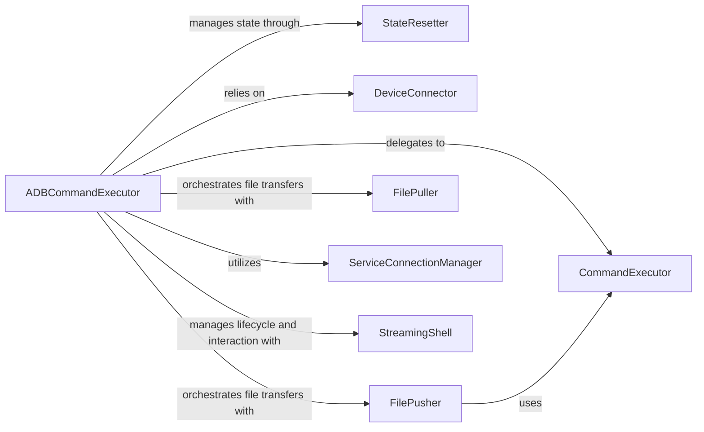

## Details

The ADB Command Executor subsystem is primarily defined by the adb.adb_commands module, specifically the AdbCommands class and its methods, all contained within the file /mnt/e/StartUp/python-adb/adb/adb_commands.py. This subsystem provides a comprehensive interface for interacting with Android devices via the ADB protocol.

### ADBCommandExecutor
The primary interface for all high-level ADB operations. It orchestrates interactions with the device and manages the lifecycle of ADB connections.

**Related Classes/Methods**:

- <a href="https://github.com/google/python-adb/blob/master/adb/adb_commands.py#L49-L419" target="_blank" rel="noopener noreferrer">`adb.adb_commands.AdbCommands`:49-419</a>

### StateResetter
Resets the internal state of the ADBCommandExecutor instance, clearing connection handles and service connections to ensure a clean slate for new operations or after closing a connection.

**Related Classes/Methods**:

- <a href="https://github.com/google/python-adb/blob/master/adb/adb_commands.py" target="_blank" rel="noopener noreferrer">`adb.adb_commands.AdbCommands.__reset`</a>

### DeviceConnector
Handles the underlying logic for establishing a connection to an ADB device, supporting both USB and TCP connections. It abstracts the details of finding and opening device handles.

**Related Classes/Methods**:

- <a href="https://github.com/google/python-adb/blob/master/adb/adb_commands.py" target="_blank" rel="noopener noreferrer">`adb.adb_commands.AdbCommands.ConnectDevice`</a>
- <a href="https://github.com/google/python-adb/blob/master/adb/adb_commands.py" target="_blank" rel="noopener noreferrer">`adb.adb_commands.AdbCommands._Connect`</a>

### CommandExecutor
Executes arbitrary shell commands directly on the connected Android device. The Install and Uninstall methods are higher-level wrappers that leverage the Shell command.

**Related Classes/Methods**:

- <a href="https://github.com/google/python-adb/blob/master/adb/adb_commands.py" target="_blank" rel="noopener noreferrer">`adb.adb_commands.AdbCommands.Shell`</a>
- <a href="https://github.com/google/python-adb/blob/master/adb/adb_commands.py" target="_blank" rel="noopener noreferrer">`adb.adb_commands.AdbCommands.Install`</a>
- <a href="https://github.com/google/python-adb/blob/master/adb/adb_commands.py" target="_blank" rel="noopener noreferrer">`adb.adb_commands.AdbCommands.Uninstall`</a>

### FilePusher
Manages the transfer of files and directories from the host system to the Android device. It handles opening the source file/directory and initiating the sync protocol.

**Related Classes/Methods**:

- <a href="https://github.com/google/python-adb/blob/master/adb/adb_commands.py" target="_blank" rel="noopener noreferrer">`adb.adb_commands.AdbCommands.Push`</a>

### FilePuller
Manages the transfer of files from the Android device to the host system. It handles writing the received data to a destination file or returning it as bytes.

**Related Classes/Methods**:

- <a href="https://github.com/google/python-adb/blob/master/adb/adb_commands.py" target="_blank" rel="noopener noreferrer">`adb.adb_commands.AdbCommands.Pull`</a>

### ServiceConnectionManager
Establishes and manages persistent connections to specific ADB services (e.g., "shell", "sync"). It optimizes by reusing existing connections for the same service type.

**Related Classes/Methods**:

- <a href="https://github.com/google/python-adb/blob/master/adb/adb_commands.py" target="_blank" rel="noopener noreferrer">`adb.adb_commands.AdbCommands._get_service_connection`</a>

### StreamingShell
Provides a mechanism for continuous, streaming output from shell commands, suitable for long-running processes like log retrieval.

**Related Classes/Methods**:

- <a href="https://github.com/google/python-adb/blob/master/adb/adb_commands.py" target="_blank" rel="noopener noreferrer">`adb.adb_commands.AdbCommands.StreamingShell`</a>

### [FAQ](https://github.com/CodeBoarding/GeneratedOnBoardings/tree/main?tab=readme-ov-file#faq)