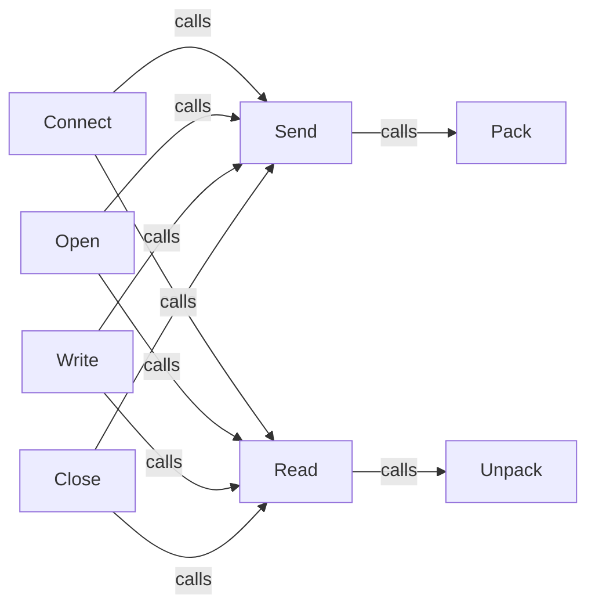

## Details

The `adb.adb_protocol` subsystem forms the backbone of ADB communication, abstracting the complexities of message framing and transmission. At its core, `AdbMessage` handles the fundamental `Pack` and `Unpack` operations for message serialization and deserialization, respectively. The `Send` and `Read` components, part of `AdbMessage`, act as the primary interfaces for sending and receiving raw ADB messages over the USB connection, leveraging `Pack` and `Unpack` for data preparation and interpretation. Higher-level components like `Connect` and `Open` orchestrate the initial connection handshake and stream establishment by utilizing `Send` and `Read`. Similarly, `Write` and `Close` manage data flow and stream termination, relying on `Send` and `Read` for their underlying message exchange. This layered architecture ensures a clear separation of concerns, from low-level byte manipulation to high-level protocol interactions.

### Connect
Initiates the ADB protocol handshake, establishing the initial connection with the Android device. This involves sending connection requests and handling authentication challenges.

**Related Classes/Methods**:

- <a href="https://github.com/google/python-adb/blob/master/adb/adb_protocol.py#L275-L348" target="_blank" rel="noopener noreferrer">`adb.adb_protocol.Connect`:275-348</a>

### Open
Opens new service-specific streams over an established ADB connection, allowing for concurrent operations. It sends an OPEN message to the device to request a new stream.

**Related Classes/Methods**:

- <a href="https://github.com/google/python-adb/blob/master/adb/adb_protocol.py#L350-L388" target="_blank" rel="noopener noreferrer">`adb.adb_protocol.Open`:350-388</a>

### Send
Orchestrates the transmission of raw ADB messages. It serializes the message header and then writes both the header and the data payload to the underlying USB communication channel.

**Related Classes/Methods**:

- <a href="https://github.com/google/python-adb/blob/master/adb/adb_protocol.py#L231-L234" target="_blank" rel="noopener noreferrer">`adb.adb_protocol.AdbMessage.Send`:231-234</a>

### Read
Manages the reception of raw ADB messages. It reads incoming bytes from the USB channel, deserializes the message header, and then reads the associated data payload, performing checksum validation.

**Related Classes/Methods**:

- <a href="https://github.com/google/python-adb/blob/master/adb/adb_protocol.py#L236-L273" target="_blank" rel="noopener noreferrer">`adb.adb_protocol.AdbMessage.Read`:236-273</a>

### Pack
Formats and serializes Python objects into the byte-level ADB message header structure, ensuring compliance with the ADB protocol's framing.

**Related Classes/Methods**:

- <a href="https://github.com/google/python-adb/blob/master/adb/adb_protocol.py#L217-L220" target="_blank" rel="noopener noreferrer">`adb.adb_protocol.AdbMessage.Pack`:217-220</a>

### Unpack
Deserializes received byte streams into structured ADB message header objects, making them usable by higher-level components.

**Related Classes/Methods**:

- <a href="https://github.com/google/python-adb/blob/master/adb/adb_protocol.py#L222-L229" target="_blank" rel="noopener noreferrer">`adb.adb_protocol.AdbMessage.Unpack`:222-229</a>

### Write
Writes data to an active ADB stream, typically used for sending service-specific payloads or commands, and expects an acknowledgment.

**Related Classes/Methods**:

- <a href="https://github.com/google/python-adb/blob/master/adb/adb_protocol.py#L109-L121" target="_blank" rel="noopener noreferrer">`adb.adb_protocol._AdbConnection.Write`:109-121</a>

### Close
Terminates an active ADB stream, signaling the end of a service-specific communication session.

**Related Classes/Methods**:

- <a href="https://github.com/google/python-adb/blob/master/adb/adb_protocol.py#L156-L163" target="_blank" rel="noopener noreferrer">`adb.adb_protocol._AdbConnection.Close`:156-163</a>

### [FAQ](https://github.com/CodeBoarding/GeneratedOnBoardings/tree/main?tab=readme-ov-file#faq)