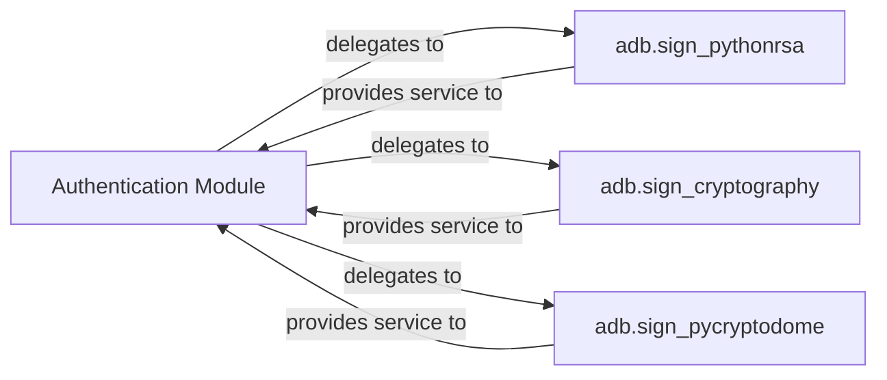

## Details

The `adb` project's authentication subsystem is designed with a clear separation of concerns, centralizing signing operations within the `adb` package, which acts as the "Authentication Module." This module provides a unified interface, abstracting the underlying cryptographic library used for RSA key generation, loading, and digital signing. It delegates the actual signing tasks to specialized components, namely `adb.sign_pythonrsa`, `adb.sign_cryptography`, and `adb.sign_pycryptodome`, each implementing the signing functionality using a different Python cryptographic library. This architecture allows for flexibility in choosing the cryptographic backend while maintaining a consistent API for the rest of the system.

### Authentication Module [[Expand]](./Authentication_Module.md)
This module, represented by the `adb` package, provides the overarching interface and mechanism for orchestrating and selecting the appropriate RSA signing implementation. It offers a unified API for the rest of the system to request signing operations, abstracting the underlying cryptographic library details.

**Related Classes/Methods**:

- <a href="https://github.com/google/python-adb/blob/master/adb/filesync_protocol.py" target="_blank" rel="noopener noreferrer">`adb`</a>

### adb.sign_pythonrsa
Implements RSA key generation, loading, and digital signing functionalities specifically using the `python-rsa` library, serving as one concrete strategy for cryptographic operations.

**Related Classes/Methods**:

- <a href="https://github.com/google/python-adb/blob/master/adb/sign_pythonrsa.py" target="_blank" rel="noopener noreferrer">`adb.sign_pythonrsa`</a>

### adb.sign_cryptography
Implements RSA key generation, loading, and digital signing functionalities using the `cryptography` library, offering an alternative, potentially more robust or performant, signing strategy.

**Related Classes/Methods**:

- <a href="https://github.com/google/python-adb/blob/master/adb/sign_cryptography.py" target="_blank" rel="noopener noreferrer">`adb.sign_cryptography`</a>

### adb.sign_pycryptodome
Implements RSA key generation, loading, and digital signing functionalities using the `pycryptodome` library, providing another alternative signing strategy for flexibility in cryptographic library choice.

**Related Classes/Methods**:

- <a href="https://github.com/google/python-adb/blob/master/adb/sign_pycryptodome.py" target="_blank" rel="noopener noreferrer">`adb.sign_pycryptodome`</a>

### [FAQ](https://github.com/CodeBoarding/GeneratedOnBoardings/tree/main?tab=readme-ov-file#faq)