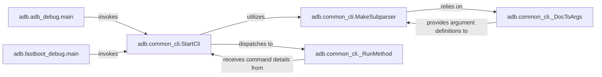

## Details

The `adb` project's command-line interface (CLI) subsystem is designed around a flexible and extensible architecture, primarily leveraging `argparse` for command parsing. The `adb.adb_debug.main` and `adb.fastboot_debug.main` components serve as distinct entry points for ADB and Fastboot functionalities, respectively. Both delegate the core CLI processing to `adb.common_cli.StartCli`, which acts as a central orchestrator. `StartCli` dynamically constructs the command structure using `adb.common_cli.MakeSubparser`, which in turn relies on `adb.common_cli._DocToArgs` to extract argument definitions from documentation. Finally, `StartCli` dispatches the parsed commands for execution via `adb.common_cli._RunMethod`, bridging the generic CLI with specific business logic. This design promotes modularity, allowing new commands to be added with minimal changes to the core parsing logic.

### adb.adb_debug.main
The primary entry point for the ADB command-line interface. It initializes the ADB-specific CLI environment and delegates to the common CLI parsing mechanism.

**Related Classes/Methods**:

- <a href="https://github.com/google/python-adb/blob/master/adb/adb_debug.py#L128-L207" target="_blank" rel="noopener noreferrer">`adb.adb_debug.main`:128-207</a>

### adb.fastboot_debug.main
The primary entry point for the Fastboot command-line interface. It initializes the Fastboot-specific CLI environment and delegates to the common CLI parsing mechanism.

**Related Classes/Methods**:

- <a href="https://github.com/google/python-adb/blob/master/adb/fastboot_debug.py#L56-L123" target="_blank" rel="noopener noreferrer">`adb.fastboot_debug.main`:56-123</a>

### adb.common_cli.StartCli
The central orchestrator for parsing command-line arguments and dispatching execution to the appropriate handler function. It abstracts the underlying `argparse` logic.

**Related Classes/Methods**:

- <a href="https://github.com/google/python-adb/blob/master/adb/common_cli.py#L89-L121" target="_blank" rel="noopener noreferrer">`adb.common_cli.MakeSubparser`:89-121</a>
- <a href="https://github.com/google/python-adb/blob/master/adb/common_cli.py#L124-L143" target="_blank" rel="noopener noreferrer">`adb.common_cli._RunMethod`:124-143</a>

### adb.common_cli.MakeSubparser
Dynamically constructs the command-line interface's subcommand structure and defines arguments for each command, enabling a flexible and extensible CLI.

**Related Classes/Methods**:

- <a href="https://github.com/google/python-adb/blob/master/adb/common_cli.py#L66-L86" target="_blank" rel="noopener noreferrer">`adb.common_cli._DocToArgs`:66-86</a>

### adb.common_cli._DocToArgs
A utility component that processes internal documentation strings (likely docstrings of command functions) to extract and format command-line argument definitions.

**Related Classes/Methods**:

- <a href="https://github.com/google/python-adb/blob/master/adb/common_cli.py#L66-L86" target="_blank" rel="noopener noreferrer">`adb.common_cli._DocToArgs`:66-86</a>

### adb.common_cli._RunMethod
Executes the specific Python function or method that corresponds to the command parsed from the command line, acting as the bridge between generic CLI parsing and specific business logic.

**Related Classes/Methods**:

- <a href="https://github.com/google/python-adb/blob/master/adb/common_cli.py#L124-L143" target="_blank" rel="noopener noreferrer">`adb.common_cli._RunMethod`:124-143</a>

### [FAQ](https://github.com/CodeBoarding/GeneratedOnBoardings/tree/main?tab=readme-ov-file#faq)