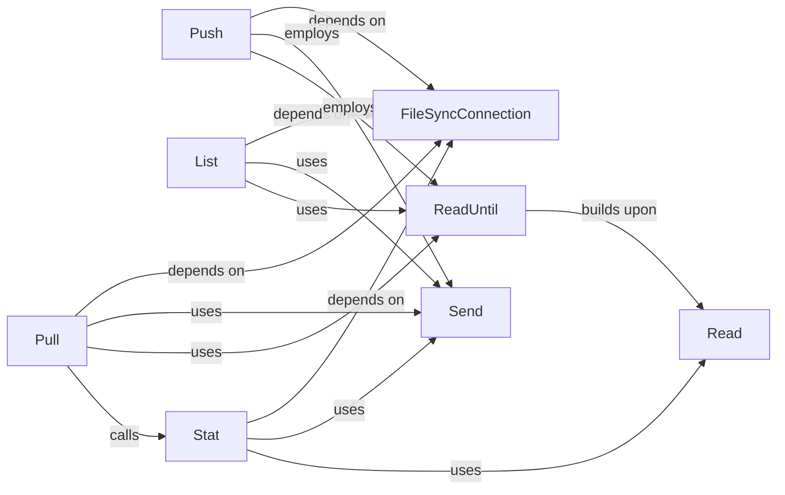

## Details

The `Filesync Protocol Handler` subsystem is a critical part of the `python-adb` project, specializing in file synchronization operations over an established ADB connection. It adheres to the project's architectural bias towards direct, stateless communication with Android devices, implementing the client-side logic for file transfer and metadata retrieval.

### FileSyncConnection
Manages the dedicated ADB connection for filesync operations, serving as the foundational communication channel for all file synchronization commands. It abstracts the low-level connection details, providing a reliable stream for data exchange.

**Related Classes/Methods**:

- <a href="https://github.com/google/python-adb/blob/master/adb/filesync_protocol.py#L167-L268" target="_blank" rel="noopener noreferrer">`FileSyncConnection`:167-268</a>

### Push
Implements the file upload functionality, enabling the transfer of files from the host machine to the connected Android device. It handles the protocol-specific commands and data streaming for uploads.

**Related Classes/Methods**:

- <a href="https://github.com/google/python-adb/blob/master/adb/adb_commands.py#L250-L281" target="_blank" rel="noopener noreferrer">`Push`:250-281</a>

### Pull
Implements the file download functionality, facilitating the transfer of files from the Android device to the host machine. It manages the request and reception of file data from the device.

**Related Classes/Methods**:

- <a href="https://github.com/google/python-adb/blob/master/adb/adb_commands.py#L283-L318" target="_blank" rel="noopener noreferrer">`Pull`:283-318</a>

### List
Implements the directory listing functionality, allowing the host to retrieve a list of files and directories present at a specified path on the Android device.

**Related Classes/Methods**:

- <a href="https://github.com/google/python-adb/blob/master/adb/adb_debug.py#L63-L89" target="_blank" rel="noopener noreferrer">`List`:63-89</a>

### Stat
Implements the file metadata retrieval functionality, enabling the host to query detailed information (e.g., size, permissions, modification time) about a specific file or directory on the Android device.

**Related Classes/Methods**:

- <a href="https://github.com/google/python-adb/blob/master/adb/adb_commands.py#L320-L326" target="_blank" rel="noopener noreferrer">`Stat`:320-326</a>

### Send
Provides the low-level mechanism for transmitting data packets over the established filesync connection. It is a utility component used by higher-level operations to send commands and data to the device.

**Related Classes/Methods**:

- <a href="https://github.com/google/python-adb/blob/master/adb/adb_protocol.py#L105-L107" target="_blank" rel="noopener noreferrer">`Send`:105-107</a>

### Read
Provides the low-level mechanism for receiving data packets from the filesync connection. It is a fundamental utility component for all operations that expect a response or data stream from the device.

**Related Classes/Methods**:

- <a href="https://github.com/google/python-adb/blob/master/adb/common.py#L337-L344" target="_blank" rel="noopener noreferrer">`Read`:337-344</a>

### ReadUntil
A specialized utility for controlled reading of data streams from the filesync connection until a specific condition or pattern is met. It builds upon the basic `Read` functionality to provide more sophisticated data parsing.

**Related Classes/Methods**:

- <a href="https://github.com/google/python-adb/blob/master/adb/adb_protocol.py#L126-L139" target="_blank" rel="noopener noreferrer">`ReadUntil`:126-139</a>

### [FAQ](https://github.com/CodeBoarding/GeneratedOnBoardings/tree/main?tab=readme-ov-file#faq)