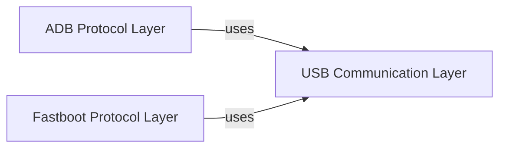

## Details

The `python-adb` project is structured around distinct layers to manage communication with Android devices via USB. At its core, the `USB Communication Layer` provides a robust, abstracted interface for low-level USB interactions, handling device discovery, connection, and data transfer. Building upon this foundation, the `ADB Protocol Layer` and `Fastboot Protocol Layer` implement their respective communication protocols, leveraging the underlying USB capabilities to interact with devices for debugging and flashing operations. This layered approach ensures modularity, separating the complexities of USB hardware interaction from the higher-level protocol logic.

### USB Communication Layer [[Expand]](./USB_Communication_Layer.md)
This component provides the foundational interface for all USB communications within the python-adb project. It abstracts the complexities of direct `libusb1` interactions, offering a simplified API for managing USB devices, transferring data, and handling communication errors. It is crucial for enabling the higher-level ADB and Fastboot protocols to interact with physical Android devices.

**Related Classes/Methods**:

- <a href="https://github.com/google/python-adb/blob/master/adb/common.py#L52-L286" target="_blank" rel="noopener noreferrer">`adb.common.UsbHandle`:52-286</a>

### ADB Protocol Layer
Implements the ADB communication protocol, leveraging the USB Communication Layer.

**Related Classes/Methods**: _None_

### Fastboot Protocol Layer
Implements the Fastboot communication protocol, leveraging the USB Communication Layer.

**Related Classes/Methods**: _None_

### [FAQ](https://github.com/CodeBoarding/GeneratedOnBoardings/tree/main?tab=readme-ov-file#faq)