```mermaid
graph LR
    CLI_Interface["CLI Interface"]
    USB_Communication_Layer["USB Communication Layer"]
    Authentication_Module["Authentication Module"]
    ADB_Protocol_Handler["ADB Protocol Handler"]
    ADB_Command_Executor["ADB Command Executor"]
    Filesync_Protocol_Handler["Filesync Protocol Handler"]
    Fastboot_Protocol_Handler["Fastboot Protocol Handler"]
    CLI_Interface -- "Initiates Device Discovery" --> USB_Communication_Layer
    CLI_Interface -- "Invokes ADB Commands" --> ADB_Command_Executor
    CLI_Interface -- "Invokes Fastboot Commands" --> Fastboot_Protocol_Handler
    ADB_Command_Executor -- "Sends ADB Messages" --> ADB_Protocol_Handler
    ADB_Command_Executor -- "Utilizes Filesync for Transfers" --> Filesync_Protocol_Handler
    ADB_Protocol_Handler -- "Performs Raw I/O" --> USB_Communication_Layer
    ADB_Protocol_Handler -- "Requests Signing" --> Authentication_Module
    Filesync_Protocol_Handler -- "Sends Filesync Messages" --> ADB_Protocol_Handler
    Fastboot_Protocol_Handler -- "Performs Raw I/O" --> USB_Communication_Layer
    click CLI_Interface href "https://github.com/CodeBoarding/GeneratedOnBoardings/blob/main/python-adb/CLI_Interface.md" "Details"
    click USB_Communication_Layer href "https://github.com/CodeBoarding/GeneratedOnBoardings/blob/main/python-adb/USB_Communication_Layer.md" "Details"
    click Authentication_Module href "https://github.com/CodeBoarding/GeneratedOnBoardings/blob/main/python-adb/Authentication_Module.md" "Details"
    click ADB_Protocol_Handler href "https://github.com/CodeBoarding/GeneratedOnBoardings/blob/main/python-adb/ADB_Protocol_Handler.md" "Details"
    click ADB_Command_Executor href "https://github.com/CodeBoarding/GeneratedOnBoardings/blob/main/python-adb/ADB_Command_Executor.md" "Details"
    click Filesync_Protocol_Handler href "https://github.com/CodeBoarding/GeneratedOnBoardings/blob/main/python-adb/Filesync_Protocol_Handler.md" "Details"
```

## Details

The `python-adb` project provides a robust framework for interacting with Android devices, primarily through ADB and Fastboot protocols. At its core, a `CLI Interface` serves as the user's gateway, directing commands to specialized `ADB Command Executor` or `Fastboot Protocol Handler` components. All device communication ultimately funnels through a `USB Communication Layer`, which abstracts the low-level hardware interactions. The `ADB Protocol Handler` manages the intricacies of the ADB protocol, including secure connections facilitated by an `Authentication Module` and file transfers handled by a dedicated `Filesync Protocol Handler`. This layered architecture ensures clear separation of concerns, enabling efficient command processing, secure communication, and reliable data transfer with Android devices.

### CLI Interface [[Expand]](./CLI_Interface.md)
The user-facing entry point, responsible for parsing commands and directing execution.

**Related Classes/Methods**:

- <a href="https://github.com/google/python-adb/blob/master/adb/adb_debug.py" target="_blank" rel="noopener noreferrer">`adb.adb_debug`</a>
- <a href="https://github.com/google/python-adb/blob/master/adb/fastboot_debug.py" target="_blank" rel="noopener noreferrer">`adb.fastboot_debug`</a>
- <a href="https://github.com/google/python-adb/blob/master/adb/common_cli.py" target="_blank" rel="noopener noreferrer">`adb.common_cli`</a>

### USB Communication Layer [[Expand]](./USB_Communication_Layer.md)
Manages low-level USB interactions, providing an abstraction for reading from and writing to devices.

**Related Classes/Methods**:

- <a href="https://github.com/google/python-adb/blob/master/adb/common.py" target="_blank" rel="noopener noreferrer">`adb.common`</a>

### Authentication Module [[Expand]](./Authentication_Module.md)
Handles cryptographic operations, primarily RSA key management and signing for secure ADB connections.

**Related Classes/Methods**:

- <a href="https://github.com/google/python-adb/blob/master/adb/sign_pythonrsa.py" target="_blank" rel="noopener noreferrer">`adb.sign_pythonrsa`</a>
- <a href="https://github.com/google/python-adb/blob/master/adb/sign_cryptography.py" target="_blank" rel="noopener noreferrer">`adb.sign_cryptography`</a>
- <a href="https://github.com/google/python-adb/blob/master/adb/sign_pycryptodome.py" target="_blank" rel="noopener noreferrer">`adb.sign_pycryptodome`</a>

### ADB Protocol Handler [[Expand]](./ADB_Protocol_Handler.md)
Implements the core ADB protocol, managing connections, streams, and message framing.

**Related Classes/Methods**:

- <a href="https://github.com/google/python-adb/blob/master/adb/adb_protocol.py" target="_blank" rel="noopener noreferrer">`adb.adb_protocol`</a>

### ADB Command Executor [[Expand]](./ADB_Command_Executor.md)
Provides high-level abstractions for common ADB operations like app installation, shell commands, and file transfers.

**Related Classes/Methods**:

- <a href="https://github.com/google/python-adb/blob/master/adb/adb_commands.py" target="_blank" rel="noopener noreferrer">`adb.adb_commands`</a>

### Filesync Protocol Handler [[Expand]](./Filesync_Protocol_Handler.md)
Specializes in file synchronization operations (push, pull, list, stat) over an established ADB connection.

**Related Classes/Methods**:

- <a href="https://github.com/google/python-adb/blob/master/adb/filesync_protocol.py" target="_blank" rel="noopener noreferrer">`adb.filesync_protocol`</a>

### Fastboot Protocol Handler
Implements the Fastboot protocol for bootloader-level commands, such as flashing device images.

**Related Classes/Methods**:

- <a href="https://github.com/google/python-adb/blob/master/adb/fastboot.py" target="_blank" rel="noopener noreferrer">`adb.fastboot`</a>

### [FAQ](https://github.com/CodeBoarding/GeneratedOnBoardings/tree/main?tab=readme-ov-file#faq)