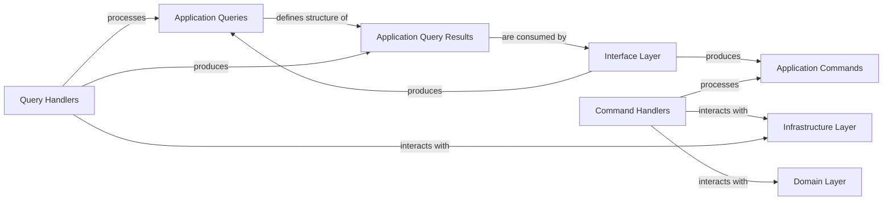

## Details

This project follows a Clean Architecture pattern, separating concerns into distinct layers: Interface, Application, Domain, and Infrastructure. The **Interface Layer** acts as the entry point, handling user requests and initiating operations. It produces `Application Commands` for write operations and `Application Queries` for read operations. The **Application Layer** contains `Command Handlers` and `Query Handlers` that process these commands and queries, respectively. `Command Handlers` orchestrate business logic by interacting with the **Domain Layer** to enforce core business rules and persist changes through the **Infrastructure Layer**. `Query Handlers` retrieve data from the **Infrastructure Layer** and transform it into `Application Query Results`, which are then consumed by the **Interface Layer**. The **Domain Layer** encapsulates the core business logic, entities, and repositories, remaining independent of external concerns. The **Infrastructure Layer** provides concrete implementations for persistence, external services, and other technical concerns, serving as an adaptable detail. This layered approach promotes maintainability, testability, and flexibility by clearly defining responsibilities and dependencies.

## Critical Interaction Pathways

1.  **Command Flow**: `Interface Layer` -> `Application Commands` -> `Command Handlers` -> `Domain Layer` (business logic) -> `Infrastructure Layer` (persistence).
2.  **Query Flow**: `Interface Layer` -> `Application Queries` -> `Query Handlers` -> `Infrastructure Layer` (data retrieval) -> `Application Query Results` -> `Interface Layer`.

### Application Commands
Immutable Data Transfer Objects (DTOs) that represent the intent and data for write operations. They are the input for `Command Handlers`, encapsulating the request to change the system's state.

**Related Classes/Methods**:

- <a href="https://github.com/agomezb/python-archetype/blob/main/src/application/commands/user_commands.py" target="_blank" rel="noopener noreferrer">`src.application.commands.user_commands`</a>

### Application Queries
Immutable Data Transfer Objects (DTOs) that encapsulate the criteria for read operations and define the structure of the expected results. They are the input for `Query Handlers`, representing a request for information without side effects.

**Related Classes/Methods**:

- <a href="https://github.com/agomezb/python-archetype/blob/main/src/application/queries/user_queries.py" target="_blank" rel="noopener noreferrer">`src.application.queries.user_queries`</a>

### Command Handlers
Components responsible for processing `Application Commands`. They orchestrate business logic by interacting with the `Domain Layer` (e.g., aggregates, domain services) and persist changes through `Infrastructure Layer` ports (e.g., repositories). They manage transactions and ensure data consistency.

**Related Classes/Methods**:

- <a href="https://github.com/agomezb/python-archetype/blob/main/src/application/handlers/user_command_handlers.py" target="_blank" rel="noopener noreferrer">`src.application.handlers.user_command_handlers`</a>

### Query Handlers
Components responsible for processing `Application Queries`. They retrieve data from the `Infrastructure Layer` (e.g., read models, repositories) and transform it into `Application Query Results`. They explicitly do not modify the system state, adhering to CQRS principles.

**Related Classes/Methods**:

- <a href="https://github.com/agomezb/python-archetype/blob/main/src/application/handlers/user_query_handlers.py" target="_blank" rel="noopener noreferrer">`src.application.handlers.user_query_handlers`</a>

### Application Query Results
Data Transfer Objects (DTOs) that define the structure for the expected output of `Application Queries`. These are the structured responses returned to the `Interface Layer` after a query has been processed.

**Related Classes/Methods**:

- <a href="https://github.com/agomezb/python-archetype/blob/main/src/application/queries/base.py" target="_blank" rel="noopener noreferrer">`src.application.queries.base`</a>

### Interface Layer
Initiates operations and consumes results from the Application Layer.

**Related Classes/Methods**:

- <a href="https://github.com/agomezb/python-archetype/blob/main/src/interfaces/web/controllers.py" target="_blank" rel="noopener noreferrer">`src.interfaces.web.controllers`</a>
- <a href="https://github.com/agomezb/python-archetype/blob/main/src/interfaces/web/main.py" target="_blank" rel="noopener noreferrer">`src.interfaces.web.main`</a>

### Domain Layer [[Expand]](./Domain_Layer.md)
Encapsulates core business rules.

**Related Classes/Methods**:

- <a href="https://github.com/agomezb/python-archetype/blob/main/src/domain/entities/user.py" target="_blank" rel="noopener noreferrer">`src.domain.entities.user`</a>
- <a href="https://github.com/agomezb/python-archetype/blob/main/src/domain/repositories/user_repository.py" target="_blank" rel="noopener noreferrer">`src.domain.repositories.user_repository`</a>
- <a href="https://github.com/agomezb/python-archetype/blob/main/src/domain/services/user_service.py" target="_blank" rel="noopener noreferrer">`src.domain.services.user_service`</a>

### Infrastructure Layer
Handles persistence and external services.

**Related Classes/Methods**:

- <a href="https://github.com/agomezb/python-archetype/blob/main/src/infrastructure/database/connection.py" target="_blank" rel="noopener noreferrer">`src.infrastructure.database.connection`</a>
- <a href="https://github.com/agomezb/python-archetype/blob/main/src/infrastructure/repositories/mongo_user_repository.py" target="_blank" rel="noopener noreferrer">`src.infrastructure.repositories.mongo_user_repository`</a>

### [FAQ](https://github.com/CodeBoarding/GeneratedOnBoardings/tree/main?tab=readme-ov-file#faq)