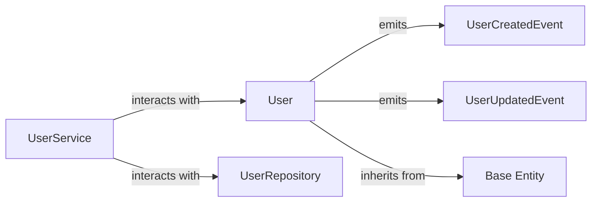

## Details

The Domain Layer is encapsulated within the `src/domain` directory. Its boundaries are defined by: `src/domain/entities/user.py`, `src/domain/services/user_service.py`, `src/domain/repositories/user_repository.py`, `src/domain/entities/base.py`.

### User
Represents the core business data and behavior of a user. It manages its own state, enforces invariants (e.g., email format, uniqueness), and signals domain events (`UserCreatedEvent`, `UserUpdatedEvent`) upon significant lifecycle changes. It also provides methods for data representation (e.g., `to_dict`). This is a fundamental Domain Entity.

**Related Classes/Methods**:

- <a href="https://github.com/agomezb/python-archetype/blob/main/demo_clean_imports.py" target="_blank" rel="noopener noreferrer">`User`</a>

### UserService
Orchestrates complex business logic that involves `User` entities but doesn't naturally belong to a single entity. This includes cross-entity validations (e.g., `is_email_unique`) that might require interaction with `UserRepository` ports. It ensures business rules are applied consistently. This is a Domain Service.

**Related Classes/Methods**:

- <a href="https://github.com/agomezb/python-archetype/blob/main/src/domain/services/user_service.py" target="_blank" rel="noopener noreferrer">`UserService`</a>

### UserRepository
Defines the contract (interface) for persistence operations related to `User` entities. It abstracts the underlying data storage mechanism, allowing the domain layer to remain independent of infrastructure concerns. This is a "port" in the Hexagonal Architecture, crucial for dependency inversion.

**Related Classes/Methods**:

- <a href="https://github.com/agomezb/python-archetype/blob/main/src/domain/repositories/user_repository.py#L9-L40" target="_blank" rel="noopener noreferrer">`UserRepository`:9-40</a>

### UserCreatedEvent
Represents a significant occurrence in the domain when a new `User` entity is successfully created. It carries relevant data about the new user, enabling decoupled reactions within the same microservice or across different microservices (via an event bus). This is a Domain Event.

**Related Classes/Methods**:

- <a href="https://github.com/agomezb/python-archetype/blob/main/src/domain/entities/user.py#L9-L18" target="_blank" rel="noopener noreferrer">`UserCreatedEvent`:9-18</a>

### UserUpdatedEvent
Represents a significant occurrence in the domain when an existing `User` entity is successfully updated. It carries relevant data about the updated user, enabling decoupled reactions. This is a Domain Event.

**Related Classes/Methods**:

- <a href="https://github.com/agomezb/python-archetype/blob/main/src/domain/entities/user.py#L21-L30" target="_blank" rel="noopener noreferrer">`UserUpdatedEvent`:21-30</a>

### Base Entity
Provides common attributes and behaviors for all domain entities, such as a unique identifier (`id`), ensuring consistency and reducing duplication across entities. `User` entity inherits from this base. This is an abstract base for Domain Entities.

**Related Classes/Methods**:

- <a href="https://github.com/agomezb/python-archetype/blob/main/src/domain/entities/base.py" target="_blank" rel="noopener noreferrer">`Base Entity`</a>

### [FAQ](https://github.com/CodeBoarding/GeneratedOnBoardings/tree/main?tab=readme-ov-file#faq)