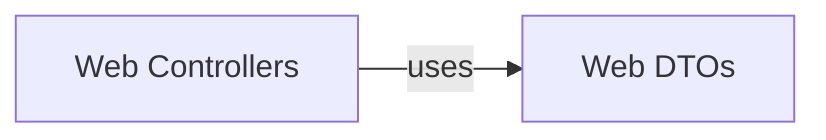

## Details

The Web API subsystem forms the external interface layer of the microservice, handling web-specific concerns, and is composed of Web Controllers and Web DTOs.

### Web Controllers
These are the API endpoints, serving as the primary entry point for external HTTP requests. Following the Hexagonal Architecture's "Adapter" pattern, they translate incoming web requests into calls to the application layer's "ports" (e.g., command/query handlers). In a microservice context, these controllers define the service's public API contract, handling request parsing, validation, and response orchestration.

**Related Classes/Methods**:

- <a href="https://github.com/agomezb/python-archetype/blob/main/src/interfaces/web/controllers.py" target="_blank" rel="noopener noreferrer">`src.interfaces.web.controllers`</a>

### Web DTOs
These objects define the explicit data contract for the Web API. They are crucial for ensuring clear and type-safe communication between the client and the microservice. DTOs separate the external API representation from internal domain models, preventing direct exposure of domain logic and providing a stable, versionable interface.

**Related Classes/Methods**:

- <a href="https://github.com/agomezb/python-archetype/blob/main/src/interfaces/web/dtos.py" target="_blank" rel="noopener noreferrer">`src.interfaces.web.dtos`</a>

### [FAQ](https://github.com/CodeBoarding/GeneratedOnBoardings/tree/main?tab=readme-ov-file#faq)