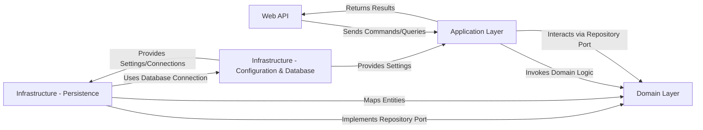

## Details

The python-archetype project is structured around a clean architecture, emphasizing separation of concerns and maintainability. The Web API acts as the external entry point, receiving requests and forwarding them as Commands or Queries to the Application Layer. This layer orchestrates the application's core business logic, invoking Domain Logic within the Domain Layer and interacting with Infrastructure - Persistence through Repository Ports defined by the Domain Layer. The Infrastructure - Persistence component provides concrete implementations for these repository ports, handling data storage and retrieval, and mapping Domain Entities to persistence-specific structures. Both the Application Layer and Infrastructure - Persistence rely on Infrastructure - Configuration & Database for essential settings and database connections, ensuring a clear flow of data and dependencies throughout the system.

### Web API [[Expand]](./Web_API.md)
The external interface for the microservice, responsible for handling incoming HTTP requests, routing them to the appropriate application services, and formatting responses using Data Transfer Objects (DTOs).

**Related Classes/Methods**:

- <a href="https://github.com/agomezb/python-archetype/blob/main/src/interfaces/web/controllers.py" target="_blank" rel="noopener noreferrer">`src/interfaces/web/controllers.py`</a>
- <a href="https://github.com/agomezb/python-archetype/blob/main/src/interfaces/web/dtos.py" target="_blank" rel="noopener noreferrer">`src/interfaces/web/dtos.py`</a>

### Application Layer [[Expand]](./Application_Layer.md)
This layer orchestrates the application's business logic. It contains distinct command handlers for write operations and query handlers for read operations, processing Application Commands and Application Queries, and managing Application Query Results. It interacts with the Domain Layer and Infrastructure via ports.

**Related Classes/Methods**:

- <a href="https://github.com/agomezb/python-archetype/blob/main/src/application/commands/user_commands.py" target="_blank" rel="noopener noreferrer">`src/application/commands/user_commands.py`</a>
- <a href="https://github.com/agomezb/python-archetype/blob/main/src/application/queries/user_queries.py" target="_blank" rel="noopener noreferrer">`src/application/queries/user_queries.py`</a>
- <a href="https://github.com/agomezb/python-archetype/blob/main/src/application/queries/base.py" target="_blank" rel="noopener noreferrer">`src/application/queries/base.py`</a>
- <a href="https://github.com/agomezb/python-archetype/blob/main/src/application/handlers/user_command_handlers.py" target="_blank" rel="noopener noreferrer">`src/application/handlers/user_command_handlers.py`</a>
- <a href="https://github.com/agomezb/python-archetype/blob/main/src/application/handlers/user_query_handlers.py" target="_blank" rel="noopener noreferrer">`src/application/handlers/user_query_handlers.py`</a>

### Domain Layer [[Expand]](./Domain_Layer.md)
The core of the application, encapsulating the essential business rules, Domain Entities, Domain Services, and defining Domain Repository Ports (interfaces). It is independent of external concerns and technology choices.

**Related Classes/Methods**:

- <a href="https://github.com/agomezb/python-archetype/blob/main/src/domain/entities/user.py" target="_blank" rel="noopener noreferrer">`src/domain/entities/user.py`</a>
- <a href="https://github.com/agomezb/python-archetype/blob/main/src/domain/services/user_service.py" target="_blank" rel="noopener noreferrer">`src/domain/services/user_service.py`</a>
- <a href="https://github.com/agomezb/python-archetype/blob/main/src/domain/repositories/user_repository.py" target="_blank" rel="noopener noreferrer">`src/domain/repositories/user_repository.py`</a>

### Infrastructure - Persistence
Provides concrete implementations (adapters) for the Domain Repository Ports defined in the Domain Layer. It handles the actual data storage and retrieval mechanisms, mapping between domain entities and database-specific structures (e.g., MongoDB documents).

**Related Classes/Methods**:

- <a href="https://github.com/agomezb/python-archetype/blob/main/src/infrastructure/repositories/mongo_user_repository.py" target="_blank" rel="noopener noreferrer">`src/infrastructure/repositories/mongo_user_repository.py`</a>

### Infrastructure - Configuration & Database
Manages application-wide configuration settings, environment variables, and establishes connections to external resources, primarily the database. It provides these settings and connections to other infrastructure components and the Application Layer.

**Related Classes/Methods**:

- <a href="https://github.com/agomezb/python-archetype/blob/main/src/infrastructure/config/settings.py" target="_blank" rel="noopener noreferrer">`src/infrastructure/config/settings.py`</a>
- <a href="https://github.com/agomezb/python-archetype/blob/main/src/infrastructure/database/connection.py" target="_blank" rel="noopener noreferrer">`src/infrastructure/database/connection.py`</a>

### [FAQ](https://github.com/CodeBoarding/GeneratedOnBoardings/tree/main?tab=readme-ov-file#faq)