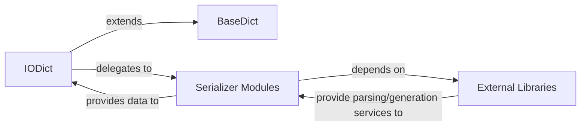

## Details

The `benedict` library's serialization subsystem is designed around a flexible, pluggable architecture. At its core, the `BaseDict` provides fundamental dictionary capabilities, which are extended by `IODict` to handle diverse data serialization and deserialization. `IODict` acts as a central dispatcher, delegating format-specific tasks to a suite of dedicated Serializer components (e.g., JSON, XML, YAML). These Serializers, in turn, leverage various External Libraries to perform the actual low-level data parsing and generation. This design ensures modularity, allowing easy extension with new data formats and efficient management of external dependencies.

### BaseDict
The foundational component of the `benedict` library, providing core dictionary functionalities and serving as the base for all specialized dictionary types.

**Related Classes/Methods**:

- <a href="https://github.com/fabiocaccamo/python-benedict/blob/main/benedict/dicts/base/base_dict.py#L4-L163" target="_blank" rel="noopener noreferrer">`benedict.dicts.base.base_dict.BaseDict`:4-163</a>

### IODict
Acts as a Facade or Adapter, centralizing serialization/deserialization requests and delegating them to the appropriate serializer module based on the requested format. It extends `BaseDict` to integrate I/O capabilities.

**Related Classes/Methods**:

- <a href="https://github.com/fabiocaccamo/python-benedict/blob/main/benedict/dicts/io/io_dict.py#L9-L327" target="_blank" rel="noopener noreferrer">`benedict.dicts.io.io_dict.IODict`:9-327</a>

### Serializer Modules
A collection of specialized modules, each responsible for handling the serialization and deserialization of a specific data format (e.g., JSON, XML, YAML, CSV, TOML, XLS, Base64, Pickle). These modules encapsulate the logic for converting Python data structures to and from their respective formats.

**Related Classes/Methods**:

- <a href="https://github.com/fabiocaccamo/python-benedict/blob/main/benedict/serializers/json.py" target="_blank" rel="noopener noreferrer">`benedict.serializers.json`</a>
- <a href="https://github.com/fabiocaccamo/python-benedict/blob/main/benedict/serializers/xml.py" target="_blank" rel="noopener noreferrer">`benedict.serializers.xml`</a>
- <a href="https://github.com/fabiocaccamo/python-benedict/blob/main/benedict/serializers/yaml.py" target="_blank" rel="noopener noreferrer">`benedict.serializers.yaml`</a>
- <a href="https://github.com/fabiocaccamo/python-benedict/blob/main/benedict/serializers/csv.py" target="_blank" rel="noopener noreferrer">`benedict.serializers.csv`</a>
- <a href="https://github.com/fabiocaccamo/python-benedict/blob/main/benedict/serializers/toml.py" target="_blank" rel="noopener noreferrer">`benedict.serializers.toml`</a>
- <a href="https://github.com/fabiocaccamo/python-benedict/blob/main/benedict/serializers/xls.py" target="_blank" rel="noopener noreferrer">`benedict.serializers.xls`</a>
- <a href="https://github.com/fabiocaccamo/python-benedict/blob/main/benedict/serializers/base64.py" target="_blank" rel="noopener noreferrer">`benedict.serializers.base64`</a>
- <a href="https://github.com/fabiocaccamo/python-benedict/blob/main/benedict/serializers/pickle.py" target="_blank" rel="noopener noreferrer">`benedict.serializers.pickle`</a>

### External Libraries
External Python libraries (e.g., `json`, `xmltodict`, `PyYAML`, `openpyxl`, `xlrd`, `configparser`, `BeautifulSoup4`, `argparse`, `boto3`) that provide low-level parsing and generation services for various data formats. These libraries are utilized by the `Serializer Modules`.

**Related Classes/Methods**: _None_

### [FAQ](https://github.com/CodeBoarding/GeneratedOnBoardings/tree/main?tab=readme-ov-file#faq)