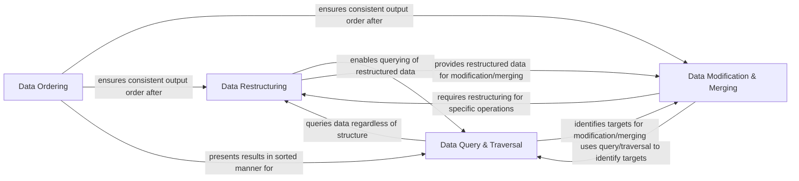

## Details

The `Data Transformation & Manipulation` subsystem within `benedict.core` provides a robust set of utilities for handling dictionary data. The components within `benedict.core` are tightly integrated, forming a cohesive utility library. They often operate sequentially, where the output of one component becomes the input for another. This interdependency allows for complex data pipelines to be constructed by chaining these fundamental operations. The design promotes modularity, where each function focuses on a specific transformation or query, contributing to the overall `Data Transformation & Manipulation` capabilities of the `benedict` library.

### Data Restructuring
This component is responsible for altering the hierarchical structure of dictionary data, enabling transformations between flattened and nested representations. It simplifies complex data for easier processing or restores original structures.

**Related Classes/Methods**:

- <a href="https://github.com/fabiocaccamo/python-benedict/blob/main/benedict/core/__init__.py" target="_blank" rel="noopener noreferrer">`benedict.core.flatten`</a>
- <a href="https://github.com/fabiocaccamo/python-benedict/blob/main/benedict/core/__init__.py" target="_blank" rel="noopener noreferrer">`benedict.core.unflatten`</a>
- <a href="https://github.com/fabiocaccamo/python-benedict/blob/main/benedict/core/__init__.py" target="_blank" rel="noopener noreferrer">`benedict.core.nest`</a>

### Data Modification & Merging
This component provides functionalities for modifying dictionary content, including sanitization, key-value inversion, and combining multiple dictionaries with various conflict resolution strategies.

**Related Classes/Methods**:

- <a href="https://github.com/fabiocaccamo/python-benedict/blob/main/benedict/core/__init__.py" target="_blank" rel="noopener noreferrer">`benedict.core.clean`</a>
- <a href="https://github.com/fabiocaccamo/python-benedict/blob/main/benedict/core/__init__.py" target="_blank" rel="noopener noreferrer">`benedict.core.invert`</a>
- <a href="https://github.com/fabiocaccamo/python-benedict/blob/main/benedict/core/__init__.py" target="_blank" rel="noopener noreferrer">`benedict.core.merge`</a>

### Data Query & Traversal
This component focuses on navigating and extracting information from dictionary structures. It supports searching for specific patterns or values and provides mechanisms for iterating through data at different depths.

**Related Classes/Methods**:

- <a href="https://github.com/fabiocaccamo/python-benedict/blob/main/benedict/core/__init__.py" target="_blank" rel="noopener noreferrer">`benedict.core.search`</a>
- <a href="https://github.com/fabiocaccamo/python-benedict/blob/main/benedict/core/__init__.py" target="_blank" rel="noopener noreferrer">`benedict.core.traverse`</a>
- <a href="https://github.com/fabiocaccamo/python-benedict/blob/main/benedict/core/__init__.py" target="_blank" rel="noopener noreferrer">`benedict.core.keylists`</a>

### Data Ordering
This component offers utilities to sort dictionary items, providing ordered views of data based on keys or values, which is crucial for consistent processing and presentation.

**Related Classes/Methods**:

- <a href="https://github.com/fabiocaccamo/python-benedict/blob/main/benedict/core/__init__.py" target="_blank" rel="noopener noreferrer">`benedict.core.items_sorted`</a>

### [FAQ](https://github.com/CodeBoarding/GeneratedOnBoardings/tree/main?tab=readme-ov-file#faq)