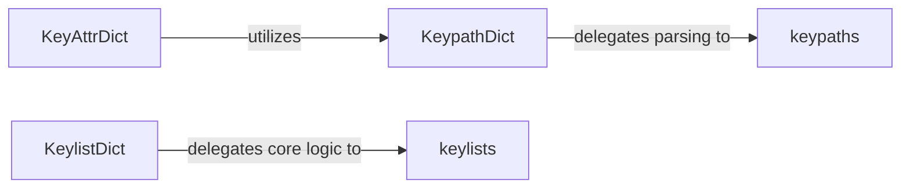

## Details

The `benedict` library's core functionality for advanced dictionary manipulation is centered around extending standard dictionary behavior. The `KeypathDict` and `KeylistDict` components provide specialized dictionary interfaces, enabling access to nested data using dot-notation keypaths and list-based key sequences, respectively. These interfaces heavily rely on the `keypaths` and `keylists` utility functions, which encapsulate the complex logic for parsing key strings and traversing nested data structures. The `KeyAttrDict` further enhances usability by offering attribute-style access, likely leveraging the `KeypathDict`'s underlying mechanisms. This modular design separates the concerns of interface presentation from the core logic of keypath and keylist resolution, promoting reusability and maintainability within the subsystem.

### KeypathDict
Serves as the primary interface for interacting with dictionary data using dot-notation keypaths (e.g., `data.nested.item`). It overrides standard dictionary methods (`__contains__`, `__delitem__`, `__getitem__`, `__setitem__`, `get`, `pop`) to enable seamless nested access and manipulation.

**Related Classes/Methods**:

### keypaths
A dedicated utility function responsible for parsing and interpreting string-based keypaths into a structured format (e.g., a list of individual keys or indices). It encapsulates the complex logic for splitting and validating keypath strings.

**Related Classes/Methods**:

- <a href="https://github.com/fabiocaccamo/python-benedict/blob/main/benedict/core/keypaths.py#L5-L13" target="_blank" rel="noopener noreferrer">`benedict.core.keypaths.keypaths`:5-13</a>

### KeylistDict
Provides a dictionary-like interface that specifically handles key access using list-based key sequences (e.g., `['key', 'nested_key']`). This allows for precise, programmatic navigation and manipulation of nested structures when the key sequence is already provided as a list.

**Related Classes/Methods**:

### keylists
This utility function provides the fundamental logic for retrieving, setting, and manipulating items within nested data structures (dictionaries and lists) based on a list of keys or indices. It handles the low-level traversal and modification of these structures.

**Related Classes/Methods**:

- <a href="https://github.com/fabiocaccamo/python-benedict/blob/main/benedict/core/keylists.py#L31-L32" target="_blank" rel="noopener noreferrer">`benedict.core.keylists.keylists`:31-32</a>

### KeyAttrDict
Enables attribute-style access to dictionary elements, allowing syntax like `my_dict.key.nested_key` instead of `my_dict['key']['nested_key']`. This likely involves dynamic attribute handling (`__getattr__`, `__setattr__`) to provide a more Pythonic and concise way to access data.

**Related Classes/Methods**:

### [FAQ](https://github.com/CodeBoarding/GeneratedOnBoardings/tree/main?tab=readme-ov-file#faq)