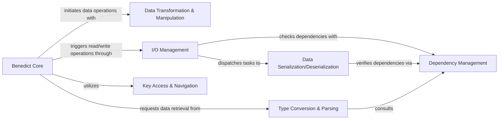

## Details

The `python-benedict` library is designed with a clear, modular architecture centered around the **Benedict Core** class. This core acts as the primary entry point and orchestrator, delegating specialized data operations to dedicated components. Data input and output are managed by the **I/O Management** layer, which intelligently routes requests to specific **Data Serialization/Deserialization** modules based on format. For in-memory data manipulation, the `Benedict Core` interacts with **Data Transformation & Manipulation** for structural changes and **Key Access & Navigation** for precise element access. Additionally, **Type Conversion & Parsing** handles data type conversions, often relying on **Dependency Management** to ensure all necessary external libraries are present for advanced functionalities. This structure promotes a clean flow, where the `Benedict Core` coordinates operations across well-defined, interchangeable components, ensuring extensibility and maintainability.

### Benedict Core [[Expand]](./Benedict_Core.md)
The central dictionary-like object, extending Python's built-in `dict` with advanced features for data manipulation and access. It serves as the primary interface for all library functionalities.

**Related Classes/Methods**:

- <a href="https://github.com/fabiocaccamo/python-benedict/blob/main/benedict/dicts/__init__.py#L42-L314" target="_blank" rel="noopener noreferrer">`benedict`:42-314</a>
- <a href="https://github.com/fabiocaccamo/python-benedict/blob/main/benedict/dicts/base/base_dict.py" target="_blank" rel="noopener noreferrer">`benedict.dicts.base.base_dict`</a>

### Data Transformation & Manipulation [[Expand]](./Data_Transformation_Manipulation.md)
A comprehensive set of functions for transforming, cleaning, flattening, nesting, merging, and searching dictionary data structures.

**Related Classes/Methods**:

- <a href="https://github.com/fabiocaccamo/python-benedict/blob/main/benedict/core/__init__.py" target="_blank" rel="noopener noreferrer">`benedict.core`</a>

### I/O Management [[Expand]](./I_O_Management.md)
Manages the reading and writing of content from/to various sources (files, URLs, S3) and handles format auto-detection. It provides the high-level interface for encoding and decoding dictionary data.

**Related Classes/Methods**:

- <a href="https://github.com/fabiocaccamo/python-benedict/blob/main/benedict/dicts/io/io_dict.py" target="_blank" rel="noopener noreferrer">`benedict.dicts.io.io_dict`</a>
- <a href="https://github.com/fabiocaccamo/python-benedict/blob/main/benedict/dicts/io/io_util.py" target="_blank" rel="noopener noreferrer">`benedict.dicts.io.io_util`</a>

### Key Access & Navigation [[Expand]](./Key_Access_Navigation.md)
Handles operations on dictionary data using dot-notation (keypath) or list-based (keylist) syntax for nested access, retrieval, and manipulation.

**Related Classes/Methods**:

- <a href="https://github.com/fabiocaccamo/python-benedict/blob/main/benedict/dicts/keypath/__init__.py" target="_blank" rel="noopener noreferrer">`benedict.dicts.keypath`</a>
- <a href="https://github.com/fabiocaccamo/python-benedict/blob/main/benedict/dicts/keylist/__init__.py" target="_blank" rel="noopener noreferrer">`benedict.dicts.keylist`</a>
- <a href="https://github.com/fabiocaccamo/python-benedict/blob/main/benedict/dicts/keyattr/__init__.py" target="_blank" rel="noopener noreferrer">`benedict.dicts.keyattr`</a>

### Type Conversion & Parsing
Provides methods for retrieving and parsing dictionary values into specific Python data types, including utility functions for the actual conversion logic.

**Related Classes/Methods**:

- <a href="https://github.com/fabiocaccamo/python-benedict/blob/main/benedict/dicts/parse/parse_dict.py" target="_blank" rel="noopener noreferrer">`benedict.dicts.parse.parse_dict`</a>
- <a href="https://github.com/fabiocaccamo/python-benedict/blob/main/benedict/dicts/parse/parse_util.py" target="_blank" rel="noopener noreferrer">`benedict.dicts.parse.parse_util`</a>

### Data Serialization/Deserialization [[Expand]](./Data_Serialization_Deserialization.md)
A collection of specialized modules, each responsible for encoding and decoding data to/from a specific format (e.g., JSON, XML, YAML, CSV, Base64, Pickle, Plist, Query String, INI, XLS, HTML, TOML, CLI).

**Related Classes/Methods**:

- <a href="https://github.com/fabiocaccamo/python-benedict/blob/main/benedict/serializers/__init__.py" target="_blank" rel="noopener noreferrer">`benedict.serializers`</a>

### Dependency Management
Manages and enforces the presence of optional third-party package dependencies required for specific features (e.g., HTML parsing, S3 integration, TOML parsing).

**Related Classes/Methods**:

- <a href="https://github.com/fabiocaccamo/python-benedict/blob/main/benedict/extras.py" target="_blank" rel="noopener noreferrer">`benedict.extras`</a>

### [FAQ](https://github.com/CodeBoarding/GeneratedOnBoardings/tree/main?tab=readme-ov-file#faq)