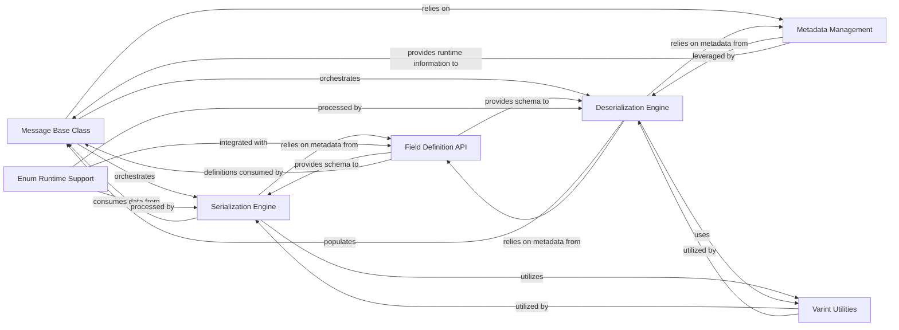

## Details

Analysis of the Betterproto Runtime Library subsystem, which provides foundational mechanisms for generated Protobuf classes, handling serialization, deserialization, and field management.

### Message Base Class
The foundational class for all generated Protobuf messages. It orchestrates the lifecycle, attribute access, equality checks, and high-level serialization/deserialization processes for Protobuf data in Python.

**Related Classes/Methods**:

- <a href="https://github.com/danielgtaylor/python-betterproto/blob/master/src/betterproto/__init__.py" target="_blank" rel="noopener noreferrer">`betterproto.__init__.Message`</a>

### Field Definition API
Offers a declarative API (e.g., `string_field`, `message_field`) for defining Protobuf fields within Python dataclasses. It attaches essential Protobuf-specific metadata like field numbers, wire types, and type hints, forming the schema for messages.

**Related Classes/Methods**:

- <a href="https://github.com/danielgtaylor/python-betterproto/blob/master/src/betterproto/__init__.py" target="_blank" rel="noopener noreferrer">`betterproto.__init__.Field Definition Functions`</a>

### Serialization Engine
Responsible for converting Python field values into their corresponding Protobuf binary format. It applies Protobuf encoding rules, handling various data types to prepare messages for transmission or storage.

**Related Classes/Methods**:

- <a href="https://github.com/danielgtaylor/python-betterproto/blob/master/src/betterproto/__init__.py" target="_blank" rel="noopener noreferrer">`betterproto.__init__.Serialization Logic`</a>

### Deserialization Engine
Parses incoming Protobuf binary data, identifies individual fields, and converts them into appropriate Python data types. It reconstructs the Python message object from the binary stream.

**Related Classes/Methods**:

- <a href="https://github.com/danielgtaylor/python-betterproto/blob/master/src/betterproto/__init__.py" target="_blank" rel="noopener noreferrer">`betterproto.__init__.Deserialization Logic`</a>

### Metadata Management
Provides a consistent interface for retrieving runtime metadata about Protobuf messages and their fields. This includes information such as field numbers, types, default values, and class mappings, crucial for dynamic operations.

**Related Classes/Methods**:

- <a href="https://github.com/danielgtaylor/python-betterproto/blob/master/src/betterproto/__init__.py" target="_blank" rel="noopener noreferrer">`betterproto.__init__.Metadata Accessors`</a>

### Enum Runtime Support
Serves as the base class and provides runtime support for generated Protobuf enumeration types. It ensures proper instantiation and behavior of these enums as idiomatic Python enums.

**Related Classes/Methods**:

- <a href="https://github.com/danielgtaylor/python-betterproto/blob/master/src/betterproto/enum.py#L118-L197" target="_blank" rel="noopener noreferrer">`betterproto.enum.Enum`:118-197</a>

### Varint Utilities
Offers fundamental utilities for varint encoding and decoding. This is a low-level but critical component, as varints are a core part of Protobuf's efficient serialization format for integers.

**Related Classes/Methods**:

- <a href="https://github.com/danielgtaylor/python-betterproto/blob/master/src/betterproto/__init__.py" target="_blank" rel="noopener noreferrer">`betterproto.__init__.Varint Utility Layer`</a>

### [FAQ](https://github.com/CodeBoarding/GeneratedOnBoardings/tree/main?tab=readme-ov-file#faq)