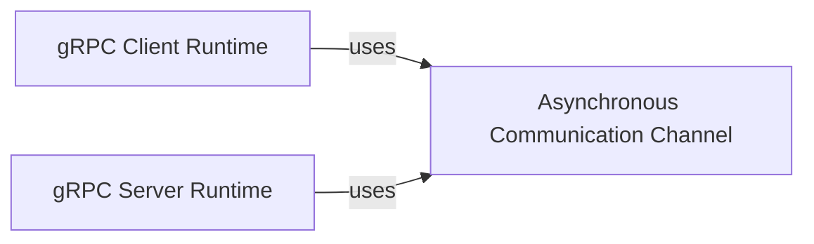

## Details

The `betterproto` gRPC subsystem is designed around two primary runtime components: the `gRPC Client Runtime` and the `gRPC Server Runtime`. The `gRPC Client Runtime` facilitates the initiation and management of gRPC calls from the client side, handling the serialization of requests and deserialization of responses. Conversely, the `gRPC Server Runtime` provides the foundational framework for hosting gRPC services, managing incoming requests and dispatching them to user-defined service implementations. Both of these core components rely on the `Asynchronous Communication Channel` for their underlying data transport and channel state management, ensuring efficient and reliable asynchronous communication. This clear separation of concerns allows for robust and scalable gRPC service development.

### gRPC Client Runtime
Manages the initiation and execution of various gRPC call types (unary-unary, unary-stream, stream-unary, stream-stream) from the client perspective. It handles the serialization of outgoing requests and deserialization of incoming responses, abstracting the underlying network communication. This component is the runtime support for the client stubs generated by `betterproto`.

**Related Classes/Methods**:

- <a href="https://github.com/danielgtaylor/python-betterproto/blob/master/src/betterproto/grpc/grpclib_client.py" target="_blank" rel="noopener noreferrer">`betterproto.grpc.grpclib_client`</a>

### gRPC Server Runtime
Provides the core framework for implementing gRPC services on the server side. It is responsible for listening for incoming gRPC requests, dispatching them to the appropriate service methods (which are implemented by the user via generated base classes), and handling the serialization of responses. This component forms the backbone for hosting gRPC services.

**Related Classes/Methods**:

- <a href="https://github.com/danielgtaylor/python-betterproto/blob/master/src/betterproto/grpc/grpclib_server.py#L13-L33" target="_blank" rel="noopener noreferrer">`betterproto.grpc.grpclib_server.ServiceBase`:13-33</a>

### Asynchronous Communication Channel
Acts as a low-level, generic asynchronous communication channel. Its primary role is to manage the flow of data (sending and receiving messages) and maintain the state of the communication channel (e.g., open, closed, done). It provides the fundamental transport mechanism for gRPC messages, abstracting network specifics.

**Related Classes/Methods**:

- <a href="https://github.com/danielgtaylor/python-betterproto/blob/master/src/betterproto/grpc/util/async_channel.py" target="_blank" rel="noopener noreferrer">`betterproto.grpc.util.async_channel`</a>

### [FAQ](https://github.com/CodeBoarding/GeneratedOnBoardings/tree/main?tab=readme-ov-file#faq)