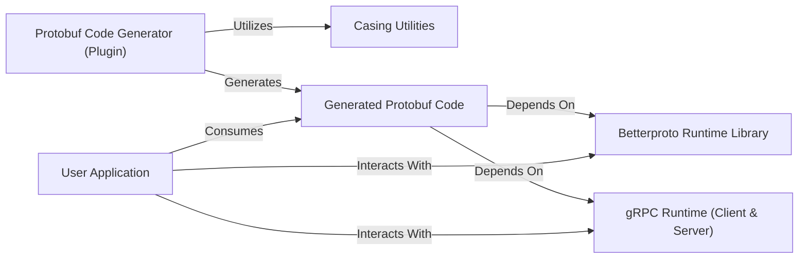

## Details

The `python-betterproto` project is structured around a core `Protobuf Code Generator (Plugin)` that processes `.proto` definition files to produce `Generated Protobuf Code`. This generated code, which includes Python classes for messages, enums, and gRPC service stubs, forms the primary interface for `User Applications`. The `Generated Protobuf Code` relies heavily on the `Betterproto Runtime Library` for fundamental operations like serialization and deserialization, and on the `gRPC Runtime (Client & Server)` for asynchronous gRPC communication. During the code generation phase, the `Protobuf Code Generator (Plugin)` utilizes `Casing Utilities` to ensure proper naming conventions in the generated Python output. This architecture clearly separates the code generation concerns from the runtime execution, providing a robust framework for integrating Protobuf and gRPC into Python applications.

### Protobuf Code Generator (Plugin) [[Expand]](./Protobuf_Code_Generator_Plugin_.md)
The `protoc` plugin responsible for parsing `.proto` definition files and generating Python source code.

**Related Classes/Methods**:

- <a href="https://github.com/danielgtaylor/python-betterproto/blob/master/src/betterproto/plugin/main.py" target="_blank" rel="noopener noreferrer">`betterproto.plugin.main`</a>
- <a href="https://github.com/danielgtaylor/python-betterproto/blob/master/src/betterproto/plugin/parser.py" target="_blank" rel="noopener noreferrer">`betterproto.plugin.parser`</a>
- <a href="https://github.com/danielgtaylor/python-betterproto/blob/master/src/betterproto/plugin/models.py" target="_blank" rel="noopener noreferrer">`betterproto.plugin.models`</a>
- <a href="https://github.com/danielgtaylor/python-betterproto/blob/master/src/betterproto/plugin/typing_compiler.py" target="_blank" rel="noopener noreferrer">`betterproto.plugin.typing_compiler`</a>

### Betterproto Runtime Library [[Expand]](./Betterproto_Runtime_Library.md)
The foundational Python library providing core mechanisms for generated Protobuf classes, including serialization/deserialization and field management.

**Related Classes/Methods**:

- <a href="https://github.com/danielgtaylor/python-betterproto/blob/master/src/betterproto/__init__.py" target="_blank" rel="noopener noreferrer">`betterproto.__init__`</a>
- <a href="https://github.com/danielgtaylor/python-betterproto/blob/master/src/betterproto/enum.py" target="_blank" rel="noopener noreferrer">`betterproto.enum`</a>
- <a href="https://github.com/danielgtaylor/python-betterproto/blob/master/src/betterproto/_types.py" target="_blank" rel="noopener noreferrer">`betterproto._types`</a>

### gRPC Runtime (Client & Server) [[Expand]](./gRPC_Runtime_Client_Server_.md)
Provides asynchronous gRPC communication capabilities, supporting both client-side stubs and server-side service implementations.

**Related Classes/Methods**:

- <a href="https://github.com/danielgtaylor/python-betterproto/blob/master/src/betterproto/grpc/grpclib_client.py" target="_blank" rel="noopener noreferrer">`betterproto.grpc.grpclib_client`</a>
- <a href="https://github.com/danielgtaylor/python-betterproto/blob/master/src/betterproto/grpc/grpclib_server.py" target="_blank" rel="noopener noreferrer">`betterproto.grpc.grpclib_server`</a>
- <a href="https://github.com/danielgtaylor/python-betterproto/blob/master/src/betterproto/grpc/util/async_channel.py" target="_blank" rel="noopener noreferrer">`betterproto.grpc.util.async_channel`</a>

### Casing Utilities
A shared utility module for converting string casing and sanitizing names, primarily used during code generation.

**Related Classes/Methods**:

- <a href="https://github.com/danielgtaylor/python-betterproto/blob/master/src/betterproto/casing.py" target="_blank" rel="noopener noreferrer">`betterproto.casing`</a>

### Generated Protobuf Code
The Python classes, enums, and gRPC service stubs automatically generated by the `Protobuf Code Generator (Plugin)` from user-defined `.proto` definitions. This code serves as the primary user-facing interface for interacting with Protobuf messages and gRPC services. Its source code is dynamically created at build time based on user input, rather than being a static part of the `betterproto` library's codebase.

**Related Classes/Methods**: _None_

### User Application
Represents external applications or services developed by users that integrate with and utilize the `betterproto` library. These applications consume the `Generated Protobuf Code` (e.g., message classes, gRPC stubs) and interact with the `Betterproto Runtime Library` and `gRPC Runtime` to send and receive Protobuf messages and make gRPC calls. Its source code resides outside the `betterproto` project.

**Related Classes/Methods**: _None_

### [FAQ](https://github.com/CodeBoarding/GeneratedOnBoardings/tree/main?tab=readme-ov-file#faq)