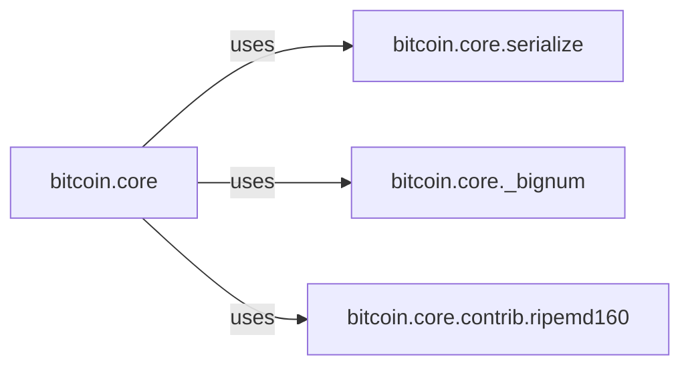

## Details

The `Core Protocol Primitives` subsystem is responsible for the fundamental data processing and cryptographic operations required by the Bitcoin protocol. Its boundaries are defined by the `bitcoin.core` package and its direct sub-modules and utilities that handle serialization, deserialization, hashing, and large number conversions.

### bitcoin.core
The central component that defines and manages Bitcoin's fundamental data structures (transactions, blocks, headers) and orchestrates their processing. It acts as the primary interface for interacting with these core protocol elements.

**Related Classes/Methods**:

- <a href="https://github.com/petertodd/python-bitcoinlib/blob/master/bitcoin/core" target="_blank" rel="noopener noreferrer">`bitcoin.core`</a>

### bitcoin.core.serialize
Provides the essential low-level serialization, deserialization, and standard SHA256 hashing services. It is crucial for converting Bitcoin data structures to and from raw byte streams, and for generating cryptographic hashes.

**Related Classes/Methods**:

- <a href="https://github.com/petertodd/python-bitcoinlib/blob/master/bitcoin/core/serialize.py" target="_blank" rel="noopener noreferrer">`bitcoin.core.serialize`</a>

### bitcoin.core._bignum
A specialized utility component dedicated to handling conversions between large integers (bignums) and their binary representations, as required by specific aspects of the Bitcoin protocol.

**Related Classes/Methods**:

- <a href="https://github.com/petertodd/python-bitcoinlib/blob/master/bitcoin/core/_bignum.py" target="_blank" rel="noopener noreferrer">`bitcoin.core._bignum`</a>

### bitcoin.core.contrib.ripemd160
A cryptographic utility component that implements the RIPEMD160 hash function, which is used in Bitcoin for generating public key hashes (e.g., for Bitcoin addresses).

**Related Classes/Methods**:

- <a href="https://github.com/petertodd/python-bitcoinlib/blob/master/bitcoin/core/contrib/ripemd160.py" target="_blank" rel="noopener noreferrer">`bitcoin.core.contrib.ripemd160`</a>

### [FAQ](https://github.com/CodeBoarding/GeneratedOnBoardings/tree/main?tab=readme-ov-file#faq)