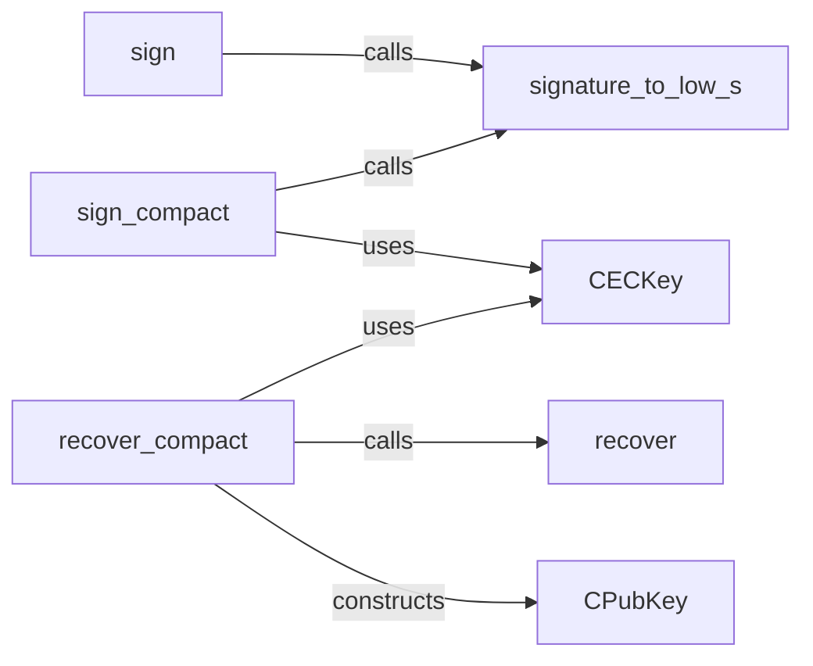

## Details

The Cryptographic Utilities subsystem is primarily encapsulated within the bitcoin.core.key module, with supporting elements from bitcoin.signature and bitcoin.signmessage. Its core responsibility is to handle Elliptic Curve Cryptography (ECC) operations, including key management, digital signing, and public key recovery, essential for securing transactions and messages within the Bitcoin protocol.

### CECKey
The foundational class representing an Elliptic Curve Cryptography (ECC) key, encapsulating both private and public key data. It is central to all key-related operations, including generation, signing, and public key derivation.

**Related Classes/Methods**:

- <a href="https://github.com/petertodd/python-bitcoinlib/blob/master/bitcoin/core/key.py#L246-L564" target="_blank" rel="noopener noreferrer">`bitcoin.core.key.CECKey`:246-564</a>

### sign
Provides the primary function for generating standard ECDSA digital signatures for arbitrary data, typically transaction hashes. It ensures the integrity and authenticity of data.

**Related Classes/Methods**:

- <a href="https://github.com/petertodd/python-bitcoinlib/blob/master/bitcoin/core/key.py#L334-L351" target="_blank" rel="noopener noreferrer">`bitcoin.core.key.sign`:334-351</a>

### sign_compact
Generates compact ECDSA signatures, which include a recovery ID. This is commonly used for message signing in Bitcoin, allowing the public key to be recovered from the signature itself.

**Related Classes/Methods**:

- <a href="https://github.com/petertodd/python-bitcoinlib/blob/master/bitcoin/core/key.py#L353-L398" target="_blank" rel="noopener noreferrer">`bitcoin.core.key.sign_compact`:353-398</a>

### recover_compact
Recovers the public key from a compact signature and the original message hash. This function is crucial for verifying signed messages without requiring the explicit transmission of the public key.

**Related Classes/Methods**:

- <a href="https://github.com/petertodd/python-bitcoinlib/blob/master/bitcoin/core/key.py#L586-L608" target="_blank" rel="noopener noreferrer">`bitcoin.core.key.recover_compact`:586-608</a>

### CPubKey
A data structure representing a public key. It is used in the context of public key recovery and verification processes, providing a standardized format for public key representation.

**Related Classes/Methods**:

- <a href="https://github.com/petertodd/python-bitcoinlib/blob/master/bitcoin/core/key.py#L566-L625" target="_blank" rel="noopener noreferrer">`bitcoin.core.key.CPubKey`:566-625</a>

### recover
An internal utility function that provides the core cryptographic logic for public key recovery from a signature and message. It is leveraged by higher-level functions like `recover_compact`.

**Related Classes/Methods**:

- <a href="https://github.com/petertodd/python-bitcoinlib/blob/master/bitcoin/core/key.py#L463-L564" target="_blank" rel="noopener noreferrer">`bitcoin.core.key.recover`:463-564</a>

### signature_to_low_s
A critical utility function that ensures the 's' component of an ECDSA signature is canonical (in the lower half of the curve order). This prevents signature malleability, a standard and essential practice in Bitcoin.

**Related Classes/Methods**:

- <a href="https://github.com/petertodd/python-bitcoinlib/blob/master/bitcoin/core/key.py#L400-L427" target="_blank" rel="noopener noreferrer">`bitcoin.core.key.signature_to_low_s`:400-427</a>

### [FAQ](https://github.com/CodeBoarding/GeneratedOnBoardings/tree/main?tab=readme-ov-file#faq)