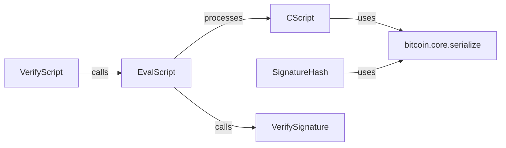

## Details

This subsystem is responsible for the core validation of Bitcoin transactions by interpreting and executing Bitcoin scripts, and by verifying cryptographic signatures. It acts as the central engine for enforcing the rules of the Bitcoin protocol related to transaction validity.

### CScript
Serves as the fundamental data structure for Bitcoin scripts. It encapsulates script opcodes and provides utilities for their construction, parsing, and serialization. It is the primary data object processed by the script evaluation engine.

**Related Classes/Methods**:

- <a href="https://github.com/petertodd/python-bitcoinlib/blob/master/bitcoin/core/script.py#L503-L811" target="_blank" rel="noopener noreferrer">`bitcoin.core.script.CScript`:503-811</a>

### EvalScript
Provides the public interface for initiating the script evaluation process. It acts as the primary interpreter for executing Bitcoin script opcodes, managing the script execution stack, and performing opcode-specific operations.

**Related Classes/Methods**:

- <a href="https://github.com/petertodd/python-bitcoinlib/blob/master/bitcoin/core/scripteval.py#L710-L732" target="_blank" rel="noopener noreferrer">`bitcoin.core.scripteval.EvalScript`:710-732</a>

### VerifyScript
Orchestrates the complete script validation process for a transaction. It ensures the overall correctness of a script after execution, including checking final stack state and error conditions, providing the final verdict on script validity.

**Related Classes/Methods**:

- <a href="https://github.com/petertodd/python-bitcoinlib/blob/master/bitcoin/core/scripteval.py#L737-L787" target="_blank" rel="noopener noreferrer">`bitcoin.core.scripteval.VerifyScript`:737-787</a>

### SignatureHash
Computes the hash of a transaction that is used for signing. This hash is a critical input for creating and verifying digital signatures, ensuring that the correct data context is signed.

**Related Classes/Methods**:

- <a href="https://github.com/petertodd/python-bitcoinlib/blob/master/bitcoin/core/script.py#L977-L1030" target="_blank" rel="noopener noreferrer">`bitcoin.core.script.SignatureHash`:977-1030</a>

### VerifySignature
A specialized function dedicated to verifying cryptographic signatures within a script context. It performs the actual cryptographic check of a signature against a public key and a message hash, ensuring authenticity.

**Related Classes/Methods**:

- <a href="https://github.com/petertodd/python-bitcoinlib/blob/master/bitcoin/core/scripteval.py#L793-L814" target="_blank" rel="noopener noreferrer">`bitcoin.core.scripteval.VerifySignature`:793-814</a>

### bitcoin.core.serialize
Provides essential utility functions for the serialization and deserialization of various Bitcoin data structures, including scripts and transaction components. It ensures data can be correctly formatted for processing, storage, and network transmission, crucial for protocol compliance.

**Related Classes/Methods**:

- <a href="https://github.com/petertodd/python-bitcoinlib/blob/master/bitcoin/core/serialize.py" target="_blank" rel="noopener noreferrer">`bitcoin.core.serialize`</a>

### [FAQ](https://github.com/CodeBoarding/GeneratedOnBoardings/tree/main?tab=readme-ov-file#faq)