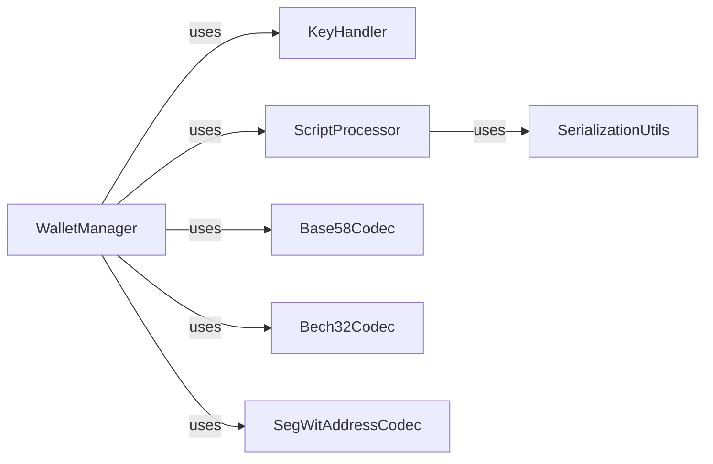

## Details

The Wallet & Key Management subsystem is a critical part of the python-bitcoinlib project, focusing on the secure and correct handling of cryptographic keys, addresses, and associated scripting logic. It adheres to the project's "Data Processing Library / Protocol Implementation Library" and "Modular Design / Layered Architecture" patterns by providing distinct, specialized components for each aspect of key and address management.

### WalletManager
Serves as the primary high-level interface for users to create, manage, and convert Bitcoin addresses (CBitcoinAddress) and secrets (CBitcoinSecret). It orchestrates operations related to wallet functionality, abstracting the underlying cryptographic and encoding complexities.

**Related Classes/Methods**:

- <a href="https://github.com/petertodd/python-bitcoinlib/blob/master/bitcoin/wallet.py" target="_blank" rel="noopener noreferrer">`bitcoin.wallet.WalletManager`</a>

### KeyHandler
Responsible for low-level elliptic curve cryptography (ECC) operations specific to Bitcoin's secp256k1 curve. This includes private/public key generation, message signing, and public key recovery. It forms the cryptographic backbone for key management.

**Related Classes/Methods**:

- <a href="https://github.com/petertodd/python-bitcoinlib/blob/master/bitcoin/core/key.py" target="_blank" rel="noopener noreferrer">`bitcoin.core.key.KeyHandler`</a>

### ScriptProcessor
Manages the lifecycle and operations of Bitcoin scripts, which are fundamental to defining transaction outputs and unlocking conditions. This includes encoding/decoding script operations, iterating through script elements, and handling signature hashing (SignatureHash) for transaction validation.

**Related Classes/Methods**:

- <a href="https://github.com/petertodd/python-bitcoinlib/blob/master/bitcoin/core/script.py" target="_blank" rel="noopener noreferrer">`bitcoin.core.script.ScriptProcessor`</a>

### Base58Codec
Provides functionalities for encoding and decoding data using the Base58Check format, which includes crucial checksum validation. This component is specifically used for traditional Bitcoin addresses (P2PKH, P2SH) and private keys (WIF).

**Related Classes/Methods**:

- <a href="https://github.com/petertodd/python-bitcoinlib/blob/master/bitcoin/base58.py" target="_blank" rel="noopener noreferrer">`bitcoin.base58.Base58Codec`</a>

### Bech32Codec
Handles the encoding and decoding of data using the Bech32 format, including its specific checksum verification. This format is predominantly used for native SegWit addresses (P2WPKH, P2WSH).

**Related Classes/Methods**:

- <a href="https://github.com/petertodd/python-bitcoinlib/blob/master/bitcoin/bech32.py" target="_blank" rel="noopener noreferrer">`bitcoin.bech32.Bech32Codec`</a>

### SegWitAddressCodec
Offers specialized functions for encoding and decoding SegWit addresses, supporting both Bech32 and Bech32m formats. It manages the specific version bytes and bit conversions required for these modern address formats.

**Related Classes/Methods**:

- <a href="https://github.com/petertodd/python-bitcoinlib/blob/master/bitcoin/segwit_addr.py" target="_blank" rel="noopener noreferrer">`bitcoin.segwit_addr.SegWitAddressCodec`</a>

### SerializationUtils
Provides generic serialization and deserialization mechanisms for various Bitcoin data structures. While a utility component, its fundamental importance lies in ensuring data integrity and proper formatting for on-chain and off-chain data exchange, particularly for scripts and transaction elements.

**Related Classes/Methods**:

- <a href="https://github.com/petertodd/python-bitcoinlib/blob/master/bitcoin/core/serialize.py" target="_blank" rel="noopener noreferrer">`bitcoin.core.serialize.SerializationUtils`</a>

### [FAQ](https://github.com/CodeBoarding/GeneratedOnBoardings/tree/main?tab=readme-ov-file#faq)