```mermaid
graph LR
    RPC_Communication["RPC Communication"]
    Core_Protocol_Primitives["Core Protocol Primitives"]
    Scripting_Transaction_Logic["Scripting & Transaction Logic"]
    Cryptographic_Utilities["Cryptographic Utilities"]
    Address_Encoding_Formats["Address & Encoding Formats"]
    Wallet_Key_Management["Wallet & Key Management"]
    Network_Configuration["Network Configuration"]
    RPC_Communication -- "sends data to" --> Core_Protocol_Primitives
    Core_Protocol_Primitives -- "provides data to" --> Scripting_Transaction_Logic
    Core_Protocol_Primitives -- "provides data to" --> Cryptographic_Utilities
    Scripting_Transaction_Logic -- "requests signature verification from" --> Cryptographic_Utilities
    Cryptographic_Utilities -- "provides public keys to" --> Address_Encoding_Formats
    Cryptographic_Utilities -- "provides key management services to" --> Wallet_Key_Management
    Address_Encoding_Formats -- "provides address derivation to" --> Wallet_Key_Management
    Wallet_Key_Management -- "requests signing from" --> Cryptographic_Utilities
    Wallet_Key_Management -- "requests script construction from" --> Scripting_Transaction_Logic
    Wallet_Key_Management -- "requests address generation from" --> Address_Encoding_Formats
    Network_Configuration -- "configures" --> Core_Protocol_Primitives
    Network_Configuration -- "configures" --> Address_Encoding_Formats
    click Core_Protocol_Primitives href "https://github.com/CodeBoarding/GeneratedOnBoardings/blob/main/python-bitcoinlib/Core_Protocol_Primitives.md" "Details"
    click Scripting_Transaction_Logic href "https://github.com/CodeBoarding/GeneratedOnBoardings/blob/main/python-bitcoinlib/Scripting_Transaction_Logic.md" "Details"
    click Cryptographic_Utilities href "https://github.com/CodeBoarding/GeneratedOnBoardings/blob/main/python-bitcoinlib/Cryptographic_Utilities.md" "Details"
    click Wallet_Key_Management href "https://github.com/CodeBoarding/GeneratedOnBoardings/blob/main/python-bitcoinlib/Wallet_Key_Management.md" "Details"
```

## Details

The `python-bitcoinlib` project functions as a comprehensive data processing and protocol implementation library for Bitcoin. Its architecture is modular, centered around the core Bitcoin protocol primitives, which define fundamental data structures like blocks and transactions, along with their serialization and hashing. This core interacts with a dedicated Scripting & Transaction Logic component responsible for evaluating Bitcoin scripts and validating transaction integrity. Cryptographic Utilities provide the essential elliptic curve operations for key management and digital signatures, which are then utilized by the Address & Encoding Formats component to handle various Bitcoin address representations. External interaction with Bitcoin Core nodes is managed by the RPC Communication component, while the Wallet & Key Management component offers a higher-level abstraction for managing user funds by orchestrating operations across the cryptographic, scripting, and address components. Finally, the Network Configuration component ensures the entire system operates correctly by setting network-specific parameters. This layered design facilitates clear separation of concerns, making the library robust and extensible for various Bitcoin-related applications.

### RPC Communication
Interacts with external Bitcoin Core nodes, sending commands (e.g., sendrawtransaction) and receiving blockchain data.

**Related Classes/Methods**:

- <a href="https://github.com/petertodd/python-bitcoinlib/blob/master/bitcoin/rpc.py" target="_blank" rel="noopener noreferrer">`bitcoin.rpc`</a>

### Core Protocol Primitives [[Expand]](./Core_Protocol_Primitives.md)
Processes Raw Data: Receives raw data from RPC Communication or Network Messaging (if present) and deserializes it into Bitcoin data structures. Provides Hashing/Serialization: Offers fundamental serialization (stream_serialize, stream_deserialize) and hashing (GetHash) services to other components.

**Related Classes/Methods**:

- <a href="https://github.com/petertodd/python-bitcoinlib/blob/master/bitcoin/core/__init__.py" target="_blank" rel="noopener noreferrer">`bitcoin.core`</a>
- <a href="https://github.com/petertodd/python-bitcoinlib/blob/master/bitcoin/core/serialize.py" target="_blank" rel="noopener noreferrer">`bitcoin.core.serialize`</a>
- <a href="https://github.com/petertodd/python-bitcoinlib/blob/master/bitcoin/core/_bignum.py" target="_blank" rel="noopener noreferrer">`bitcoin.core._bignum`</a>
- <a href="https://github.com/petertodd/python-bitcoinlib/blob/master/bitcoin/core/contrib/ripemd160.py" target="_blank" rel="noopener noreferrer">`bitcoin.core.contrib.ripemd160`</a>

### Scripting & Transaction Logic [[Expand]](./Scripting_Transaction_Logic.md)
Validates Transactions: Receives transaction data from Core Protocol Primitives and evaluates Bitcoin scripts (EvalScript, VerifyScript) to ensure transaction validity. Requests Signatures: Interacts with Cryptographic Utilities for signature verification during script evaluation.

**Related Classes/Methods**:

- <a href="https://github.com/petertodd/python-bitcoinlib/blob/master/bitcoin/core/script.py" target="_blank" rel="noopener noreferrer">`bitcoin.core.script`</a>
- <a href="https://github.com/petertodd/python-bitcoinlib/blob/master/bitcoin/core/scripteval.py" target="_blank" rel="noopener noreferrer">`bitcoin.core.scripteval`</a>

### Cryptographic Utilities [[Expand]](./Cryptographic_Utilities.md)
Performs ECC Operations: Provides key generation, signing (sign), and public key recovery (recover_compact) services. Receives Data For Hashing: Takes data (e.g., transaction hashes) from Core Protocol Primitives or Scripting & Transaction Logic for signing.

**Related Classes/Methods**:

- <a href="https://github.com/petertodd/python-bitcoinlib/blob/master/bitcoin/core/key.py" target="_blank" rel="noopener noreferrer">`bitcoin.core.key`</a>
- <a href="https://github.com/petertodd/python-bitcoinlib/blob/master/bitcoin/signature.py" target="_blank" rel="noopener noreferrer">`bitcoin.signature`</a>
- <a href="https://github.com/petertodd/python-bitcoinlib/blob/master/bitcoin/signmessage.py" target="_blank" rel="noopener noreferrer">`bitcoin.signmessage`</a>

### Address & Encoding Formats
Encodes/Decodes Addresses: Converts public keys and script hashes into various Bitcoin address formats (Base58Check, Bech32, SegWit). Receives Public Keys: Takes public key data from Cryptographic Utilities or Wallet & Key Management.

**Related Classes/Methods**:

- <a href="https://github.com/petertodd/python-bitcoinlib/blob/master/bitcoin/base58.py" target="_blank" rel="noopener noreferrer">`bitcoin.base58`</a>
- <a href="https://github.com/petertodd/python-bitcoinlib/blob/master/bitcoin/bech32.py" target="_blank" rel="noopener noreferrer">`bitcoin.bech32`</a>
- <a href="https://github.com/petertodd/python-bitcoinlib/blob/master/bitcoin/segwit_addr.py" target="_blank" rel="noopener noreferrer">`bitcoin.segwit_addr`</a>

### Wallet & Key Management [[Expand]](./Wallet_Key_Management.md)
Manages Keys & Addresses: High-level component for deriving and managing private keys and addresses. Orchestrates Operations: Utilizes Cryptographic Utilities for key operations, Scripting & Transaction Logic for script-based derivations, and Address & Encoding Formats for address conversions.

**Related Classes/Methods**:

- <a href="https://github.com/petertodd/python-bitcoinlib/blob/master/bitcoin/core/key.py" target="_blank" rel="noopener noreferrer">`bitcoin.core.key`</a>
- <a href="https://github.com/petertodd/python-bitcoinlib/blob/master/bitcoin/core/script.py" target="_blank" rel="noopener noreferrer">`bitcoin.core.script`</a>
- <a href="https://github.com/petertodd/python-bitcoinlib/blob/master/bitcoin/base58.py" target="_blank" rel="noopener noreferrer">`bitcoin.base58`</a>
- <a href="https://github.com/petertodd/python-bitcoinlib/blob/master/bitcoin/bech32.py" target="_blank" rel="noopener noreferrer">`bitcoin.bech32`</a>
- <a href="https://github.com/petertodd/python-bitcoinlib/blob/master/bitcoin/segwit_addr.py" target="_blank" rel="noopener noreferrer">`bitcoin.segwit_addr`</a>

### Network Configuration
Sets Network Parameters: Configures global network-specific constants (e.g., magic bytes, address prefixes) for the entire library.

**Related Classes/Methods**:

- <a href="https://github.com/petertodd/python-bitcoinlib/blob/master/bitcoin/__init__.py" target="_blank" rel="noopener noreferrer">`bitcoin`</a>

### [FAQ](https://github.com/CodeBoarding/GeneratedOnBoardings/tree/main?tab=readme-ov-file#faq)